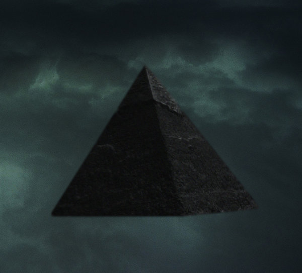

artist: **AUN**  
release: _Black Pyramid  
_format: CD  
year of release: 2010  
label: [Cyclic Law](http://www.cycliclaw.com)  
duration: 47:59

I like surprises, though pleasant ones in particular. Just when I thought I could write down **Cyclic Law** as a slightly predictable label with minimalist dark ambient of usually high quality and occasional orchestral or martial outbursts, just then comes along an album like _Black Pyramid_.

**AUN** is a duo (**Martin Dumais** and **Julie Leblanc**) from Montréal, with a couple of albums to their name already. If this most recent offering is representative, it's an oeuvre stitched together from ambient, drones, and guitar psychedelia. The seven soundscapes on this album are highly varied, showcasing a wide array of textures conjured from synths and guitars, often forming subtle rhythms from the layering of melodic lines on different levels and loops. The result is stunning, combining the bright and deep colourings of astronomical inspiration with both coarse and delicate edges to the sound.

The title track is an excellent example, with its shimmering main melody waves and some rawer bits sticking out here and there. Of note is also the masterful closer "Shining", starting with a psychy guitar freakout and segueing into massive distorted rhythms and drones.

It's a perfect move on Cyclic Law's part to sign AUN, as this is simply a stunning album. Obligatory listening for all ambient lovers, especially if you like **Troum**, **Alphane Moon**, and others in that vein where ambient, drone, ritual, and spaciousness meet.

Reviewed by **O.S.**

Tracklist:

1\. Phoenix (7:04)  
2\. Taurus Ten (6:19)  
3\. Black Pyramid (7:59)  
4\. Ursa Major (6:38)  
5\. 2095 (8:02)  
6\. Ursa Minor (2:42)  
7\. Shining (9:15)
