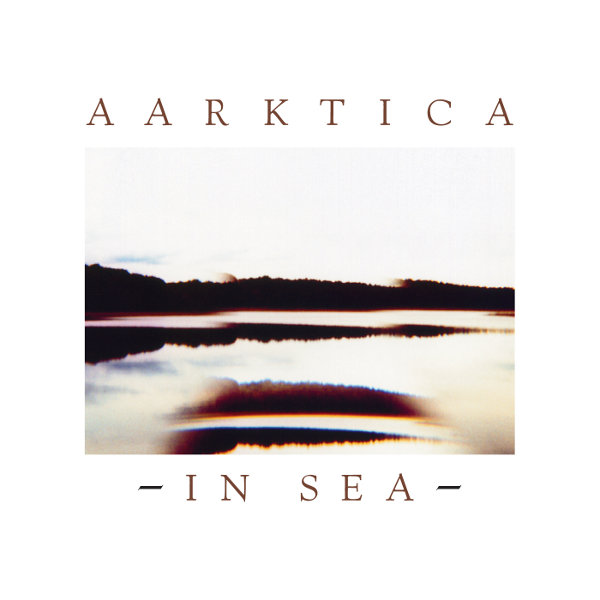
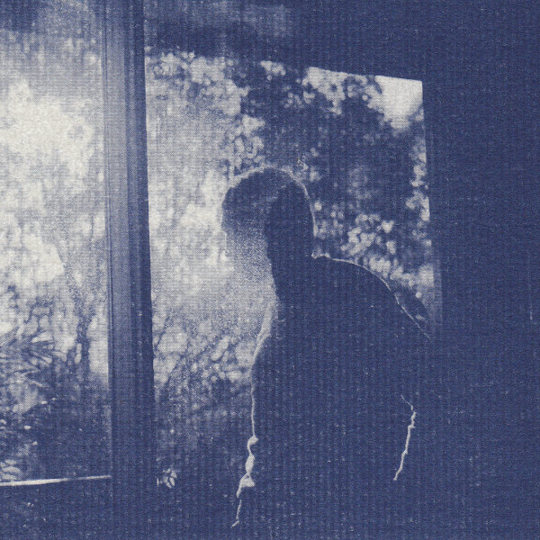

\[caption id="attachment\_1348" align="alignright" width="150" caption="In Sea"\]\[/caption\]

artist: **Aarktica** release: _In Sea_ / _In Sea Remixes_ format: CD, CD year of release: 2009, 2010 label: [Silber](http://www.silbermedia.com/) duration: 56:03, 73:05

detailed info: discogs.com \[[1](http://www.discogs.com/Aarktica-In-Sea/release/1959401), [2](http://www.discogs.com/Aarktica-In-Sea-Remixes/release/2375324)\]

**Jon DeRosa** returned to **Silber Records** with **Aarktica** last year, releasing a new album entitled _In Sea_. This album of calm guitar ambient, drones, and a couple of songs, was subsequently tackled by a host of guest artists, who remixed each song of the album in turn, culminating in three alternative versions of Aarktica's magnificent cover of **Danzig**'s "Am I Demon?". The balance between the original and the remix album is perfect, and as such, both deserve a place in the spotlight here in turn.

_In Sea_ is my introduction to **Aarktica**, but it turned out to be a very pleasant one. The strength in DeRosa's approach to music is the combination of simplicity and refinement. His melodies and chord waves in general have a calm, relaxing sound, appropriate to the album title, and somewhat reminiscent of **Dirk Serries**' recent work on **3 Second of Air** and **Microphonics**. The mournful sounds of the opening track set a somewhat somber (but beautiful!) tone for the start -  a version with a great animated video by **Karolina Waclawiak** can be seen on [youtube](http://www.youtube.com/watch?v=l1trz5gY380). However, the moods shift through the second track, and the uplifting vocal on "Hollow Earth Theory", which sees DeRosa introducing a more rhythmic approach as well. The whole album stays afloat on this subtle balance of moods and sound textures, with the central highlight being the incredible dronework of the title track. Special mention also goes to the aforementioned Danzig cover. The original, a pounding proto-metal track, is transformed into a brooding and perfectly proportioned vocal ambient track that pushes the album to new heights at the very end.

\[caption id="attachment\_1349" align="alignleft" width="150" caption="In Sea Remixes"\]\[/caption\]

This year saw the release of the companion remix album, simply entitled _In Sea Remixes_. This well-stocked appendix contains some very fine material as well, especially since all these different remixers bring their own influences to the board, which results in a broad and accessible album that retains a great deal of the unique atmosphere of the original. The basic line is still ambient of course, as is illustrated by **Rameses III**'s relaxing rendition of "I Am (The Ice)". However, it is when these new influences shine through that the strength of this album comes to the fore. A perfect example is **Mason Jones**, adding subtle drums and treatments to "In Sea", taking the track to a different, but equally brilliant plane. Idem the **Planar** remix of "Young Light", where minimal rhythms and newly added female vocals evolve the song beyond its original form. Of course, not all of these remixes are as remarkable as these, but the general flow of the album is preserved excellently. It ends, as mentioned with a trio of remixes of "Am I Demon?", each of which is more than worthwhile. **The Declining Winter** add a cold, windswept touch to the song with some strings and additional vocals. The one by **Suckers** goes for a minimal beat and subdued distortion of the original vocals, resulting in a quirky, muted new version. The **Landing** remix, finally, opts for a simpler approach with delays and reverbs, delivering a slightly more dreamy reworking.

Of course, _In Sea_ is the basic album here, but both CDs can really be listened or bought separately, as they contain ample material to delight a broad spectrum of listeners - ambient, experimental, independent rock, drone. However, as a pair they are even more fulfilling, so it is certainly worth it to purchase both if my above words sounded convincing enough. Regardless, Aarktica is a name that is on my watchlist from now on.

Reviewed by **O.S.**

Tracklists:

_In Sea_ 1\. I Am (The Ice) (3:54) 2. LYMZ (4:46) 3. Hollow Earth Theory (4:46) 4. A Plague Of Frost (In The Guise Of Diamonds) (8:10) 5. In Sea (3:54) 6. Onward! (2:40) 7. Young Light (3:02) 8. Autumnal (3:14) 9. Corpse Reviver No. 2 (8:00) 10. Instill (3:32) 11. When We're Ghosts (4:07) 12. Am I Demon? (5:58)

_In Sea Remixes_ 1\. I Am (The Ice) (Sky Burial Remix by **Rameses III**) (4:04) 2. LYMZ (**Slicnaton** Remix) (5:58) 3. Hollow Earth Theory (**Summer Cats** Remix) (4:21) 4. A Plague Of Frost (In The Guise Of Diamonds) (**Al Qaeda** Remix) (8:08) 5. In Sea (**Mason Jones** Remix) (4:34) 6. Onward! (**Yellow6** Remix) (4:08) 7. Young Light (**Planar** Remix) (4:45) 8. Autumnal (**Keith Canisius** Remix) (5:01) 9. Corpse Reviver No. 2 (**ThisQuietArmy** Remix) (5:47) 10. Instill (**Remora** Remix) (4:14) 11. When We're Ghosts (**James Duncan** Remix) (6:43) 12. Am I Demon? (**Declining Winter** Remix) (4:53) 13. Am I Demon? (**Pan/Suckers** Remix) (4:31) 14. Am I Demon? (**Landing** Remix) (5:58)
