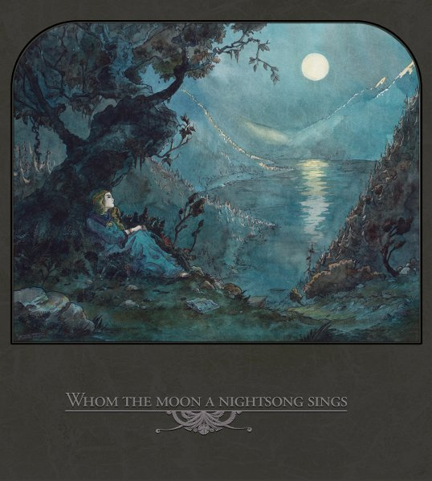

artist: **Various Artists** release: _Whom the Moon a Nightsong Signs_ format: 2CD year of release: 2010 label: [Auerbach/Prophecy](http://www.prophecy.cd/) duration: 1:44:23

The subgenre of dark acoustic or dark folk keeps fascinating me endlessly. On the one hand, it harbours some of the most direct and and powerful musical expressions of romanticism, melancholy and nature mysticism that can be found in popular music. On the other hand, it is a horribly limited and stagnant musical idiom that can annoy as much as delight with its pathos. **Prophecy**, with essential artists of the genre as **Empyrium** and **Tenhi** in its stalls, is of course the label to expect a compilation like this one from, and as can be expected, it is in its own way an admirable piece of work. This 2CD collection contains rare and unreleased track selections from a slew of more or less important artists in the dark acoustic spectrum, embellished with fine cover art by **Les Discrets**' **Fursy Teyssier**, and no doubt more of his fine illustrations to be seen in the digibook when it comes out end of October 2010.

One of the main attractions of this compilation will for many be the return, after eight years, of Empyrium. Personally, I found a great part of the band's output to have aged less than gracefully compared to e.g. **Ulver** and Tenhi, but let's put that aside for a moment. "The Days Before the Fall", their new track, and presumably a portent of an upcoming album, is a fine track, somehow drawing both upon their last album _Weiland_ and their earlier work on _Songs of Moors and Misty Fields_. The first part is richly orchestrated with guitar, drums, percussion and strings, and the joint vocals (chant and classical) of Schwadorf and Helm. The second half suddenly launches into a return to the metal style of the early albums, not jarringly so, but still surprising considering the mostly acoustic nature of their last two albums.  On the whole the track is certainly classic Empyrium, an amalgam of all their stylistic qualities so far, but it is also a bit on the slick side, a bit overpolished and... well... by the book. It's sure to delight many, but I'm afraid it hasn't completely stirred anew my interest in the band.

Of the other artists featured here, a number come out of the woodwork quite nicely. I've never hidden my admiration for **Vàli**'s subtle layered guitar work, and his return here with new material (albeit only two short tracks) deserves to be heralded as much as Empyrium's. **October Falls** is serene and subdued as always; a nice listen, but nothing we haven't heard before. The inclusion of the two Les Discrets tracks is also very nice, not in the least because he is an artist of a new generation, having shown on the recent album _Septembre et ses Dernières Pensées_ to be able to mix shoegazing metal and neofolk in a way that goes a bit beyond the paradigm of more traditional artists in the metal/folk crossover. The short but sweet "5 Montee des Epies" is a stronger track than the second one, though, which is bogged down by the muddled vocal harmonies of the band. **Musk Ox** is another one of those younger artists who have emulated the instrumental dark acoustic style to perfection, and always a pleasure to listen to. "Solstice" is a wonderfully calming track that is hopefully also a precursor to upcoming works.

There are a couple of noteworthy tracks on disc 2, as well, not in the least the rerelease of Ulver's hard-to-find 1996 track "Synen". Released originally on the strictly limited _Souvenirs from Hell_ compilation, it was something that always wandered around the net and on tapes, never again finding an official home, until now. And deservedly so. 14 years after, the track shows that if we're totally honest, many have attempted to take this original style of dark acoustic music further, but few have been able to equal Ulver's level back then with [_Kveldssanger_](http://www.eveningoflight.nl/2009/04/29/eclipse-review-ulver-kveldssanger-1995/), and indeed, with "Synen", which is a masterpiece of that style, combining powerful vocals in Norwegian, guitar, cello, and percussion. "Kausienranta" is an equally marvellous track - I'll refer again to the brilliant video [here](http://www.youtube.com/watch?v=xGAZMDtrK4c) -  and Tenhi is easily one the most original and refined of all bands present here. The only pity is that this is not a new track, and that while new material by this band would be more than welcome. Some of the - for me - newcomers on this disc also present nice material. The moody piano opener by **Nhor**, for example, as well as the sparse acoustic meanderings of "Krähenkönigin III" by **Nucleus Torn**. A final mention goes to **Syven**, a brand new project by **A. Tolonen** of **Nest** (also featured on disc 1 with an acoustic version of an older track) and **Andy Koski-Semmens**, a former vocalist of **Pantheist**. The epic 14-minute "How Fare the Gods?" is very nice, a brooding dark piece based on tribal percussion, faint kantele melodies, thick synth drones and a selection of ritual and classical vocals. A touch more stately than Nest, and sure to appeal to a wide audience.

So, what verdict to slap on a chimeric release such as this? Let's start with what this album is _not_. It's not the holy grail of dark acoustic, to give this "unnamed genre" a moniker, nor is it even a best-of. The song choices lean in various directions, not all of them geared simply toward quality. Neither is it a true rarities collection, as these songs are not all hard to find or unreleased. And if you're looking for the cutting edge of the genre, if there is any, you won't find it in large quantities here either, as a significant part of the tracks is quite old, and most others just rehash the same old style. To reiterate my feelings from the opening, over the course of this release, I find that the genre is a difficult one, and the balance between captivating romanticism and overblown cheesiness is a very fine one, or perhaps they are two sides of the same coin.

That doesn't mean that it isn't any good, of course. For all its indecision, _Whom the Moon a Nightsong Sings_ is on the whole a very pleasant and listenable collection, where the idea is not to try and find any line in the selection, but just to listen and see what you like, and there is enough to like for a broad range of listeners. Combined with lovingly made artwork and a very fair pricing, that makes this compilation worth the effort of pursuing anyway.

Reviewed by **O.S.**

Tracklist:

1\. **Vàli**: Hoestmelankoli 2. **Empyrium**: The Days Before The Fall 3. **Nest**: Summer Storm (acoustic) 4. **Nebelung**: Ich würd es hören 5. **October Falls**: Viima 6. **Ainulindalë**: A Year Of Silence 7. **Les Discrets**: 5 Montee Des Epies 8. **Les Discrets**: Apres l'Ombre 9. **Musk Ox**: Solstice 10. **Havnatt**: Dagen Og Natta 11. **Dornenreich**: Dem Wind Geboren 12. **Vàli**: Haredans I Fjellheimen

1\. **Nhor**: Upon The Wind Its Wings Beat Sorrow Into The Stars 2. **Ulver**: Synen 3. **Neun Welten**: Pan 4. **Tenhi**: Kausienranta 5. **Bauda**: Ocaso (acoustic) 6. **Orplid**: Stille (Demo) 7. **Nucleus Torn**: Krähenkönigin III 8. **Lönndom**: Språnget Ur Ursprunget 9. **Syven**: How Fare The Gods?
