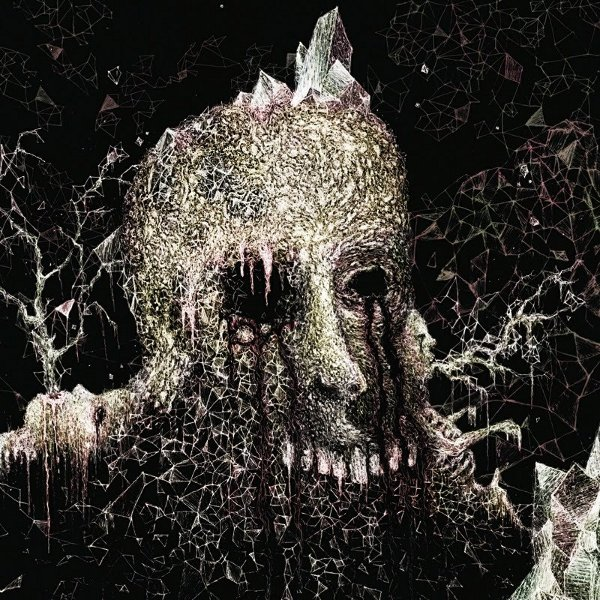

artist: **Locrian** release: _The Crystal World_ format: 2CD, LP year of release: 2010 label: [Utech](http://www.utechrecords.com/) duration: 1:47:53

**Locrian** does not rest idly, and I for one am all the happier for it. Not incredibly long after the previous album _Territories_ comes another full-length, and a further step for this band. **Andre Foisy** and **Terence Hannum** are  joined by **Steven Hess** on percussion and electronics, finalising the sound - at least for now - that was developed on albums like _Drenched Lands_ and the previous one mentioned above. If you hadn't read my previous reviews yet: Locrian are of the most important names to watch in the realm of guitar drones, improvised raw soundscapes, and for lack of a better term, 'post-metal'.

Although the theme of _The Crystal World_ can once again be called apocalyptic or even dystopian, this time there is a clear literary reference behind it, and that is [the novel of the same name](http://www.goodreads.com/book/show/70255.The_Crystal_World) by **J.G. Ballard**, published in 1966. In this novel, a doctor and researcher of leprosy travels deep into the African jungle in search of a past love interest, and to investigate a strange natural phenomenon. As it turns out, an unknown virus or pathogen is causing the gradual crystallisation of everything in the jungle, and it is slowly spreading outward, encasing the world in a crystalline stasis where time stops.

The novel and this album are both equally fascinating works, and luckily the links backward are rather loose, allowing one to enjoy each without intrusion from the other. However, keeping the thematic background of the novel in the back of your mind while listening to this work certainly doesn't hurt the atmosphere created. I had already praised the inclusion of percussion in _Territories_, and they are equally functional here, laying down subtle rolling fills and gentle rhythms, rather than the black metal explosions on the previous albums. In general, the flow of this album is also more gradual, mirroring the slow but steady crystallisation in the novel. The tools of the trade are still the same: a lot of feedback, distant screams, subtle synths, and quite a few guitar melodies, both distorted and clean. Of particular beauty is the title track, which perfectly captures a feeling of foreboding in a gently looping melody with asymmetric drums and high-pitched guitar wails. It strikes me also that despite the songs having a clear head and tail, the progression of the album is very smooth and coherent, perhaps also because of the subtle repetition of musical motifs. The main part ends with "Elevations and Depths", a slow metal intro latched onto an epic acoustic ending of acoustic guitar, accordion, and violin.

The CD release of the album comes with a 53-minute bonus, called "Extinction", which feels like purer drone-reworking of the main part of the album. The atmosphere is similar, but more vast and extensive. Compared to the perfectly proportioned tracks of the first CD, but also longer droneworks of Locrian's past, I feel it is perhaps a bit too drawn out in places. However, it does make a conceptually nice fit as the post-apocalyptic stage of this album, and in its long duration there are many parts worth discovering for laid back listening sessions.

As such, the third full length album by Locrian is another success for these men, and a highly recommended piece of experimental music. The 2CD edition is out end of November 2010 on **Utech Records,** with the LP (without "Extinction") coming somewhere in 2011.

Reviewed by **O.S.**

Tracklist:

1\. Triumph of Elimination (5:48) 2. At Night's End (7:20) 3. The Crystal World (5:52) 4. Pathogens (11:06) 5. Obsidian Facades (7:48) 6. Elevations and Depths (10:47)

7\. Extinction (53:40)
