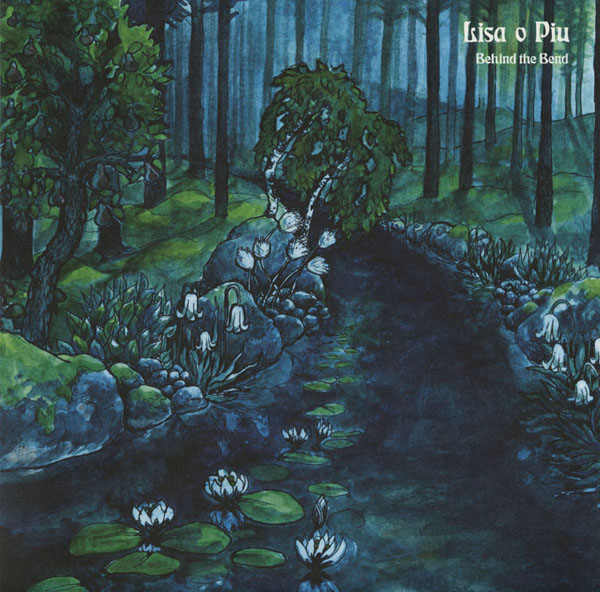

artist: **Lisa o Piu** release: _Behind the Bend_ format: CD, LP year of release: 2010 label: [Subliminal Sounds](http://www.subliminalsounds.se/) duration: 28:28

detailed info: [discogs.com](http://www.discogs.com/Lisa-O-Piu-Behind-The-Bend/release/2380195)

**Lisa o Piu**, the project of Swedish **Lisa Isaksson** and her band mates, is an essential new name to watch in realm of psychedelic folk. The past two years saw the release of a [succesful single](http://www.eveningoflight.nl/2009/06/03/review-lisa-o-piu-whisperers-wavers-hunters-and-sailors-2008/ "Review: Lisa O Piu – Whisperers, Wavers, Hunters And Sailors (2008)") and an album, but what made the best impression on me was her intimate gallery show together with **In Gowan Ring** in Amsterdam last year. You can view three of our videos of this gig here: \[[1](http://www.youtube.com/watch?v=ofthF6ov75k), [2](http://www.youtube.com/watch?v=g33JzV6ZDLY), [3](http://www.youtube.com/watch?v=dXRtM8oFeZM)\]. Discovering a new LP in the store this year was a nice surprise, and as it turns out, another great release for Lisa, where her own voice and playing is accompanied by a rich group of supporters who add bass, strings, percussion, flute, etc.

In fact, she almost errs on the side of caution with this highly compact LP, clocking in at under 30 minutes. In a way, it's gone before you know it, but what is here leaves little to be desired in the way of quality. Tracks like "Was it the Moon" and "Dream of Goats" are fairly standard fare when it comes to style and atmosphere, but played and sung at top quality. "Simplicity" is a beautiful minimalist piece, convincingly echoing the yearning for, well, simplicity in life, which has been on the agenda since the Romantic era, all through to the hippie days, but also today, and basically any time in which modern life can sometimes confuse and bewilder us, and makes us look to the (apparent) simplicity and serenity of a life closer to nature. "World Falling Down" and "Gong for Hours" are nicely poised instrumental interludes, providing a padding for the extensive and flawless "Child of Trees", a great exercise in alternative folk music with rich harp and guitar passages, subtle changes in intensity, and a swerving psychedelic electric guitar solo to boot.

Every time I come across albums like _Behind the Bend_, I hail the folk revival of the past ten/fifteen years or so, and am thankful that there are people today still following this wonderful alternative musical path. Needless to say, this is recommended stuff for fans of psychedelic folk anywhere.

Reviewed by **O.S.**

Tracklist:

1\. Was It The Moon (3:49) 2. Simplicity (4:40) 3. Dream Of Goats (3:10) 4. World Falling Down (1:16)

5\. Child Of Trees (11:59) 6. Gong For Hours (Jupiter's Under The Moon) (3:34)
