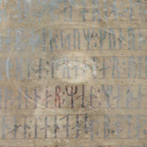

[Cloudscape #8: November 2010](http://www.mixcloud.com/eveningoflight/cloudscape-8-november-2010/?utm_source=widget&utm_medium=web&utm_campaign=base_links&utm_term=resource_link) by [Evening Of Light](http://www.mixcloud.com/eveningoflight/?utm_source=widget&utm_medium=web&utm_campaign=base_links&utm_term=profile_link) on [Mixcloud](http://www.mixcloud.com/?utm_source=widget&utm_medium=web&utm_campaign=base_links&utm_term=homepage_link)

00:00 | Kentin Jivek | L'Effet Pandemonium | [Ode to Marmæle](http://www.eveningoflight.nl/2011/03/16/march-2011-short-reviews/ "March 2011 Short Reviews") | 2010 03:24 | Les Discrets | 5 Montee des Epies | [Whom the Moon a Nightsong Sings](http://www.eveningoflight.nl/2010/10/13/review-v-a-whom-the-moon-a-nightsong-sings-2010/ "Review: V.A. – Whom the Moon a Nightsong Sings (2010)") | 2010 04:39 | Joonatan Elokuu | Nancy | [A Vagrant's Whim](http://www.eveningoflight.nl/2011/01/29/review-joonatan-elokuu-a-vagrants-whim-2010/ "Review: Joonatan Elokuu – A Vagrant’s Whim (2010)") | 2010 08:27 | Aarktica | Young Light (Planar Remix) | [In Sea Remixes](http://www.eveningoflight.nl/2010/10/05/review-aarktica-in-sea-2009-in-sea-remixes-2010/ "Review: Aarktica – In Sea (2009) / In Sea Remixes (2010)") | 2010 12:26 | Hadewych | A Forest for Wyrd | [Hadewych](http://www.eveningoflight.nl/2009/04/01/review-hadewych-2007/ "Review: Hadewych (2007)") | 2007 19:20 | The Joy of Nature | Zrcadlo | [The Dream of the Empty Circle](http://www.eveningoflight.nl/2011/03/16/march-2011-short-reviews/ "March 2011 Short Reviews") | 2010 22:40 | Musk Ox | Solstice | Whom the Moon a Nightsong Sings | 2010 25:56 | Plinth | Duclimer Music 2 | [Laily 03](http://www.eveningoflight.nl/2010/12/05/review-v-a-laily-03-2010/ "Review: V.A. – LAILY 03 (2010)") | 2010 32:36 | Kinit Her | Living Midnight II (excerpt) | Living Midnight at the Harvest Abbey | 2010 38:51 | raison d'être | The Invisible Gate of the Temple | The Luminous Experience | 2008 48:00 | Secret Druid Society | Phobia (Stones Are Moving) | [Restless](http://www.eveningoflight.nl/2010/11/28/review-secret-druid-society-restless-2010/ "Review: Secret Druid Society – Restless (2010)") | 2010 51:47 | Kammarheit | Sleep After Toyle, Port After Stormie Seas | The Starwheel | 2005 57:51 | Coil | The Golden Section | Horse Rotorvator | 1986
