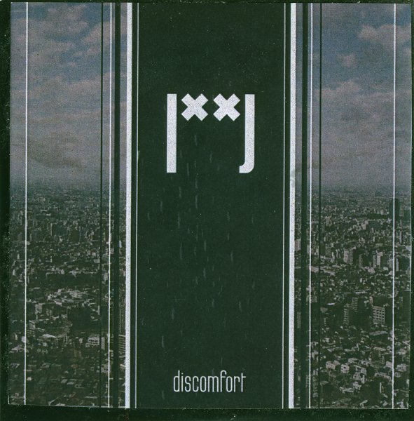

**|˟˟|** (pronounced **Gate**) is a project dedicated to improvised and experimental music, founded in 2009 in Tokyo by **Lajos Ishibashi-Brons**, originally from the Netherlands. As a solo project, he released the first two releases _Discomfort_ and _No Exit_. Later in 2009, **Takahito Hayashi** joined the project, playing tenor sax and assorted other woodwinds. Together they recorded this year's album _Iterations_. Recently, Lajos has been forced to reduce the project to a solo effort again, and he is currently preparing new material.

One of the key aspects of **|˟˟|**'s music is definitely the use of unorthodox and handmade instruments. A full description can be found on the [official homepage](http://www.lc.dds.nl/gate/info.html), but important to mention are at least the _sousen_, a four-string instrument used both for rhythms and loops, and for melodic parts, and an electric _morin khuur_, a bowed instrument from Mongolian tradition. With these instruments and others, and tools to create effects and loops, Lajos creates his fully improvised, which are selected for inclusion on releases without any post-editing.

Continuing below, this retrospective will now take a look at the three releases mentioned above, and give a sketch of the unique sounds and experiments produced by **|˟˟|** thus far. In addition to these releases, there is also the 2010 self-released CDr _Kaminaritaki_.

\[caption id="attachment\_1446" align="aligncenter" width="148" caption="Discomfort"\]\[/caption\]

_Discomfort_ is the debut release, put out in 2009 by **The Pet Goat** **Records** in a handmade CDr package. Like all of the albums to follow, it is a full one, clocking over one hour in music, distributed over songs ranging from quite brief (around two minutes) to long tracks beyond the ten-minute mark. On most tracks on this release, the use of chords on a heavily downtuned and distorted guitar is the prominent noisemaker, placing the music well in the direction of drone doom. **|˟˟|**'s sound remains unique though, through the use of all sorts of weird noises and rhythms from Lajos' one-of-a-kind instruments. Another line that runs through the album is a sort of free rock with a bluesy touch, such as on the track "34 ss.gt". Here we can hear cues from classic experimental artists like **Frank Zappa** and **Captain Beefheart**. The combination of these elements makes for a unique sound that has little parallels, as far as I know, in contemporary underground music.

\[caption id="attachment\_1447" align="aligncenter" width="150" caption="No Exit"\]\[/caption\]

_No Exit_ was released on **Fluttery Records,** also in 2009, and it highlights some different areas of Lajos' solo sound. Guitars are still present here and there, but the album leans less on thick chords and drones than _No Exit_. There is a more prominent role for more abstract sounds, weird noise, and other experimental whims. There are, for example, ghostly string murmurs on the short "38 ss.mk", but a chugging noise attack in loops on "13 ss.rd.gt". "8 ss.rd.mk" contains sounds that lie somewhere between shifting radio noises and the scratching of records. There are also several longer soundscapes on this album, culminating in the 27-minute final track. This one, entitled "27 ss.rd.mk.bs", starts out very subtly, with a soft rhythmic loop, some bow scratchings, and occasional bass notes, later adding different sounds, though with the same low intensity.

A brief not about the systematic track titles: they contain information about the instruments used in the improvisation, and I presume the order in which they were recorded.

\[caption id="attachment\_1453" align="aligncenter" width="150" caption="Iterations"\]\[/caption\]

The most recent album, also released on Fluttery, is _Iterations_. As mentioned above, Hayashi adds various woodwinds to this album, resulting in a further evolution of the sound of this project. In general, the tracks on _Iterations_ can be said to be a bit more minimalistic, greatly downplaying the role of guitar and dense textures, instead opting for more space and breathing room. This allows Hayashi's saxophone and flute to come forth clearly, as well as some melodies by Lajos' more unorthodox instruments. The key sound that emanates from this album is that of free music: whether it be jazzy or with a more - at times Japanese - freefolk tinge, or just straight-out noisiness. As on previous albums, ideas sometimes take the form of brief two-minute sketches, but often the tracks are spread out over longer periods of time, here resulting in a number of sessions that are calm and expansive.

On the whole, I find the music presented by **|˟˟|** on these three releases fascinating and varied, each having its own particular focus of style, while staying absolutely faithful to the philosophy of free improvisation. _Discomfort_ is best described as an exercise in heavy drone doom and free rock; _No Exit_ is looser and noisier, setting a step further in the direction of abstract improvisations; _Iterations_, finally, is a bit more organic, heading in the direction of free folk and jazz, while not totally relinquishing noisy and industrial sounds. Not all compositions on these releases are equally strong or captivating, but Lajos manages to avoid for the greater part the improvisational pitfalls of meaningless meandering. The structures imposed by looping rhythms and sounds work admirably in this context, and they give the listener something to hang on to while other instruments set out into the great unknown.

In short, if you are interested in strictly improvised music with an uncompromising and original musical philosophy, these albums are all recommended for your listening pleasure, each one geared slightly towards particular concrete musical styles that can help as a reference point for the listener.

\-**O.S.**

Links:

[Official |˟˟| Website](http://www.lc.dds.nl/gate/index.html) [|˟˟| Bandcamp](http://gate.bandcamp.com/) [Fluttery Records](http://www.flutteryrecords.com/index.html) [The Pet Goat Records](http://mypetgoatrecords.tripod.com/)
