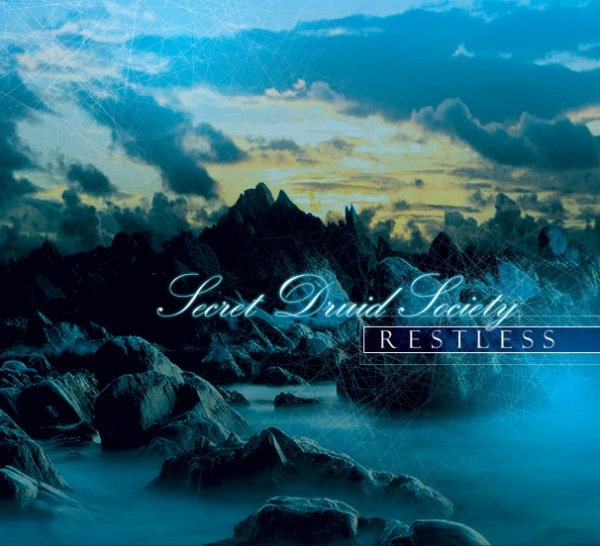

artist: **Secret Druid Society** release: _Restless_ format: CD year of release: 2010 label: [First Fallen Star](http://www.firstfallenstar.com/) duration: 52:43

detailed info: [discogs.com](http://www.discogs.com/release/2347501)

The **Secret Druid Society** is an enigmatic Australian project - members undisclosed - dedicated to dark ambient soundscapes that conjure up feelings of wilderness and isolation. This album, _Restless_, was released in a beautiful digipak by **First Fallen Star** records.

The dark tracks on this album sound quite empty and spacious, and they describe the landscape of our planet after all human life is gone. It is desolate, but breathing and moving at its own subtle pace. The music of these places is devoid of conventional melody, consisting only of the droning of the winds, oceanic waves, and the shifting of the stones.

An admirable creation of atmosphere can be found here, but sadly enough the music only rarely offers enough variation or structure to reward close listening. Most of it seems not only bereft of human life, but also of human interest, fading into the background readily. As such, _Restless_ is more like a backdrop for other thoughts and activities, more than a work that commands attention by closely describing an unknown and potentially interesting world.

A pity, for this is an otherwise very nice release, with a good atmosphere and solid concept, topped off by a wonderfully laid out booklet and packaging, designed by Eclipse Media from source images by various photographers. It is an interesting album for lovers of minimalistic drone and dark ambient, but I hope that future releases will have a little more substance.

Reviewed by **O.S.**

Tracklist:

1\. Deserted World (4:43) 2. Restless (Foreboding) (11:13) 3. Lonely Moon (3:47) 4. Phobia (Stones Are Moving) (5:37) 5. Restless (Night Is Here) (14:25) 6. Dawn Over The Deserted World (5:25) 7. Endless Ice Plains (7:33)
