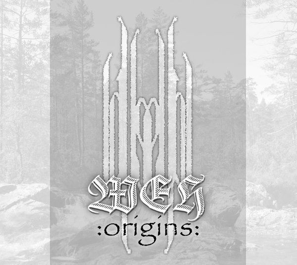

artist: **Weh** release: _Origins_ format: 2xCD year of release: 2010 label: [Soulseller](http://www.soulsellerrecords.com/) duration: 1:57:33

detailed info: [discogs.com](http://www.discogs.com/release/2571013)

_Origins_ is a double-CD release compiling all work put out so far by Norwegian neofolk artist **Erik E**, working under the name of **Weh**. It starts with _The Death_ EP from 2002, and continues all the way up to the present year, with several new tracks released as _Origins_. Dutch extreme metal label **Soulseller** has put it all on two discs in a nice gatefold sleeve, making the material available to a broader audience after all these years. Throughout all the music on these two full discs, Erik opts for basic neofolk approach of guitar and voice, both produced warmly and clearly on all the releases featured. Additional instrumentation is quite rare and often minimal, restricted to the use of tambourine, samples and subtle keyboards in a couple of tracks.

The first EP reveals the project's background in the extreme metal world, with the addition of some mediocre growled vocals in a number of the tracks, which tends to clash with the subdued style of the music in general. The rest of the EP's aspects didn't really appeal to me either, with its rather simplistic (and militant) lyrics expressing sentiments of primitive anti-christianity and similar themes common in metal.

Such themes can also be found on some of the other material on this compilation, but thankfully, they becomes more and more mixed with personal and melancholic reflections. Examples are calmer tracks like "The War Is Over", "Any Other Day", and "The Grave". As we move on across disc one, many tracks remind one pleasantly of contemporary German neofolk artists like **Orplid** and **Forseti**, though rarely quite matching that level.

Disc two starts off promisingly with a very nice cover of **Windir**'s "Likbør", which featured earlier on the _Valfar, Ein Windir_ album, a tribute released after the death in 2004 of its main songwriter and musician **Valfar** (Terje Bakken). This longer track manages to capture the melodic movements of [the intense black/viking metal of the original](http://www.youtube.com/watch?v=RmWyQJsjVwU) quite nicely, though perhaps not quite matching the overall level, especially on the second half, which is simply way more epic in electric guitar.

The further tracks on this second disc in general show more sophistication than those on the first, especially in terms of songwriting. There is room for longer compositions, and Erik incorporates a bit more soloing and the like to add variation to the tracks. Nevertheless, I must say that I absolutely nowhere blown away by these tracks. One has to recognise that it requires a measure of courage to write personal songs like this and put them forward in a straightforward manner. However, in the case of **Weh**, there is little artistic value to it all, particularly when compared to other artists. Both the music and the full spectrum of the themes (heathenry, melancholy, rebellion, introspection, etc.) have been done far better when you take the music of the past 25 years into account.

There is certainly a rising line to be discovered in the chronology of these tracks, but the final level is still not that good compared to many of the neofolk and singer/songwriter artists out there. Perhaps **Weh** will be able to continue this ascending curve, and produce a future release that is able to hold its own out there. _Origins_, however, while containing a number of enjoyable tracks, is little more than an archival collection, of interest only to neofolk completists and those who are already familiar with some of the works on these two discs.

Reviewed by **O.S.**

Tracklist:

_The Death_ (2002) 1.1 Deadline (2:19) 1.2 Darkness Part One (2:13) 1.3 Hang 'Em High (1:39) 1.4 The Justice Song (1:05) 1.5 Lady Death (2:40)

_All The Sinners Are Sleeping Now_ (2003) 1.6 Where Evil Hides Intro (1:21) 1.7 On Your Knees (2:35) 1.8 Sealing Fates (2:09) 1.9 Sometimes I Bleed (4:17) 1.10 Walk The Other Way (2:21) 1.11 The War Is Over (5:23) 1.12 Where Evil Hides Outro (1:18)

_The Coffee's Cold In The Morning, The Beer's Warm At Night_ (2004) 1.13 Any Other Day (2:42) 1.14 Barbed Wire Tight (2:32) 1.15 Ballad To The Harvest (2:42) 1.16 World Of Pain (3:34) 1.17 Darling Meet Demise (1:57) 1.18 The Grave (2:58) 1.19 When The Raven Spoke My Name (2:41) 1.20 Skeleton (3:43) 1.21 Summer Went South (3:26) 1.22 Desolate (3:00)

2.1 Likbør (5:26)

_Hoof & Horn_ (2005) 2.2 Heathen Ground  (6:05) 2.3 The Endlessness (3:01) 2.4 Ruin (6:03)

_North_ (2006) 2.5 And The Bells Are Ringing Doom (4:08) 2.6 North (5:07) 2.7 Darkness Part Two (3:04) 2.8 The Man Of Gallow Proud (4:57)

_Origins_ (2010) 2.9 The Seaward Song (3:18) 2.10 The Road And The Forest (4:09) 2.11 Nihil Interit (4:48) 2.12 Sigars Øyk (1:33) 2.13 Origins (3:56) 2.14 En Bekk Av Blod (3:18)
