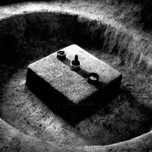

[Cloudscape #9: December 2010](http://www.mixcloud.com/eveningoflight/cloudscape-9-december-2010/?utm_source=widget&utm_medium=web&utm_campaign=base_links&utm_term=resource_link) by [Evening Of Light](http://www.mixcloud.com/eveningoflight/?utm_source=widget&utm_medium=web&utm_campaign=base_links&utm_term=profile_link) on [Mixcloud](http://www.mixcloud.com/?utm_source=widget&utm_medium=web&utm_campaign=base_links&utm_term=homepage_link)

00:00 | Coil | Ubu Noir | Scatology | 1984 02:14 | Maarten van der Vleuten | A.XX.VIII.MCLXXXXI | [The Scars Remain](http://www.eveningoflight.nl/2011/02/22/new-maarten-van-der-vleuten-2lp-on-tonefloat-out-feb-27th-2011/ "New Maarten van der Vleuten 2LP on Tonefloat out Feb. 27th 2011") | 2011 08:30 | Karjalan Sissit | Loppuun Nussittu Avioliitto | [Fucking Whore Society](http://www.eveningoflight.nl/2009/11/03/review-karjalan-sissit-fucking-whore-society-2009/ "Review: Karjalan Sissit – Fucking Whore Society (2009)") | 2009 11:37 | Veinke | ii | Collection III: The Black Summer | 2000 18:40 | Shub-Niggurath | Yog-Sothoth | Les Morts Vont Vite | 1986 30:56 | Coil | Heaven's Blade | The Ape of Naples | 2005 34:33 | Black to Comm | Void | Alphabet 1968 | 2009 37:09 | Cisfinitum | Tactio VI | [Tactio](http://www.eveningoflight.nl/2008/07/27/review-cisfinitum-tactio-2008/ "Review: Cisfinitum – Tactio (2008)") | 2008 43:10 | Gnaw Their Tongues | La Mort dans Son Ineffable Grandeur | [L'Arrivée De La Terne Mort Triomphante](http://www.eveningoflight.nl/2010/12/31/review-gnaw-their-tongues-larrivee-de-la-terne-mort-triomphante-2010/ "Review: Gnaw Their Tongues – L’Arrivée de la Terne Mort Triomphante (2010)") | 2010 50:30 | Coil | Batwings (A Limnal Hymn) | Musick to Play in the Dark, Vol. 2 | 2000
