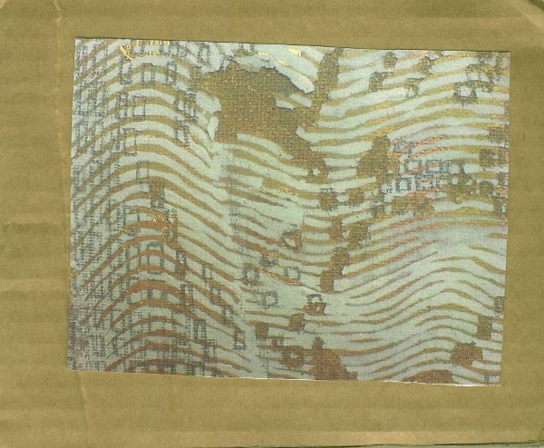

artist: **Various** release: _LAILY 03_ format: CDr year of release: 2010 label: [Laily](http://lailyrecordings.wordpress.com/) duration: 36:32

detailed info:  [discogs.com](http://www.discogs.com/Various-Various-Artists/release/2535397)

This compilation is the third release on the **Laily Recordings** label, bringing together a selection of instrumental tracks from contemporary folk and experimental artists, including label owner **Mark Kluzek**'s project **The Doomed Bird of Providence**.

Keyboardist **Jayson Cooper** opens the album with a melancholic piano piece in a suitable reverberating lo-fi production, suggesting mournful sounds in a dusty parlour somewhere. Both **Flake Brown** and **Phil Manchester** bring folk traditionals in an instrumental arrangement on solo guitar and delayed cello, respectively. Both also suffer from the same problem: a lack of skill to convincingly deliver such a piece when the listener's attention is fully focused on the instrumental playing. The Doomed Bird of Providence's "Dives and Lazarus" fares much better in its stark accordion setting. **Michael Tanner**'s **Plinth** has the longest track, and one of the nicest, with the relaxing acoustic ambient drones of "Dulcimer Music 2". **Rev Simpkins** contributes two dense experimental organ piece with some pretty melodies at their base, but a lot of noisy swells and dissonance as well. The final  piece is also an organ work, but by album opener Cooper again. "Interlocking Mysteries of the Divine Labyrinth" is a beautiful epic piece with a touch of minimal music influence thrown in.

The release is a bit hodge-podge in multiple respects. The handmade cover is cobbled together from cardboard and vague prints of what must have been rather nice mixed-media abstract visuals. The result is a bit so-so, reflecting some of the less attractive leanings of cottage industry. The same goes for the music, which ranges from disappointing to quite good, but never spectacular. As such _LAILY 03_ is a nice enough compilation, and certainly worth checking out if you fancy new works by one or more of the contributing artists, but it could also have been a whole lot better.

Reviewed by **O.S.**

Tracklist:

1\. **Jayson Cooper** - Lonely Hearts (3:56) 2. **Flake Brown** - Hardiman The Fiddler (2:42) 3. **Phil Manchester** - The Gathering Song (2:52) 4. **The Doomed Bird Of Providence** - Dives And Lazarus (2:15) 5. **Plinth** - Dulcimer Music 2 (9:18) 6. **Rev Simpkins** - Jericho Part 2 (4:10) 7. **Rev Simpkins** - Love Unknown (4:31) 8. **Jayson Cooper** - Interlocking Mysteries Of The Divine Labyrinth (6:52)
