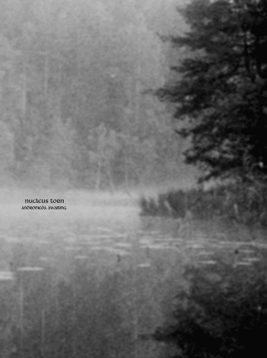

artist: **Nucleus Torn** release: _Andromeda Awaiting_ format: CD year of release: 2010 label: [Prophecy](http://www.prophecy.cd/) duration: 46:20

detailed info: [discogs.com](http://www.discogs.com/release/2584535)

Switzerland's **Fredy Schnyder** has been active with his project **Nucleus Torn** for over a decade now, but the release of _Andromeda Awaiting_ this fall may very well be his ticket to a wider audience. This latest album, released on **Prophecy**, is high point of this band's work so far, containing over 45 minutes of progressive folk, tinged with elements of classical, early music, and a touch of progrock.

The long opening track showcases many of the band's talents; excellent melodies on guitar, strings, flute, bouzouki, mandolin, and others are paired with male and female vocals in a composition that is full of twists and turns, without becoming chaotic or overwhelming. There is a natural, relaxed flow to the music that keeps new elements coming a pleasant, steady rate.

Following this long track are two shorter interludes, both showcasing more wonderful melody work. Especially the second track is an example of compact and powerful songwriting, where an original and beautiful guitar melody waltzes along, later joined by piano accents, strings and **Maria D'Allessandro**'s understated vocals. Like the short third track, it's romantic, melancholic, and more than a little sweet, but definitely something to put on repeat if you're in the right mood.

The fourth track is the heaviest one, introducing a darker oriental sound carried by flute and strings and drums that add a confident swagger to the song. Progressive rock elements are clearest here, the general sound and rhythm of the song reminding one of an acoustic **Opeth** at times. The fifth track is over before you know it, giving a short nod to the aforementioned brilliant melody from track II. The last track then, mirrors the first in some ways, mostly in the way it sets up a continuous flow that stays solid over fifteen minutes, but most particularly the last few minutes, which are a return to the melodies that opened the album, closing the circle.

There's a lot to love in this album, which is an excellent example of how to pull a red thread from musical history, running from early music and classical through progressive rock and metal, and expressing it in a mixture of acoustic instruments drawn from all of these traditions. If there are any lesser sides to _Andromeda Awaiting_, I think it would be the vocals, which are a bit understated and clichéd, though never distracting or annoying. It wouldn't have hurt, though, if they were either more integrated into the music and in a complementary role, or so exceptionally good as to warrant centre stage.

All in all, though, this is a work to be proud of, one of the few that can truly be compared to the best out there - such as **Tenhi**'s recent work - without falling short. An excellent album that will appeal to a broad audience in the neofolk and related areas, and which promises some nice things for the future.

Reviewed by **O.S.**

Tracklist:

I (15:33) 
II (3:55) 
III (1:58) 
IV (8:11) 
V (0:48) 
VI (15:55)
