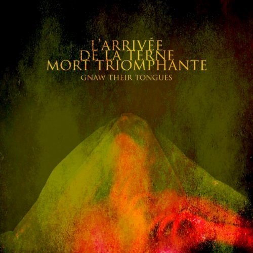

artist: **Gnaw Their Tongues** release: _L'Arrivée de la Terne Mort Triomphante_ year of release: 2010 format: CD, LP label: [Candlelight](http://www.candlelightrecords.co.uk/), [Crucial Blast](http://www.crucialblast.net/), [Burning World](http://www.burningworldrecords.com/) duration: 44:49

detailed info: [discogs.com](http://www.discogs.com/Gnaw-Their-Tongues-Larriv%C3%A9e-De-La-Terne-Mort-Triomphante/master/291005)

Frisia's pride - and perhaps that of the entire Netherlands - when it comes to experimental musical terror is without a doubt **Gnaw Their Tongues**, a project of **Mories de Jong**. This year's album, bearing the epic title _L'Arrivée de la Terne Mort Triomphante_, forms one of the highlights of Gnaw Their Tongues discography thus far, with its exquisitely balanced combination of neoclassical grandeur and dashes of martial, industrial, and extreme metal.

This stylistic mixture is not new in itself. At the very least, we were able to hear it in action on 2009's album _All the Dread Magnificence of Perversity_. However, I do believe that the way these elements are arranged on _L'Arrivée_ is just a bit more refined. The album as a whole has a more consistent flow, making it more than a collection of five separate tracks, and that is after all what the album as a format is for.

The album jumps straight into the action with its title track, launching full-blown choirs, orchestral swells and industrial percussion. More impulses later on come from mad screams, drums, and guitars that blend seamlessly with the other instruments, suggesting a heavy metal sound, without putting it centre stage. The album basically oscillates between intense parts and subtler pieces, constantly maintaining a captivating flow full of overpowering emotions.

_L'Arrivée_ is certainly not Mories' sickest album to date. Earlier works dwelled heavily on torture, sadism, and bizarre rituals, while this one is concerned, basically, with Death. And that is more than impressive enough. The great nothing might well be one of the most inspiring concepts in existence, and even though it is most likely no more than nothing, for that very reason, we surround it with an aura that is ominous and awe-inspiring. The arrival of death is heralded by an onrushing presence that foretells that all will be lost. In this sense, death can come as a blow, but also as a release. I think this ambiguity is expressed beautifully by this album as well; there is a strong presence of violence and death as a destructive force, and also of sadness and loss in the more introspective passages. But something in the music reminds us that the destruction and loss that death brings also relieves us of all our burdens. This spectrum of feeling runs through the entire album, perhaps culminating locally in the central track, which to me literally shows us death in all its _ineffable grandeur_.

This work of death is an excellent album on many points; not only as an original piece of dark, dark music that successfully crosses genre boundaries, but also as a high point in the musical output of De Jong so far, and as a successful concept album with a powerful image, single yet manifold. Finally, the presentation leaves little to be desired. _L'Arrivée_ is released with subtle and fitting cover art in colour on CD, released by **Crucial Blast** in the US, and by **Candlelight** in Europe. There is also a fine vinyl edition with black & white gatefold cover, and either black or gold vinyl, released by Dutch **Burning World Records**. A highly recommend work for lovers of extreme experimental music, and definitely one of the darkest - and best - albums of the year.

Reviewed by **O.S.**

Tracklist:

1\. L'arrivée De La Terne Mort Triomphante (9:49) 2. Les Anges Frémissent Devant La Mort (11:35)

3\. La Mort Dans Toute Son Ineffable Grandeur (8:12) 4. Le Chant De La Mort (7:02) 5. Le Trône Blanc De La Mort (8:11)
