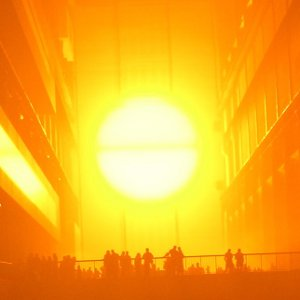

[Cloudscape #10: January 2011](http://www.mixcloud.com/eveningoflight/cloudscape-10-january-2011/?utm_source=widget&utm_medium=web&utm_campaign=base_links&utm_term=resource_link) by [Evening Of Light](http://www.mixcloud.com/eveningoflight/?utm_source=widget&utm_medium=web&utm_campaign=base_links&utm_term=profile_link) on [Mixcloud](http://www.mixcloud.com/?utm_source=widget&utm_medium=web&utm_campaign=base_links&utm_term=homepage_link)

00:00 | Depeche Mode | Black Celebration | Black Celebration | 1986 04:07 | Joonatan Elokuu | Wicker Girl | [A Vagrant's Whim](http://www.eveningoflight.nl/2011/01/29/review-joonatan-elokuu-a-vagrants-whim-2010/ "Review: Joonatan Elokuu – A Vagrant’s Whim (2010)") | 2010 07:29 | Mekanik Kommando | Run Rintintin Run | [Shadow of a Rose](http://www.eveningoflight.nl/2011/01/07/review-mekanik-kommando-shadow-of-a-rose-1986/ "Review: Mekanik Kommando – Shadow of a Rose (1986)") | 1986 13:00 | Coil | Tattooed Man | The Ape of Naples | 2005 19:16 | Aarktica | Ocean | Pure Tone Audiometry | 2003 23:50 | Sixth Comm | Content | Asylum | 1990 25:28 | Lycia | Sleepless | The Burning Circle and Then Dust | 1995 28:25 | Bengalfuel | Blue Spring | Feldspar | 2010 32:40 | In Gowan Ring | Way to Blue | Exists and Entrances | 2007 38:19 | Agitated Radio Pilot | Take Heed of Your Hurt | [World Winding Down](http://www.eveningoflight.nl/2008/02/01/review-agitated-radio-pilot-world-winding-down-2007/ "Review: Agitated Radio Pilot – World Winding Down (2007)") | 2007 41:20 | Swans | Will We Survive | White Light from the Mouth of Infinity | 1991 48:05 | Rozz Williams & Gitane Demone | A World Apart | Dream Home Heartache | 1995 51:50 | Dead Can Dance | In the Kingdom of the Blind, the One-eyed Are Kings | The Serpent's Egg | 1988 55:50 | Tenhi | Neidiie | [Folk Aesthetic 1996-2006](http://www.eveningoflight.nl/2008/01/01/review-tenhi-folk-aesthetic-1996-2006-2007/ "Review: Tenhi – Folk Aesthetic 1996-2006 (2007)") | 2007
