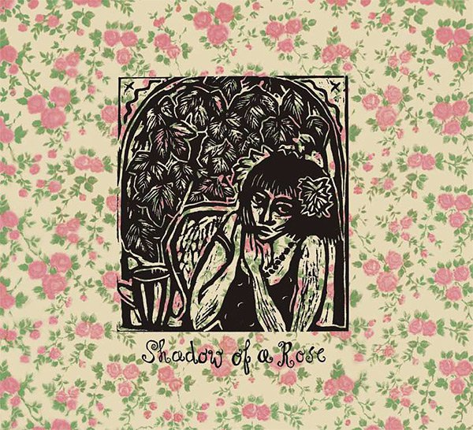

\[caption id="attachment\_1522" align="alignright" width="150" caption="2010 CD Cover"\]\[/caption\]

artist: **Mekanik Kommando** release: _Shadow of a Rose_ format: LP, CD year of release: 1986, 2010 label: Rosebud, [cat|sun](http://catsun.monotyperecords.com/) duration: 39:24

detailed info: [discogs.com](http://www.discogs.com/Mekanik-Kommando-Shadow-Of-A-Rose/master/290780)

The name **Mekanik Kommando** is an express ticket to Dutch underground music of the 1980s, a period which I sadly never got to experience, being born too late, as they say. Nevertheless, history is there to be discovered, and with the aid of beautiful rereleases like this one, we can experience bits of the music of days gone by. _Shadow of a Rose_ was the fourth studio album by this band, which debuted in 1981 with _It Would Be Quiet In The Woods If Only A Few Birds Sing_, which was also rereleased in 2010 by **tonefloat**. Since the original LP, self-released on **Rosebud** in 1986 is hard to get nowadays, this gatefold digifile remaster and rerelease on **cat|sun** is a very nice alternative.

The music on this album holds a middle ground between the experimental new wave of the early works and the psychedelic folk of **The Use of Ashes**, the band which **Peter** and **Simon van Vliet** started in the 1990s, and which continues to this day. This combination results in a series of songs with a very original sound, mostly based on acoustic and electric guitars, bass, synths, violin, and subtle drums, but with quite a few sojourns into ambient parts and with loads of freaky effects. A lot of the tracks sound quite folky, with a combination of acoustic guitar and violin, and dreamy almost hippie-like vocals, and in many senses this album was way ahead of the more recent revival of psychedelic folk.

Highlights of the album are found in the third and title track, in which **Bennie Stortelder**'s violin combines perfectly with the melodies worked out in the bass and guitar arrangement. Later on, the track features some nice percussion, and vocals by keyboardist **Mirjam van Hout**, which fades nicely into "Where the Wolf Sleeps", an experimental piece somewhat in the direction of early **Dead Can Dance**. Another nice track is "Run Rintintin Run", a bass-driven instrumental that really brings a smile to your face. From a musical point of view, the experimental "Wings of the Dragon" is perhaps the most interesting and original track.

Despite a lot of good points, listening back, this is not a totally mind-blowing album. I'm not particularly fond of the heavily accented vocals, and in general the songwriting, though with a lot of original bits scattered around, doesn't really command your attention at all times in the way better albums do. What's left, though, is a very original album with definite highlights that was really ahead of its time in some ways.

_Shadow of a Rose_ is therefore highly recommended both for its own merits, and as piece of musical history, being an essential link in the chain of alternative and psychedelic folk from the 1960s till today, released in a decade which was perhaps a low point in this tradition. And, as said, the quality of the cat|sun rerelease will definitely not disappoint you.

Reviewed by **O.S.**

Tracklist:

1\. River Of Singers (3:06) 2. The Blue Western Sea (4:39) 3. Shadow Of A Rose (4:46) 4. Where The Wolf Sleeps (2:26) 5. A Picnic In The Castlegarden (4:28) 6. Scars (2:18) 7. Run Rintintin Run (5:49) 8. Wings Of The Dragon (6:16) 9. First Snow (3:42) 10. First Reprise (1:55)
