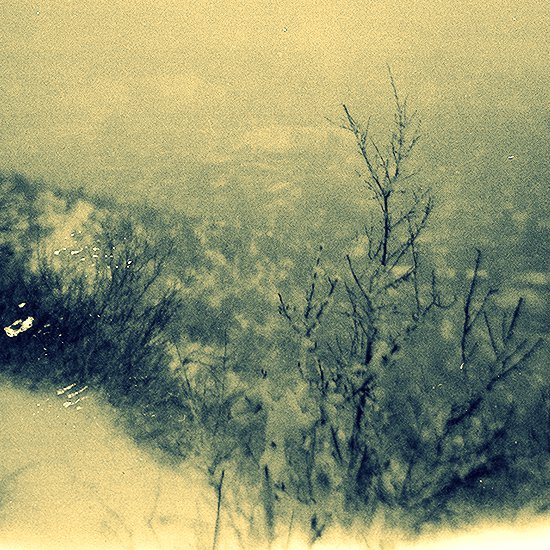
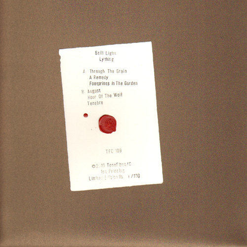

\[caption id="attachment\_1530" align="alignright" width="150" caption="CDr Cover"\]\[/caption\]

artist: **Still Light** release: _Lything_ format: CDr, LP year of release: 2009, 2010 label: [Apollolaan](http://www.apollolaan.co.uk/), [Tonefloat](http://www.crazy-diamond.nl/tonefloat/) duration: 37:45

detailed info: [discogs.com](http://www.discogs.com/Still-Light-Lything/master/300996)

As I've said before: hidden gems are one thing that make the reviewing business fun. Well, here's another one. **Still Light**'s debut album _Lything_ has seen only a 150 copies so far; 50 in 2009 on a handmade **Apollolaan** CDr, and last year 100 lovely LPs on **Tonefloat C**. This is a ridiculous number, because the music on this album could easily go on to sell ten times as much, at least.

The polished prog folk/rock on _Lything_ is dreamed up by **Kirill Nikolai**, aided here by **Sand Snowman** and **Lucy Hague** on various instruments and vocals. From the opening waltz of "Through the Grain", it is clear that we're dealing with thoroughly refined music that takes its cues from a rich tradition of progressive rock and folk styles, from **Pink Floyd** and their contemporaries to the acoustic outings of bands like **Opeth** and **Porcupine Tree** in recent days, not to mention strong parallels to the dreamlike nature of Sand Snowman's solo works. No heavy rock or death metal parts, though. The arrangement of the music is composed of softer electric and acoustic guitars, organ, flute, bass, and occasional drums and percussion. Natural sounding male-female vocal harmonies dominate most of the tracks, all of which have a wistful, melancholic tinge.

\[caption id="attachment\_1531" align="alignleft" width="150" caption="LP Cover"\]\[/caption\]

All six tracks are strong, each with particular touches that add variation, such as the sampled old lady's narrative on "Footprints in the Garden". "August" is perhaps the strongest track, along with the opener, possessing a compelling driving rhythm in the main melodic arrangement, perfectly accentuated by vocals, soloing, and the ambient interlude. Mention must also go to the final track with its catchy banjo and piano support.

_Lything_ is perhaps not at the absolute height of originality, but apart from that this is a most excellent album, deserving of a considerable audience in the world of progressive rock and alternative folk. I expect much of **Still Light**'s future, and if these expectation prove well-founded, this album will soon be a collector's item. All the more reason to check it out right now.

Reviewed by **O.S.**

Tracklist:

1\. Through The Grain (6:12) 2. A Remedy (5:48) 3. Footprints In The Garden (4:58)

4\. August (10:47) 5. Hour Of The Wolf (2:49) 6. Tenebre (7:11)
