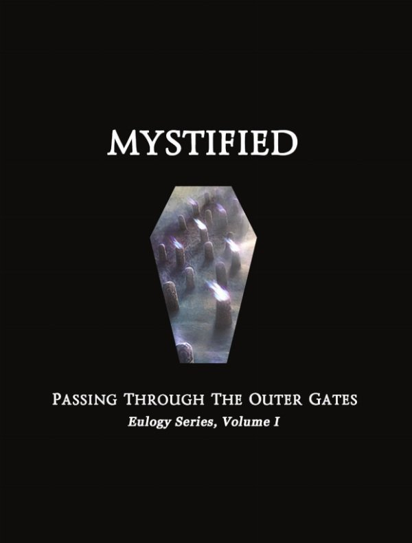

artist: **Mystified** release: _Passing Through the Outer Gates_ (Eulogy Series, Volume 1) format: CD year of release: 2010 label: [First Fallen Star](http://www.firstfallenstar.com/) duration: 50:06

detailed info: [discogs.com](http://www.discogs.com/Mystified-Passing-Through-the-Outer-Gates/release/2347489)

**Mystified** is the _nom de guerre_ of **Thomas Park**, who manages to put out more than a dozen releases every year. It makes you wonder whether the level quality of each of those can possibly be adequate, but in the case of _Passing Through the Outer Gates_, there is no cause for concern, as this is a subtle ambient album that combines spiritual concept matter with crafty composition.

This CD is volume one in the _Eulogy Series_ by **First Fallen Star** Records, a conceptual line in which artists are encouraged to musically reflect on their own death. In Park's case, the result is an expression of the idea of the soul posthumously passing through a series of gates, before reaching the afterlife. This belief, which Park for himself terms "Dark New Age", has its parallels in Gnosticism and related religious currents.

The eight tracks here represent these stages of the journey of the soul. At first, in the beginning tracks, orchestral sounds dominate, brief sketches of melody constituting minimal soundscapes. Subdued percussion rhythms are already present here, but only in later tracks do these really come to the fore, as we can hear in "Lost My Body", "Approaching Something", and "Soul in Motion". Particularly the latter two have strong, driving rhythms. One imagines the soul gently gliding and searching during the first stages, picking up speed gradually on its way toward "The Final Gate". This one is taken calmly once more, consisting mostly of snippets of melody falling into the right places, like magic words to open the gate.  "The Soul's Resting Place" seems merely a short afterthought, as if it was the journey that really mattered after all.

A wonderful journey it was, both calming and engaging. This isn't an album that exactly commands attention, and it is in some ways easy to dismiss. However, it certainly does reward attention, revealing a subtlety of composition that is a joy to listen to during quiet moments. A successful first instalment for this series, in other words, and one packaged in a very fine A5 digipak, at that. The front cover is black with silver lettering, with a coffin-shaped cut-out in the centre, revealing part of the rich artwork behind. Next up in the series is **Svartsinn**, so there's more to look forward to.

Reviewed by **O.S.**

Tracklist:

1\. Eulogy For Thomas Park (7:50) 2. Dark Transition (7:37) 3. Lost My Body (4:46) 4. Up Down Or Out (8:05) 5. Approaching Something (6:08) 6. Soul In Motion (5:18) 7. The Final Gate (7:36) 8. The Soul's Resting Place (2:47)
