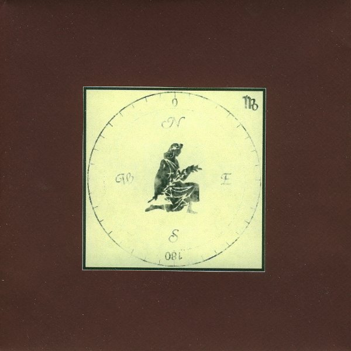

artist: **Joonatan Elokuu** release: _A Vagrant's Whim_ format: CDr year of release: 2010 label: [Utupuu](http://kiiltomatolyhty.blogspot.com/) duration: 46:07

detailed info: [discogs.com](http://www.discogs.com/Joonatan-Elokuu-A-Vagrants-Whim/release/2680086)

After several years of building up steam as **Aura Shining Green**, it seems **Joonatan Elokuu** has recently settled into a relatively steady rhythm of writing and recording songs. _Mushroom Heart_ was a very pleasant album from 2009, and this one, self-released in late 2010, is its equally fine successor.

Even more so than the last time around, travels form the inspiration for this collection of singer/songwriter folk pieces. The road took Joonatan and his wife Helena through Southern Europe and Asia, as we can see from titles like "Montségur", "Valencia", "Silk Road Sunrise", and "Rishikesh Song". This, however, hasn't resulted in an overload of oriental and raga influences, as has been a fairly common occurrence in folk music since the 60s. Though certainly inspired by all kinds of vagaries from modern folk, guitar and voice dominate practically everywhere on these songs of Joonatan's, and frankly, he needs little more to make perfectly enjoyable and intimate songs.

That's not to say there isn't some variety to be found. Melodies are executed with flair and diversity across the different tracks, and in some places intensities of arrangement highlight the flow of the music, such as in the rich "Wicker Girl", where multiple guitar lines and additional vocals by Helena fill up the sound perfectly. At the other end, there is the ambient spoken word piece "Nancy", a brooding track based on soft organ chords in the background, some use of samples, and introspective text. I wouldn't have minded even more of these experimental sojourns, and perhaps it would have made the album more balanced and powerful.

As it stands, though, _A Vagrant's Whim_ is another nice album from a warm voice among the underground folk wanderers of today. Joonatan and Helena are on the move once more, but there are plans of rereleasing remastered version of the Utupuu albums in the future. Until then, the two have made all of their recent albums available as a free high-quality download on their website [here](http://kiiltomatolyhty.blogspot.com/2010/08/joonatan-elokuu-vagrants-whim-utupuu02.html), so there is no excuse for not checking their material out right now, and if you like what you hear, I'm sure they might have some physical copies available for sale.

Reviewed by **O.S.**

Tracklist:

1\. A Song Writ On Leaves (3:17) 2. Rishikesh Song (3:07) 3. Wicker Girl (3:44) 4. Silk Road Sunrise (1:50) 5. A Dream By The Arabian Sea (3:52) 6. Montségur (1:24) 7. Born Again With A Hedgehog's Heart (5:30) 8. Nancy (4:07) 9. Valencia (5:11) 10. Brother Sun (2:58) 11. Like Christ And Osiris (5:19) 12. Galilee (5:48)
