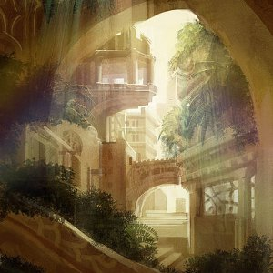

[Cloudscape 11: February 2011](http://www.mixcloud.com/eveningoflight/cloudscape-11-february-2011/#utm_source=widget&amp;utm_medium=web&amp;utm_campaign=base_links&amp;utm_term=resource_link) by [Evening Of Light](http://www.mixcloud.com/eveningoflight/#utm_source=widget&amp;utm_medium=web&amp;utm_campaign=base_links&amp;utm_term=profile_link) on [Mixcloud](http://www.mixcloud.com/#utm_source=widget&utm_medium=web&utm_campaign=base_links&utm_term=homepage_link)

Time | artist | track | album | year

00:00 | Vidna Obmana | Out from the Garden Reminded (Jesu Remix) | [Chasing the Odyssee](http://www.eveningoflight.nl/2011/03/13/review-vidna-obmana-1987-2007-chasing-the-odyssee-2011/ "Review: Vidna Obmana – 1987 – 2007 Chasing the Odyssee (2011)") | 2011 07:22 | Æthenor | Vivarium | En Form for Blå | 2011 10:36 | Slowdive | Losing Today | Just for a Day \[Expanded Edition\] | 2005 15:10 | Still Light | Footprints in the Garden | [Lything](http://www.eveningoflight.nl/2011/01/19/review-still-light-lything-2009/ "Review: Still Light – Lything (2009)") | 2009 18:37 | Plinth | Chapel Blues | Early Tapes 1995-2000 | 2011 23:10 | Vidna Obmana | In Hollow Embraced | Chasing the Odyssee | 2011 26:58 | Kentin Jivek | Le Moine | [Ode to Marmæle](http://www.eveningoflight.nl/2011/03/16/march-2011-short-reviews/ "March 2011 Short Reviews") | 2010 30:23 | Nucleus Torn | Andromeda Awaiting II | [Andromeda Awaiting](http://www.eveningoflight.nl/2010/12/09/review-nucleus-torn-andromeda-awaiting-2010/ "Review: Nucleus Torn – Andromeda Awaiting (2010)") | 2010 34:14 | Cubs | Frozen Lake | [The Whispering Woods](http://www.eveningoflight.nl/2011/05/31/may-2011-short-reviews/ "May 2011 Short Reviews") | 2011 35:41 | Parhelion | Solitude | [Midnight Sun](http://www.eveningoflight.nl/2011/03/16/march-2011-short-reviews/ "March 2011 Short Reviews") | 2010 41:50-59:42 | Vidna Obmana | III - The Bowing Harmony | Chasing the Odyssee | 2011 48:22-55:35 | Ian Holloway | Tower of Winds | [Walking Through Fireflies](http://www.eveningoflight.nl/2007/12/01/review-ian-holloway-walking-through-fireflies-2007/ "Review: Ian Holloway – Walking Through Fireflies (2007)") | 2007 59:31 | Gyron V | Writing by Erasing | Silent Snowball Crescendo | 2007
