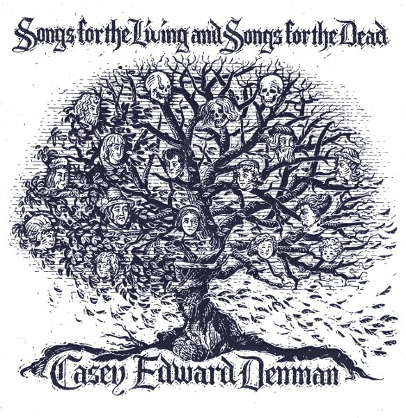

artist: **Casey Edward Denman** release: _Songs for the Living and Songs for the Dead_ format: CD-R year of release: 2010 label: [Autumn Ferment](http://www.autumnfermentrecords.com/) duration: 18:33

detailed info: [discogs.com](http://www.discogs.com/Casey-Edward-Denman-Songs-For-The-Living-And-Songs-For-The-Dead/release/2724676)

Released recently on **Autumn Ferment** was this EP by the young British singer/songwriter **Casey Edward Denman**. The four songs on _Songs for the Living and Songs for the Dead_ are a beautiful showcase of his talents, and form a debut release to be proud of.

Denman opts for the classic and time-tried combination of acoustic guitar and voice, and works them to a level that does not disappoint. Each of the first three tracks has a galloping fingerpicked melody that finds a balance between simplicity and complexity that forms a suitable backdrop to the vocals, without either overpowering or overemphasising the words. These latter are another strong point of Denman's, poetic lines that touch upon timeless themes, for example those of love, warmth, and journeying on the bittersweet "Ode to the Weathered". A final highlight is "Along the Crooked Pathway", where Denman swaps the guitar for another classic, the banjo. This instrument, too, he works to intense levels, the high-attack fingerpicks forming a strong, driving rhythm/melody combination.

If there's any point I find less appealing on this EP, it is the vocals in some parts. Through some combination of style and audio production, they sound a bit shrilly and harsh at times, when the music would have benefited from more warmth. However, nowhere does this detract from the overall high level of these songs.

It is always the question how an artist will manage the transition from EP to album, but at the very least where Denman is constrained to four tracks, this results in a release that is interesting from start to finish. This is a very fine piece of singer/songwriter folk in itself - with clear echoes of the tradition starting in the late 1960s - and one that holds promise for the future. It is also a testament to Autumn Ferment's ability to scout out fitting new artists for its growing roster. So, folk lovers are encouraged to pick this one up, and sooner rather than later, as it is limited to 200 copies.

Reviewed by **O.S.**

Tracklist:

1\. Hearts And Bones (5:25) 2. Ode To The Weathered (3:03) 3. Our Ancestors Babies (And Branches And Buds) (4:50) 4. Along The Crooked Pathway (5:15)
