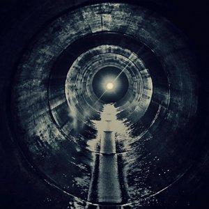

[Cloudscape #12: March 2011](http://www.mixcloud.com/eveningoflight/cloudscape-12-march-2011/?utm_source=widget&utm_medium=web&utm_campaign=base_links&utm_term=resource_link) by [Evening Of Light](http://www.mixcloud.com/eveningoflight/?utm_source=widget&utm_medium=web&utm_campaign=base_links&utm_term=profile_link) on [Mixcloud](http://www.mixcloud.com/?utm_source=widget&utm_medium=web&utm_campaign=base_links&utm_term=homepage_link)

00:00 | Dead Leaves Rising | My Face | Waking up on the Wrong Side of No One | 2001 06:13 | Sand Snowman | I Spy | [Two Way Mirror](http://www.eveningoflight.nl/2009/02/01/review-sand-snowman-two-way-mirror-2009/ "Review: Sand Snowman – Two Way Mirror (2009)") | 2009 09:58 | Current 93 | The Teeth of the Winds of the Sea | Of Ruine or Some Blazing Starre | 1994 17:02 | Dead Raven Choir | Faded | Lesbian Corpse Wolves | 2003 20:44 | Sproatly Smith | I Shall Leave You There | [We Bring You a King with a Head of Gold](http://www.eveningoflight.nl/2011/04/16/review-v-a-we-bring-you-a-king-with-a-head-of-gold-2010/ "Review: V.A. – We Bring You a King with a Head of Gold (2010)") | 2010 25:00 | Far Black Furlong | The East Room II | [The East Room](http://www.eveningoflight.nl/2007/10/01/review-far-black-furlong-the-east-room-2006/ "Review: Far Black Furlong – The East Room (2006)") | 2006 30:00 | Agitated Radio Pilot | Tiny Fires (Going Out) | The Bridesmaid & The Partial Eclipse | 2011 33:10 | Tomáš Dvorák | By the Wall | Machinarium Bonus EP | 2009 36:55 | Troum | Neheh | [AIWS](http://www.eveningoflight.nl/2007/09/01/review-troum-aiws-2007/ "Review: Troum – AIWS (2007)") | 2007 42:06 | Phantom Dog Beneath the Moon | A Shimmering Clown | [The Trees, the Sea in a Lunar Stream](http://www.eveningoflight.nl/2010/08/11/review-phantom-dog-beneath-the-moon-the-trees-the-sea-in-a-lunar-stream-2010/ "Review: Phantom Dog Beneath the Moon – The Trees, The Sea in a Lunar Stream (2010)") | 2010 48:40 | Maarten van der Vleuten | With Sorrow He Wept | The Scars Remain | 2011 52:39 | Vidna Obmana | The Ominous Dwelling | The River of Appearance | 1996 58:02 | Mar de Grises | Onírica | The Tatterdemalion Express | 2004
