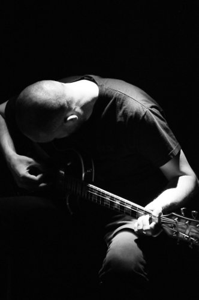
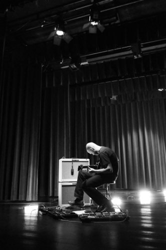
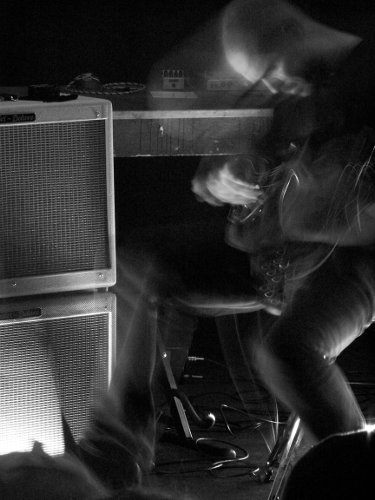
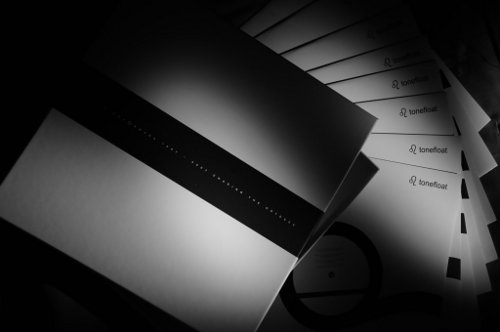
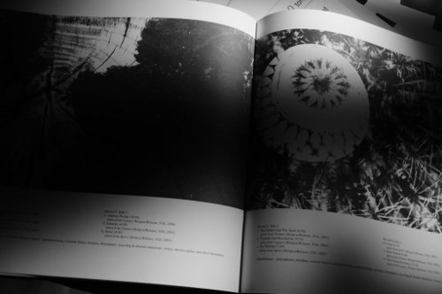
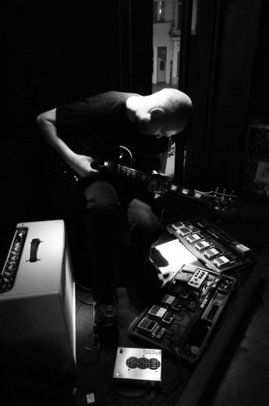

\[caption id="attachment\_1668" align="aligncenter" width="150" caption="Photo by Sjugge"\]\[/caption\]

_This interview was mainly conducted in February 2009, on the night of the Tonefloat festival in Paradiso, Amsterdam. It was corrected and supplemented with some additional material in March 2011, to roughly coincide with the release of the_ Chasing the Odyssey _retrospective box set on Tonefloat. Thanks to Dirk for the pleasure of speaking to him, and for his patience. Also, thanks to the various photographers for the permission to use their work._

_Interview conducted by **O.S.**_

* * *

_Flemish composer and musician_ **_Dirk Serries_** _is one of the more prolific names active in ambient and drone music, having released many albums under the **vidnaObmana** name, as well as material as **Fear Falls Burning**, **3 Seconds of Air**, and under his own name. Over the years, he has pioneered many styles of electronica and ambient, as well as guitar-based drone music._

_The roots of his musicianship lie in the underground Industrial music and tapetrading scene of the 1980s._

**Dirk Serries**: I started making music as a young guy, in 1984. My parents started noticing that I tried to make music with turntables, making a kind of locked grooves, particularly in movie soundtracks. That was a fascination of mine. I got an old synthesizer from my father, a Korg analog synth, and then I started experimenting with very aggressive industrial music. It was very amateurish, of course. But you start building up skills, experiment with different elements - what can I do, what can't I do - do I need musical education for that?

For the industrial music, feeling was primary as compared to classical education. I never felt the need to educate myself classically in music. Everything to do with electronic music in that time, the effects, recording equipment, synths, and so forth, I taught myself all of that, tried things, experimented, until I got a satisfying result.

But over the years, as my music grew more refined, particularly with **vidnaObmana** at the time, you start realising that you need a bit more than feeling for experimentation, more than just a good pair of ears. But I never took the step to get a classical education. Now that I play electric guitar instead of electronics, I sometimes feel that lack. On the other hand, and this is confirmed by many fellow artists, also musicians who do have classical training, it can sometimes limit you in your artistic freedom, in the sense that a classical education can impose limits on your vision. You are confined by a certain sheet music, certain schemas to follow. I am autodidactic, I hear certain things that they sometimes do not; you're not always on the same wavelength. Part of me wishes I had such a training, but on the other hand it hasn't caused me any real problems so far.

_Over the years, Dirk has collaborated with more classically trained people. He relates some of his thoughts on such collaborations between classical trained musicians and musicians working with improvisation and informal playing styles. Do differences in training cause conflict or not?_

A little bit of both. I've worked with a jazz double bass player, who was openminded enough to completely step away from his classical base, and that went perfectly. Of course, improvisation is a big part of jazz. However, with vidnaObmana I also had a project with a symphonic orchestra, and when you start talking with these people, you notice there can be a serious barrier. These people are perfectly schooled, but what they do - without wanting to disparage it - they do performances of existing works, in the form that is on their sheet. And these people have a big problem actually taking that step over the limit. It's very curious, it's something they can't picture mentally. If you talk about combining an orchestra and experimental music, they don't understand it; it is a totally different atmosphere, a different musical world. And these are real limitations you may experience, but also something you learn to deal with. There was no clash of egos or anything because one has classical training and the other hasn't, nothing like that. Just technical limitations. Luckily, though, I haven't met any people that really couldn't work with me, or vice versa.

_Dirk started his musical journey in Antwerp, which is still his home base. He tells us how the beginning years went, and whether there were a lot of people to work with at the time._

In the beginning, it was just me, I didn't have any musical friends. In the early 80s there was a huge tape culture. All independent music, very uncommercial music, was released on tapes, and you started trading these tapes with other people who had tape labels. That was a worldwide thing - there was no Internet, obviously - so you had to wait a long time before your packages were returned. It evolved really slowly. But one day, I was invited to do a radio show on **Radio Centraal** - the most important independent radio station in Belgium, I think. Certainly the most idiosyncratic, and it still exists, and has reason to exist. Anyway, in that time I did a show about tape culture with predominantly experimental music, and there were a couple of other DJs who worked with similar music. And in this way I met, among others, the people behind **Hybryds**, another experimental group who afterwards grew towards CDs and further. With people like that I was able to exchange ideas. Like I said, it's very interesting to do your own thing, to secure your own vision, to not have to compromise. But to create a broader base to work from, you have to be able to share your experiences with others, and to work with others, and that is really important to me, because you really learn a lot from interesting collaborations.

_Eventually, Dirk made the step from working only for himself, at home, to sending his music out into the world._

It started through those tape networks. I was already working as vidnaObmana at the time, also the really aggressive industrial music from the beginning. I started self-releasing some tapes, and sent those around. There was also a small number of zines worldwide writing about it. In this way, you come into contact with other musicians, with tape labels. And as the years went by, CDs started getting cheaper as well, and some of the tape labels became CD labels. And you evolve alongside of that, start releasing a CD yourself, come into contact with labels who never were a tape label, but had started with CDs in the first place and have a big scope in mind. In this way, you take a new step every time in growing, and if you have a bit of healthy ambition, you are able to grow, and for me this was a very interesting period, because I laid the base there for meeting many American people, who later helped me to get signed with labels like **Projekt**, for example.

_Dirk released a number of key albums on Projekt, like_ The River of Appearance _and_ Crossing the Trail _so we asked him more about his relationship with the label._

\[caption id="attachment\_1669" align="alignleft" width="150" caption="Photo by Sjugge"\]\[/caption\]

I had an exclusivity contract with them. At least until they got into a lesser period financially, and had to shrink a little, and they decided to terminate all exclusivity contracts. I still work with Projekt, for example vidnaObmana albums that had gone out of stock have to be rereleased, so that has become a relationship for life. And that is a beautiful thing. Actually, this all started with that one little tape network that **Sam Rosenthal** \[Projekt's owner\] had; he too started with tapes, and also evolved out of that. Luckily some people who had the right attitude back then are still in business. A lot of them disappeared, of course, which is a pity, because it is still an uncommercial genre. Many of them must have experienced a kind of disillusion when business started improving with CDs. Anyway, it's a continually evolving world, and luckily there are still a number of key figures who keep setting the stage in the market, and that is a good thing.

_It didn't stop there, however, and Dirk has since released a large number of albums on various labels._

Well, I was pretty much done with vidnaObmana. I'd said what I wanted to say. After the Projekt period I released a few CDs on the **Hypnos** label, and then, through meeting a few people from the metal scene, I ended up on **Relapse** Records. There I released the final three vidnaObmana albums, the _Dante Trilogy_. Those were actually a fusion of all elements I had experimented with over the history of the project, from industrial to pure ambient to more rhythmic work. I was able to collect that in that trilogy, and for me that was the end of the story. My fascination with electric guitar was growing at the time, and I started thinking. I wanted to set up a totally different project, and that became **Fear Falls Burning**.

_The most prominent home base for Dirk's music at the moment is the dutch label **Tonefloat**. Naturally we wanted to know how this intimate relation came into existence. He also tells us a bit more about **Conspiracy** records, who also release some of his material._

After I released the trilogy through Relapse, I came into contact with **Steven Wilson**. He had gotten the albums through the label, and he liked them so much we got in touch with each other. He wrote to me saying, look, I'm currently in touch with a label that might be up your alley. And that is how I came into contact with Charles \[Beterams, owner of Tonefloat -OS\]. Since then, it's gotten better and better. I think Steven and I are two of the most prominent figures on Tonefloat. Around it, different artists with different styles also work on the label, but we are the two pillars that the experimental part of Tonefloat is built on. And the relationship with Charles is so good that we can keep working towards the next step, and the next, and so forth. For that reason, there are only two labels that matter to me for Fear Falls Burning: Tonefloat because he really has a fascination and preference for the minimal aspect of experimental music, and **Conspiracy Records** from Belgium because they prefer the heavier, the more intimidating aspect.

For me, those are the two sides of Fear Falls Burning. It's the same person; I love the minimal, but I also love the impulsive, the very harsh things. And I really didn't think, and Charles agreed, that the latter part would fit in with Tonefloat's vision. For that reason I am glad I can work together nicely with two labels. Another advantage is both are close to me. I am in Antwerp, Charles is in Rotterdam, and Conspiracy is an Antwerp label, so it's all close together. This is really different from working with American labels, that is so distant. Now you can just sit around the table, relax, and talk about things, discuss things, look at the artwork together. If you're working from a distance this is different, and you run the risk of having misunderstandings. Especially with Charles this works great. He's such an outgoing and inspiring guy, who knows so much about artwork, about the qualitative side of things, that it is very educational working with him. In the end, I am a musician, and I know little about such things, and that way you form a great team. You can really feel and complement each other.

So Tonefloat and Conspiracy are really the labels I want to work with at the moment. There were a lot of labels who made offers to me after Fear Falls Burning sort of boomed in 2007, and I took up some of them in the beginning because I wanted to get a feel for the genre itself, the style, the world of it and how far I could come with it. In the beginning you have to play broadly to find out where you music is received best. That is very important, because you can be on a nice label, without anything really happening with the music. That happens a lot, that you get a label with a great image and feeling, bit without any commercial power. I mean, I'm not a businessman, but when you decide you want your music out there, you want it to reach the people. It's no use having 500 copies of your LP in your room, so you hope it'll go around the world a bit. So you really have to experience a number of different labels to eventually decide with which ones you want to keep working. Conspiracy is one of them, and Tonefloat is another.

_Naturally, there were various projects in the works when this interview was first conducted in 2009. Most important was the 8LP retrospective box set from vidnaObmana, ")_ [Chasing the Odyssee](http://www.eveningoflight.nl/2011/03/13/review-vidna-obmana-1987-2007-chasing-the-odyssee-2011/ "Review: Vidna Obmana – 1987 – 2007 Chasing the Odyssee (2011)"), _which finally saw the light of day recently in 2011. Dirk told us about the planning that went into the box, and some other release plans for his projects._

\[caption id="attachment\_1665" align="alignright" width="150" caption="Chasing the Odyssee"\]\[/caption\]

We are still working on the box set. It was originally going to be released this winter, but it'll be pushed back to 2010 now.  Just because we both feel we're not completely done with it yet. The music is selected, everything is mastered, but we still have to decide on a packaging that will be affordable, because I think that's very important. And it's a whole challenge, though luckily Charles knows a lot of printers he works with, so he can get samples. That's how we keep working, and before you know it, months pass without any decision making. So yes, Charles has a lot of trust in me, and I'm very grateful for that, but he is also someone that as a matter of principle doesn't invest in someone without there being a window of opportunity for having the investment pay itself pack. It's sort of like a five year plan, he wants to work with someone he can get along with, where you understand each other and build a future together, and if the investment eventually pays for itself. And that is Charles' strength, I think; he looks at is commercially, but at the same time in a unique artistic way. He would never compromise the music itself and the way you want to present it. He wants to keep his label alive at the same time, and that is important, too. It's nice to release a CD, but it has to do something commercially as well, and I think Charles has such things perfectly under control. And for that reason we like to plan into the future. Not just to prevent conflicts between the two labels I work with, but also to just see how we can shape the future, how to get a flow into it, a sort of continuity that sounds logical and is acceptable to everyone. There has only ever been one vidnaObmana release on vinyl, so we thought it would be great to do a retrospective, a closing chapter on vinyl. Because this will definitely mark the end of vidnaObmana.

With Fear Falls Burning, it's the other way around. We started with limited vinyl releases, and now that we see there is demand for it, we are switching to rereleases on CD. A big step for Charles. Soon there will be two of those, the first in a series of 10 CDs. He really believes in the quality of vinyl, but he managed to make the CDs appealing in a way as well. The sleeves are on beautiful thick cardstock, like the latest Sand Snowman album. Mine will be single sleeve, but when the series is complete, we want to have a box where you can put all 10 CDs, so you have a nice collection. Basically the whole back catalogue will be collected. There were a couple of vinyl releases on other labels, but these will return on Tonefloat, because I think it is important that one label is a sort of flagship for me. The Internet is a maze anyway, and there are so many labels that it is nearly impossible for any individual to keep up. So I want you as a fan or listener to be able to go to one label and know that there the future is being built for a particular artist. That if you want to follow artist X, that you really only have to look at one or maximally two labels to really keep track. It can be confusing otherwise, and I fell into that trap with vidnaObmana a couple of times. With Fear Falls Burning I really want to avoid that. So to me it is really important to have made a multiple year planning with Tonefloat.

_Charles works in a unique way with Tonefloat. There are only of few artists signed to the label, but with relatively many albums. In this way, the label builds up series, and creates a unique experience for listeners._

\[caption id="attachment\_1671" align="alignright" width="167" caption="Photo by Flughun"\]\[/caption\]

Yes, this is very special. I know a few musician friends myself, for example a musician from Germany that I think is really good, and I thought I might recommended it to Tonefloat. Maybe he could release a nice LP. It is really great drone music, and Charles said, I love it, but I'm not gonna do it. Why? Because I already have a drone artist on the label, and I want to focus all my attention on that one. I think that's a beautiful gesture, a great principle to work from, and I believe that is the strength of the label. Suppose you have a label with dozens of drone artists, dozens of experimental artists, they have to compete with each other on that one label. And then you get a kind of division within that label. Sometimes it works that way, curiously enough. Not because of the artists, but because listeners also make choices.

Now with Steven Wilson, Charles has the **Bass Communion** project, he has **Porcupine Tree**, and a couple of other things. With **Sand Snowman** he's got very unique experimental folk. With me, a unique drone artist who does his own thing. With **Theo Travis** he released a very remarkable and atmospheric record, very different. So these are all musicians with some common ground, but who will never be in each other's way. That is very interesting about the label. It might make things difficult to sell commercially to distributors, but at the same time it is interesting for them also.

_In the end, it is still niche music._

I don't mind it being so. If I play for three people tonight, or ten, or for 500, I will enjoy it in every case. But I have found that the best gigs for me are in front of a smaller audience. Very strange, but that works best. As long as they are on the same wavelength. If you tour as a support act, for example, and you play for 1.000 people, and you know only 10 or perhaps 100 people are really interested in your music, it'll be a rough night. Artists often talk about a black hole in the audience. You don't see it, but you feel it. The murmurs, the behaviour. And it's a pity for the 100 people who do enjoy seeing your show, that want to listen, but are hindered by the other 900. I would prefer playing an a smaller scale than in big halls. But sometimes it makes sense to join those larger groups, that's logical. You do reach out to new people. Charles does that too, but in a different way. He tries through the label to make it appealing to find out about new artists. Say you like Porcupine Tree, and you buy a record at Tonefloat. Well, Charles will do an offer where you get a discount if you also buy Fear Falls Burning. In that way people do get acquainted with different music. That's a nice system.

_In 2009, Tonefloat released a collaboration LP between Fear Falls Burning and Theo Travis. Dirk explains how this came about._

Well, I know Theo's music through the _Slow Life_ LP he put out on Tonefloat, a beautiful record. Charles knew I admired it, and I had been in contact with Theo a couple of times through MySpace, so Charles came with the idea of us doing a collaborative record for a Tonefloat release. He orchestrated it, really. He linked us up, proposed it, and in that way we started working together. Because it would be a Tonefloat release, I thought it best to take a rather minimal approach to it, and Theo agreed. We decided upon a musical key to work in, and here we return to the point of classical training, him being a classically trained musician. But after that, things came very spontaneously, and we worked towards a minimal piece. Someone asked me recently how I would describe the music on The Tonefloat Sessions, and personally I think it is the most extreme record I have made with Fear Falls Burning to date. Not in the sense of being loud or noisy, not at all, but extreme in its minimalism. In a certain sense, the nihilism that's in it. The LP has such a desolate atmosphere, even by my standards, I really starting realising this when listening back to it. I though, damn, this really turned out to be a very desolte, icily calm album. It has a certain layering, which gives it some body, but it still feels icy to me. Someone also made a parallel to vidnaObmana, which I don't agree with. To me, vidnaObmana was more easygoing, warmer, gently flowing music. With some edgier elements at times, surely, but overwhelmingly warm, flowing music. This is something entirely different. Compared to something like _Frenzy of the Absolute_, this is very extreme to me. There is a strong contrast, but at the same time, both have the same level of intensity. You work with different elements, but the intensity is just as strong, just as dynamic, even though you are working without drums. And that's why I think it is an extreme record, because it's at the opposite end of the spectrum.

_On the prolific_ Frenzy of the Absolute _album, Dirk worked with different percussionists. He related how these collaborations came about and possibilities for future works_.

This is again a matter of meeting a lot of people and labels in the beginning of Fear Falls Burning. Among the people I got into contact with via MySpace were the musicians of **Cult of Luna** and **Switchblade**. Cult of Luna invited me to support them on tour, and we did that twice. The first time on tour I started talking with Johannes, the guitarist, and we thought it would be interesting to do something together, and this grew into doing something on stage together. Before we knew it, the drummer **Magnus Lindberg** was there, and that was a symbiosis that clicked. We started thinking it would be nice to do something for Conspiracy records. I met **Tim Bertilsson**, the Switchblade drummer, in a similar way, and the followup to Frenzy of the Absolute will tread similar paths, also with drums, in that style.

The only downside is that you can't always work with the live drums. Sometimes I just have to use loops. Last November we managed to do it all live in Antwerp. That was in a cultural centre that is subsidised, so we were able to fly over all musicians. That was a wonderful gig with a perfect symbiosis, and that cave me an indication that this was a good to direction in which to continue. The only problem is the logistical one, flying everyone over from Sweden, so I hope to find someone who lives more close by, who speaks the same musical language as well, because that is also a factor. We spoke about classically trained musicians, and those who are not. Well, there is the same with drummers who have a rock attitude and those who are more open, because it is very hard to drum to drones. That was a long search for me, before I found Tim and Magnus, who are able to detach from a certain rhythmic pattern and keep drumming without a guideline, and supplement the rest iof the music, because that's very important. That works excellently now, and I hope to continue working with them in the future, maybe a little tour, we'll see, but definitely in the studio.

* * *

\[caption id="attachment\_1672" align="alignleft" width="200" caption="'Chasing the Odyssee', Photo by Igor Romanov"\]____\[/caption\]

_A few things have changed since we spoke with Dirk in 2009_. _He has initiated several new projects since then, and the_ Chasing the Odyssee _box set, spanning over two decades of work as vidnaObmana, was finally released earlier this year. We ask him how he feels about having the box out there, and what adjustments needed to be made before it could be put out._

It feels great! I’m so glad Tonefloat and I were able to complete this huge project. No real big adjustments were made, the box-set still holds 8 LPs on 180gram black vinyl and a 25-page booklet of **Martina Verhoeven**’s photography we used on most of the vidnaObmana back catalogue.

\[caption id="attachment\_1673" align="alignright" width="200" caption="'Chasing the Odyssee', Photo by Igor Romanov"\]\[/caption\]

But the actual reason for the delay was that Tonefloat and I really wanted to find the best productional solution so that we could offer the box set at a very reasonable price to the listener, and I think we really succeeded. I am very grateful to Tonefloat that he gave me the chance to conclude the vidnaObmana story in style with this 8LP box. This project gave me the ideal platform to reflect back on my work as vidnaObmana from the past 25 years, select the music I consider to be essential and return to an audio format that I personally neglected during the rise of the compact disc. Couldn’t dream for a better ending, really.

 

_Since 2009, three new projects have arisen for Dirk, one under his own name, and **3 Seconds of Air** and **The Sleep of Reason**, which are collaborations with others. He tells us briefly what's behind each of them._

Some major decisions have been made. While I slowly but surely re-discovered my ongoing fascination and respect for the minimal, introspective, and beautiful in guitar harmonics I started to realize that, due to the fast growth in style and composition, Fear Falls Burning was a project that clearly needed an ending nearby.

Fear Falls Burning surfed on a wave of appreciation and modest success and therefore I was able to not only record/release numerous albums in a short period but also work with several interesting musicians together in order to realize the vision. From extra guitarists to drummers, Fear Falls Burning became more than just myself in solo mode. While Fear Falls Burning became that uncontrollable entity, I simultaneously returned to restriction, discipline and minimalism. With Fear Falls Burning I'll release one more album that will end the project, and I'm currently working on mixing all songs, and if all goes well this last album should be released late 2011.

\[caption id="attachment\_1670" align="alignright" width="150" caption="Photo by Sjugge"\]\[/caption\]

In 2008 I took a chance to, after some many years of working under pseudonyms, release my first album ever under my real name. _Microphonics I-V_ was the debut and start of setting a goal for presenting my passion for the harmonic, beautiful and minimal from there on.

The _Microphonics_ series under my own name is a strict series that will slowly but surely take over all of my major projects, the concept is fairly simple. The music is released in three versions : the studio albums are on regular CD and LP with specific artwork, the live records are LP-only, limited to 300 copies in three different colors and without artwork and eventually all other possible and infrequent releases like tour editions, etc. are on 10”.

With Microphonics I finally reached, after some many years of discovering and experimenting, that momentum of self-awareness, a level of satisfaction. Microphonics is the result of working so hard over these past 27 years. Reducing the pallet of instruments to the most basic and returning to a genre I love the most. Microphonics is pure, minimal, harmonic, dissonant and just me.

3 Seconds Of Air is a band, a getting together of 3 musicians. I truly consider 3 Seconds Of Air not as one of my projects, but a full band. I’m just a member that participates equally as the 2 other musicians.

Naturally there’re musical parallels but in my humble opinion 3 Seconds Of Air is much more about making a sort of modern chamber music from a jazz or avant-garde point of view, music that is challenging in terms of tonality, the relationship between 3 instruments and the musical dialogue. Along with blues guitarist **Paul Van Den Berg** and my wife Martina Verhoeven on electric bass we’ve released our debut [_The Flight Of Song_](http://www.eveningoflight.nl/2009/11/09/review-3-seconds-of-air-the-flight-of-song-2009/ "Review: 3 Seconds of Air – The Flight of Song (2009)") in 2009 and this March 25th our 2nd one _We Are Dust Under The Dying Sun_ will be released. Both are on Tonefloat.

The Sleep Of Reason spontaneously grew out of correspondence between **Jon Attwood** (**Yellow6**) and myself. The Sleep Of Reason will exist in the form of a 3LP trilogy, reflecting our mutual passion for the most introspective, lo-fi and desolate in guitar music. We’re currently working on the third album and if everything goes well this vinyl trilogy will be released on Tonefloat at the end of this year.

_Finally, we wanted to know what else is planned for Dirk in the near future._

Apart from a few pending collaborative projects, main projects are the releases of the second 3 Seconds Of Air album on March 25th, The Sleep Of Reason trilogy and the last Fear Falls Burning album towards the end of the year. Steven Wilson and I will start working on a new Continuum record in the 2nd half of 2011 while I’ll compose and record the long-awaited second Microphonics studio album throughout the rest of this year and 2012. A studio album I look so forward to as it will expand the tonal scope on Microphonics, a large tour will hopefully follow.

* * *

Links:

[Dirk Serries Website](http://www.dirkserries.com/)

[Tonefloat Records](http://www.crazy-diamond.nl/tonefloat/) [Projekt Records](http://www.projekt.com/) [Conspiracy Records](http://www.conspiracyrecords.com/)
