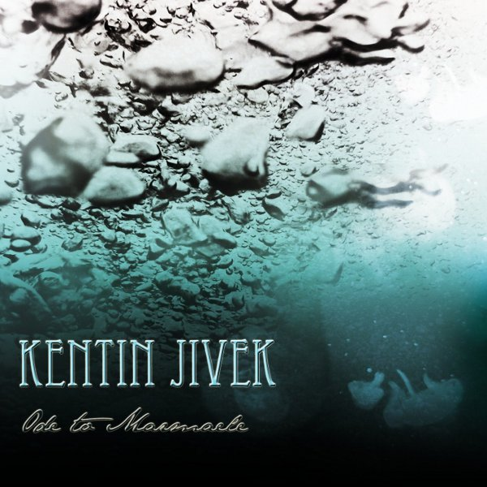
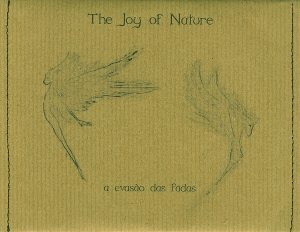
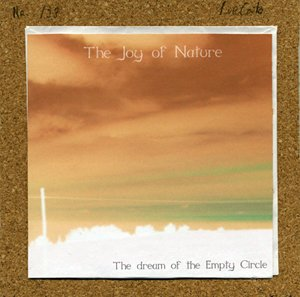
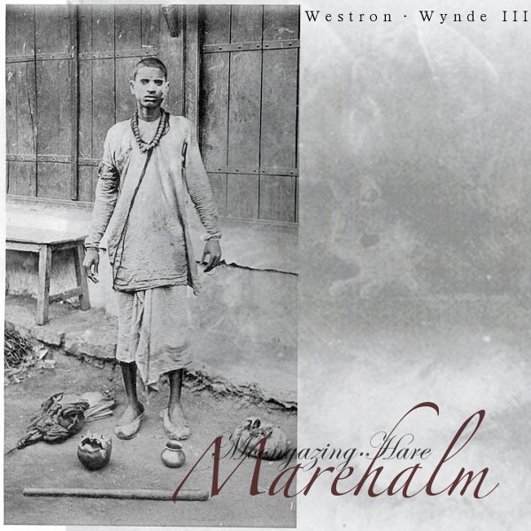
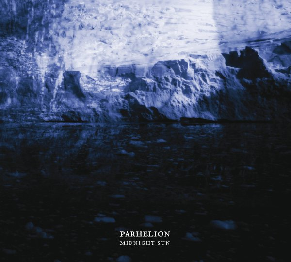

**Kentin Jivek** - _Ode to Marmæle_ \[[MySpace](http://www.myspace.com/kentinjivek)\]

\[caption id="attachment\_1684" align="alignright" width="150" caption="Ode to Marmæle"\]\[/caption\]

**Kentin Jivek** is an upcoming French neofolk artist who has several online releases to his name. _Ode to Marmæle_ is the most recent example, and a fine selection of fourteen tracks. Immediately striking about the album as a whole is the fine production, the diversity of languages, predominantly French, English and Spanish, and a varied, rich, and at times experimental instrumentation and composition. Stylistic staples from neofolk combine excellently with influences from more traditional folk and classical guitar music. Some standout tracks are the almost ambient "Le Moine" which has a beautiful guitar sound and whispered vocals, the rocking "Et Vogue la Verve", and the dark oriental instrumental "L'Effet Pandemonium". A point of criticism might be that I'm not fond of the vocals in some places, like "Arsgang" and "Pink Clouds". For me, the softer vocals in French and Spanish work better. As an album, perhaps _Ode to Marmæle_ also lacks a bit of coherence, but this is compensated for amply by a number of excellent individual tracks. Altogether, we are dealing with an enjoyable album by an upcoming talent in experimental neofolk, and one that manages to blend the feel of different areas of European folk music in a great way.

**The Joy of Nature** - _A Evasão das Fadas_ \[[discogs](http://www.discogs.com/Joy-Of-Nature-A-Evas%C3%A3o-Das-Fadas/release/2327488)\] & _The Dream of the Empty Circle_ \[[discogs](http://www.discogs.com/Joy-Of-Nature-The-Dream-Of-The-Empty-Circle/release/2204852)\]

\[caption id="attachment\_1613" align="alignleft" width="150" caption="A Evasão das Fadas"\]\[/caption\]

To fill up the gap between the second and third instalments of _The Empty Circle Trilogy,_ **Luís Couto** collected some unused material on these two limited releases. _A Evasão das Fadas_ was released on **Lurker's Path**, and it contains ten tracks showcasing more of the wonderful dreamy neofolk I have come to expect from the project. As always, various string instruments provide most of the melody, combined with flute, soft percussions and bass, and differing types of vocals. The end result is once more a very unique sound, that retains its links to other alternative folk, but providing a very own original voice. No tracks really stand out as particularly memorable, but together they do form a very pleasant continuum of relaxed song and more ambient moods with experimental and noisy sections. This album doesn't really offer that much that the main and earlier albums don't contain, but it is nevertheless a recommended purchase for those who have been following the project actively.

\[caption id="attachment\_1619" align="alignright" width="150" caption="The Dream of the Empty Circle"\]\[/caption\]

The same goes for _The Dream of the Empty Circle_, which is a collection of outtakes from the various recording sessions that somehow didn't fit into the albums in their final form. The first two tracks are calming psychedelic and dreamy songs, flowing along as the "Lady of the Flowing Waters" and "Lady of the River" in their titles. "Impermanence" has a more experimental sound, with background chanting and slightly distorted violin work, a bit reminiscent of **Matt Howden**'s style. Another nice experimental track is "Zrcadlo", with its noisy, misty guitars and deep percussion. The two following tracks venture into the more melodic and folky territory once more, with "Shadows of Our Ancestors" containing some reworked elements from the second _The Empty Circle_ album. The final two tracks are more ambient and experimental once more, the most prominent and enjoyable elements being some quirky cat samples in the first, and the samples of mediaeval devotional music - I think I hear "Mariam Matrem" there - in the final track. The conclusion here is similar to the one above, some very nice material here that might not be as interesting as one of the regular albums, but surely worth your time if you enjoy The Joy of Nature or experimental ambient and folk in general.

**Moongazing Hare** \- _Marehalm_ \[[bandcamp](http://moongazinghare.bandcamp.com/)\]

\[caption id="attachment\_1682" align="alignleft" width="150" caption="Marehalm"\]\[/caption\]

_Marehalm_ is one of the 2010 releases of Danish experimental folk project **Moongazing Hare**, led by **David Folkmann Drost**. Throughout this release, there is a highly varied and pleasant mixture of instrumental ambient and experimental electronica pieces, along with traditional folk songs and some own songwriting as well. The first two tracks fall into the first category, building up atmospheres with layered effects and electronic melodies, and also leaving place for some slightly distorted acoustic instruments and electronic rhythms. After this, we enter psychedelic folk territories with spacey melodies and female vocals courtesy of David's wife Hiro on "Everything is Holy Brown". The beautiful "Breathe Again" combines David's own vocals with the rhythmic electronica heard earlier. The further tracks feature more of David's beautiful calming vocals, as well as a similar mix of elements as in the first half of the album. Final highlight is a beautiful a capella rendition of "The Snow it Melts the Soonest", seemingly straight from their living room. Lots to love here for those into experimental folk, and I hope Moongazing Hare will have the opportunity to release some of their material on a physical format. So far the only way to get this album is through bandcamp \[see above\], though very reasonably priced. I for one will certainly be keeping an eye on this project.

**Parhelion** \- _Midnight Sun_ \[[discogs](http://www.discogs.com/Parhelion-Midnight-Sun/release/2622784)\]

\[caption id="attachment\_1644" align="alignright" width="150" caption="Midnight Sun"\]\[/caption\]

Canadian **Parhelion** (the scientific term for Sun Dog) is one of the latest additions to the **Cyclic Law** roster. With that info in mind, it should come as little surprise that the album _Midnight Sun_ is full of dark ambiences and glacial atmospheres. Parhelion combines the standard use of synth pads with waves of droning guitars, not too harsh, but just enough to add very pleasant levels of texture here and there. In general, the aqueous and flowing atmosphere of this album is very pleasant, and there are a couple of tracks that really stand out as beautiful, extended aural journeys, such as "Meditation Over Open Waters", "A Lament for Whales" and particularly the stunning closing track "Solitude". As a whole, though, the album can feel a bit long at times, at least to attentively listen to, and it doesn't really add anything new to a well established style such as this. Beautiful production values and unobtrusive  compositions do make this a very pleasant listen with a couple of definite highlights, but it is only really interesting for the true fans of the Cyclic Law style.
