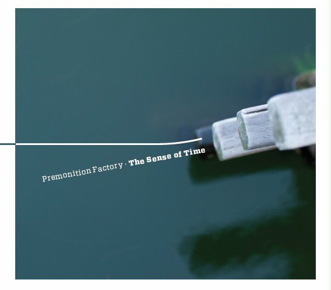

artist: **Premonition Factory** release: _The Sense of Time_ format: CD year of release: 2011 label: [Longstreet](http://premonitionfactory.com/) duration: 60:50

detailed info: [discogs.com](http://www.discogs.com/Premonition-Factory-The-Sense-Of-Time/release/2704516)

I was really excited when I found the new **Premonition Factory** album in my mailbox a few weeks ago. The first album, [_59 Airplanes Waiting for New York_](http://www.eveningoflight.nl/2010/04/21/review-premonition-factory-59-airplanes-waiting-for-new-york-2010/ "Review: Premonition Factory – 59 Airplanes Waiting for New York (2010)"), was warmly received here, so then there's always some pleasant anticipation for whatever follows after. The anticipation changed into profound joy, because this is an extremely fine ambient album that is immediately pleasant to listen to, with loads of deeper layers to discover after multiple rounds.

The basics remain the same: **Sjaak Overgaauw**, the Dutchman in Flanders who is behind the project, uses live looping techniques on synth to build his layered ambient sounds, and these recorded improvisations make up the music on his albums and shows. Compared to the last album, however, the sound on _The Sense of Time_ is thoroughly refined, seamlessly blending layers of soft synth waves, drones, piano melodies, and some rhythm here and there.

The atmosphere of Premonition Factory I would describe as abstract ambient: not necessarily reproducing or referring to elements in the real world, but acting as pure soundforms, and direct aural emotion. That Overgaauw is able to find a perfect balance in these emotions is evident here. Darker musical visions can be found on tracks like "Chasing the Unknown" and "Magic Box", while bright calm material features prominently in the gentle opener and the piano-based  "Mediate". One of the big surprises and obvious highlights of this album is the title track with its excellent glitchy rhythmic work, but for the absolute peak of the album is "Darkest Hour Pt. 2", a deceptively minimalist track with a melodic progression that brings tears to my eyes every time I hear it. Not because it reminds me of anything emotional, but simply because of the pure emotion coming from the music itself. It is a calmly moving piece that has quickly found its way into my all time favourite ambient tracks.

So, there. Heaps of deserved praise for an album that proves you don't need to be innovative if you're just damn good. I'm not going to waste time by listing ambient giants that have gone before and obviously inspired this music. Where some artists impress by pushing musical boundaries and experimenting, Overgaauw achieves equally stunning results by mastering a tradition and refining it. Here's to the next one!

Reviewed by **O.S.**

Tracklist:

1\. Darkest Hour Pt.1 (11:42) 2. Chasing The Unknown (7:20) 3. Electric (5:57) 4. Dream Within A Dream (5:50) 5. The Sense Of Time (7:13) 6. Darkest Hour Pt.2 (8:59) 7. Desolate (5:57) 8. Magic Box (4:37) 9. Mediate (3:20)
