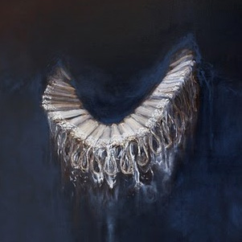

[Cloudscape #13: April 2011](http://www.mixcloud.com/eveningoflight/cloudscape-13-april-2011/?utm_source=widget&utm_medium=web&utm_campaign=base_links&utm_term=resource_link) by [Evening Of Light](http://www.mixcloud.com/eveningoflight/?utm_source=widget&utm_medium=web&utm_campaign=base_links&utm_term=profile_link) on [Mixcloud](http://www.mixcloud.com/?utm_source=widget&utm_medium=web&utm_campaign=base_links&utm_term=homepage_link)

00:00 | Black Tape for a Blue Girl | Redefine Pure Faith | Remnants of a Deeper Purity | 1996 05:05 | Ulver | Lyckantropen Themes VII | Lyckantropen Themes | 2002 07:10 | Premonition Factory | The Sense of Time | [The Sense of Time](http://www.eveningoflight.nl/2011/03/29/review-premonition-factory-the-sense-of-time-2011/ "Review: Premonition Factory – The Sense of Time (2011)") | 2011 12:48 | Northaunt | Horizons | Horizons | 2006 18:30 | Higuma | Crystal Harvest | [Pacific Fog Dreams](http://www.eveningoflight.nl/2011/11/14/review-higuma-pacific-fog-dreams-2011/ "Review: Higuma – Pacific Fog Dreams (2011)") | 2011 23:01 | Cubs | Hidden Valley | [The Whispering Woods](http://www.eveningoflight.nl/2011/05/31/may-2011-short-reviews/ "May 2011 Short Reviews") | 2011 24:58 | Current 93 | Calling for Vanished Faces II | All the Pretty Little Horses | 1996 29:02 | Ulver | Vowels | A Quick Fix of Melancholy | 2003 35:21 | Sopor Aeternus & the Ensemble of Shadows | If Loneliness Was All | Dead Lover's Sarabande: Face Two | 2000 43:43 | Martyn Bates | Mystery Seas | Imagination Feels Like Poison | 1997 46:35 | Ulver | Island | [Wars of the Roses](http://www.eveningoflight.nl/2011/05/02/review-ulver-wars-of-the-roses-2011/ "Review: Ulver – Wars of the Roses (2011)") | 2011 52:06 | Andrew King | The Death of Nelson (Nelson's Monument) | [The Kraken](http://www.eveningoflight.nl/2011/04/24/review-andrew-king-brown-sierra-the-kraken-2010/ "Review: Andrew King & Brown Sierra  – The Kraken (2010)") | 2010 59:45 | Rome | Herbstzeitlose | [Berlin](http://www.eveningoflight.nl/2007/10/01/review-rome-berlin-2006/ "Review: Rome – Berlin (2006)") | 2006
