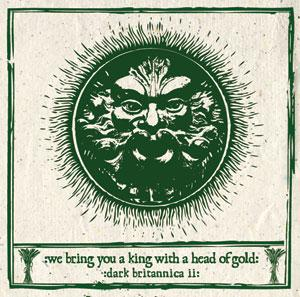

artist: **Various Artists** release: _We Bring You a King with a Head of Gold_ format: 2x CD year of release: 2010 label: [Cold Spring](http://www.coldspring.co.uk) duration: 2:25:42

detailed info: [discogs.com](http://www.discogs.com/Various-We-Bring-You-A-King-With-A-Head-Of-Gold/release/2561976)

_We Bring You a King with a Head of Gold_ is the long-awaited sequel to the excellent [_John Barleycorn Reborn_](http://www.eveningoflight.nl/2007/11/01/review-john-barleycorn-reborn-2007/ "Review: John Barleycorn Reborn (2007)") compilation released several years ago. Again **Cold Spring** does the honours of releasing a compilation of British folk, though this time without the sadly defunct **Woven Wheat Whispers**. Like before, the harvest is two CDs full of contemporary folk tunes from different areas of the genre, ranging from traditional and particularly revival-inspired songs to selection of more experimental works.

Compared to the compilation that went before, I must admit I find this one a little bit disappointing. The nearly two and a half hours running time contains a lot of tracks that are average or lacklustre, and I also miss a bit of the diversity that was present on _John Barleycorn Reborn_. Some artists on _We Bring You a King_... are simply of mediocre quality, and others mar their performance with a certain kind of naive atavism or limited form of traditionalism, bending folk to a sort of preachy path which doesn't appeal to me in any way.

Thankfully, both discs contain a good number of exceptions to this general impression, of which I will highlight a few. **Barron Brady** starts off the album with a solid rhythmic tune, excellent male and female vocals and an original set of lyrics. We find nice rich instrumentation on "Blood and Bones" by **The Roman Amber Mill,** a good example of the musically experimental folk I would have liked to hear more of on this album. **Tony Wakeford** is usually a good call in that department as well, and "The Devil" is no exception, being an originally executed track in the style of **The Triple Tree**. **Sproatly Smith** are one of the pleasant surprises for me, who bring a very fine experimental ambient folk tune that makes me interested in the rest of their work. The rest of the first disc ranges from pretty decent to disappointing, with "Jack the Mommet" by **Philip Butler and Natasha Tranter** being a nice exception, a classical guitar-based folk track with excellent supplemental instrumentation that is also spot-on in terms of atmosphere.

The second disc is similarly filled with average material interspersed with some nice highlights. **Autumn Grieve** is one, with the beautiful mystic "Within Hollows" taken from the wonderful _[Stray Birds](http://www.eveningoflight.nl/2010/02/23/review-autumn-grieve-stray-birds-2009/ "Review: Autumn Grieve – Stray Birds (2009)")_ EP. Another fun track is "The Song of the Fates" by **The Fates**, an a capella mythological narrative with a not unpleasant sixties nostalgia feel to it. **Sedayne** and his wife **Rachel McCarron** are a couple that always deliver the goods as well, with a sound that remains absolutely unique in modern folk. We hear three tracks from different projects here, as **Sedayne : Sundog**, **Venereum Arvum** and **Demdyke**, all worthwhile, particularly the latter. A final mention goes to the modern singer/songwriter folk style of **Ruby Throat**, a female voice in the area of **Marissa Nadler** or **Woodpecker Wooliams**.

All in all, I found _John Barleycorn Reborn_ a more interesting compilation with a wider spectrum of musicians and a higher overall level of quality. This album, too, would have benefited from input of excellent artists such as **Sand Snowman**, **Far Black Furlong**, or **The Owl Service**, which made that first one a success. Despite this, I feel _We Bring You a King_ is a worthy successor with quite some good tracks on it, and it is definitely worth getting for folk lovers. However, for the next instalment, if one is planned, it would be interesting to look at the folk world outside of Britain, and aim to get the very best out of that territory. Either that, or a more critical and thorough selection of British artists to truly fill up an album with excellent material.

Reviewed by **O.S.**

1-01 **Barron Brady** – Earthen Key (3:43) 1-02 **Laienda** – Little Drummer Boy / Anvil (5:53) 1-03 **The Rowan Amber Mill** – Blood And Bones (Ciderdelica Mix) (4:50) 1-04 **Tony Wakeford** – The Devil (3:58) 1-05 **Kate Harrison** – England (3:59) 1-06 **Drohne** – The Hooden Horse / An-Dro (3:37) 1-07 **Corncrow** – The Cutty Wren (3:09) 1-08 **Sproatly Smith** – I Shall Leave You There (6:10) 1-09 **Tinkerscuss** – Black Sarah (4:48) 1-10 **Cernunnos Rising** – Hear It With My Heart (3:29) 1-11 **Mama** – The Fool Of Spring (2:11) 1-12 **Magicfolk** – Green Man (3:17) 1-13 **Wyrdstone** – Lost At Ty Canol (4:14) 1-14 **Emil Brynge** – Devon Dream (4:54) 1-15 **Kim Thompsett** – Lords And Ladies (3:40) 1-16 **Dragon Spirit** – Always Be Ours (3:57) 1-17 **Philip Butler And Natasha Tranter** – Jack The Mommet (4:48) 1-18 **Touch The Earth** – Ancient Landscapes (3:17)

2-01 **Relig Oran** – Ye Mariners All (4:37) 2-02 **Autumn Grieve** – Within Hollows (4:56) 2-03 **Ian McKone** – Searching For Lambs (3:10) 2-04 **John Parker** – Manningham Blues (3:55) 2-05 **Rattlebag** – The Tyburn Sisters (2:52) 2-06 **The Fates** – The Song Of The Fates (3:31) 2-07 **The Hare And The Moon** – The Three Ravens (2:45) 2-08 **The Kittiwakes** – Lynx (4:10) 2-09 **Venereum Arvum** – Robin Sick And Weary (6:25) 2-10 **Telling The Bees** – Fithfath (3:18) 2-11 **Richard Masters** – The Wind Knows (5:33) 2-12 **Demdyke** – Mother Carey's Chicks (6:18) 2-13 **Beneath The Oak** – Oh Earthly Man (4:12) 2-14 **Sedayne : Sundog** – A Wee Brown Cow (6:24) 2-15 **Ruby Throat** – Swan And The Minotaur (Troubled Man) (3:14) 2-16 **Jennifer Crook** – Ribbons Of Green / The Dream Waltz (Live) (6:43)
