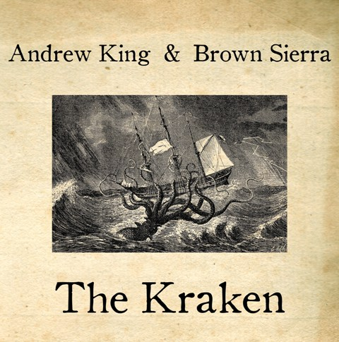

artist: **Andrew King** & **Brown Sierra** release: _The Kraken_ format: 12" year of release: 2010 label: [DAIS](http://www.daisrecords.com/) duration: 20:53

detailed info: [discogs.com](http://www.discogs.com/Andrew-King-Brown-Sierra-The-Kraken/release/2516851)

As on their previous collaboration _Thalassocracy_, **Andrew King** and **Brown Sierra** team up to combine traditional British song with noise and abstract sound. The theme of nautical song was also continued on this latest release, an EP containing four new works.

"The Kraken", a piece written by **Alfred, Lord Tennyson**, depicts the raw power of the sea, and it is cast in a rolling, powerful monologue by the aural artists here, not unlike King's staple piece "Proto-Azazel". In the background, the Kraken (or the sea) roars in surges of noise, which give way to the second piece, an instrumental exercise by Brown Sierra solo. We are treated to the unusual and evocative sound of the Pyrophone \[[wiki](http://en.wikipedia.org/wiki/Pyrophone)\], which describes the desolation and eerie nature of open sea.

Proper folk song can be found on side B, where King presents two relatively unknown traditionals dealing with British seafaring history. The first, where he is assisted by Brown Sierra again, deals with the eventful journey of the Bold Princess Royal and its crew, which narrowly escapes from an encounter with pirates. The final track is a lament for Lord Nelson and a discussion of what monument to build for the man. This piece appeals to me most, in its sparse setting, with in the background only the gentle four-second ticking of the clock in the Old Royal Naval College in Greenwich. The song is drawn-out, soft, and convincing.

In all, this is a very nice addition to the collection of anyone who enjoyed earlier work of these artists together, or Andrew King solo. For others, perhaps less so, as it takes a predilection for both bare-bones folk and experimental sounds to truly enjoy records like this.

Reviewed by **O.S.**

Tracklist:

1. **Andrew King** & **Brown Sierra** -  The Kraken (3:00) 2. **Brown Sierra** - Abysmal Sea (4:59)

3\. **Andrew King** & **Brown Sierra** \- The Bold Princess Royal (stolen version) (5:10) 4. **Andrew King** - The Death of Nelson (Nelson's Monument) (7:44)
