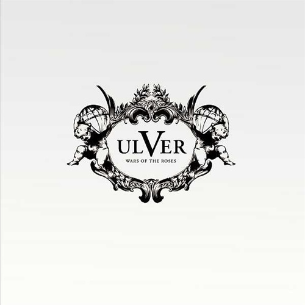

artist: **Ulver** release: _Wars of the Roses_ format: CD, LP year of release: 2011 label: [Kscope](http://www.kscopemusic.com/) / [Jester](http://www.jester-records.com/) duration: 45:37

detailed info: [discogs.com](http://www.discogs.com/Ulver-Wars-Of-The-Roses/master/329095)

The standard question accompanying a new **Ulver** album: what are they going to do _this_ time? Actually, for the first time since quite a few of these albums, the answer must be that it's not as different as we might have expected. _Wars of the Roses_ sees the Norwegian shapeshifters mainly solidifying the musical style built up on [_Blood Inside_](http://www.eveningoflight.nl/2010/03/16/eclipse-review-ulver-blood-inside-2005/ "Eclipse Review: Ulver – Blood Inside (2005)") and [_Shadows of the Sun_](http://www.eveningoflight.nl/2007/10/01/review-ulver-shadows-of-the-sun-2007/ "Review: Ulver – Shadows of the Sun (2007)"), while adding only a modest spectrum of new elements. On the one hand, we have the at times frantic mix of rock and electronics, on the other, ambience and contemplation. Where the previous two albums focused mainly on one of these, this latest one aims for a fusion.

One of the more surprising tracks might be the opener, "February MMX", which explores areas of catchy progressive rock, polished and twisted in a style that is typically Ulver. The return of drums and guitars to Ulver's music is nothing to deplore, especially in parts like the middle of "Providence", where the rock section beats on alongside a synthetic orchestra spurred on by the soloing clarinet of **Alex J. Ward.** The rest of the track is a surprisingly calm and soulful piece resting on a duet of front man **Kristoffer Rygg** and **Siri Stranger**.

I must say that the plodding mid-tempo track "September IV" forms a bit of a low point in the album, not really adding anything significant to the mix, and rehashing the mix of rock and classical/electronica we've heard before on "It Is Not Sound" off _Blood Inside_. Slightly better are "Norwegian Gothic" and "England", both of which are modestly experimental songs, and setters of atmosphere.

However, the final two tracks hold some pleasant surprises. "Island" is a beautiful calm piece, rivalling the atmosphere of some of _Shadows of the Sun_'s finer ambient moments, but somehow more bright. A gentle rhythm, synths and acoustic guitar working in unison, soft vocals, and a fine ambient ending. Simply a stunning track, and one that clears the mind for the monolithic track which follows: "Stone Angels". This fifteen-minute piece is a reading by **Daniel O'Sullivan** of **Keith Waldrop**'s entire poem of the same name, accompanied by a subtly flowing organ flow, and the improvised clarinet works of **Stephen Thrower**. Not surprisingly, the presence of Thrower's work, as well as the set-up of the track in general, its calm expansive mood, the spiritual thematics, it all refers back **Coil**, who obviously have been a great inspiration to much of Ulver's music for over a decade. Regardless, this is a track of rare beauty, something I realised first when I saw it being performed in its entirety and the end of a recent concert, along with visuals of slowly disintegrating and reintegrating blocks of stone, aligned in an array. The hypnotic cadence of the voice and music is entrancing, and the listener is guided effortlessly to the climax of the piece, after which the final words fall into silence.

Listening back to this album, it is a many-faced beast. On the one hand, a couple of older Ulver styles are integrated here, along with some small innovations, making this album perhaps the least surprising in many years of their career. Not to say that this is a bad thing per se, but in some ways, that can be disappointing if you were expecting to be overwhelmed by another whole new album style. On the other hand, the final two tracks left such a massive impression on me that I can't help but love this album for it. And I guess this still means Ulver can surprise me, even if it is not with an album as an integrated whole, but rather a part of it.

Opinions are likely to be divided as to how this one will fit into the overall picture of Ulver's musical development. As an album, it is definitely not the strongest, nor the most original. Nevertheless, it is worth having for its very special moments alone, which rank among the highlights in the band's career after all. The vinyl edition in particular is worth the investment, as it contains a chapbook reprint of the "Stone Angels" poem.

Reviewed by **O.S.**

Tracklist:

1\. February MMX (4:10) 2. Norwegian Gothic (3:37) 3. Providence (8:10) 4. September IV (4:43)

5\. England (3:57) 6. Island (6:00) 7. Stone Angels (15:00)
