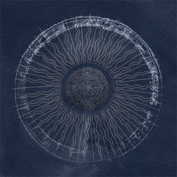

[Cloudscape #14: May 2011](http://www.mixcloud.com/eveningoflight/cloudscape-14-may-2011/?utm_source=widget&utm_medium=web&utm_campaign=base_links&utm_term=resource_link) by [Evening Of Light](http://www.mixcloud.com/eveningoflight/?utm_source=widget&utm_medium=web&utm_campaign=base_links&utm_term=profile_link) on [Mixcloud](http://www.mixcloud.com/?utm_source=widget&utm_medium=web&utm_campaign=base_links&utm_term=homepage_link)

00:00 | In Gowan Ring | Hazel Steps | Hazel Steps Through a Weathered Home | 2002 04:57 | Agalloch | Odal | The Mantle | 2002 11:30 | Life Toward Twilight | Threnody to Our Time Apart | I Swear by All the Flowers | 2007 15:50 | Coil | At the Heart of It All | Scatology | 1984 20:48 | Sixth Comm | Doubt to Death | Asylum | 1990 25:32 | The Driftwood Manor | Before It Is Time | [Everything Light Goes Out Eventually](http://www.eveningoflight.nl/2010/09/24/retrospective-the-driftwood-manor-three-2010-releases/ "Feature: The Driftwood Manor, three 2010 releases") | 2009 28:38 | Swans | Killing for Company | The Great Annihilator | 1995 35:11 | Aderlating | Descending the Naraka I | [Spear of Gold and Seraphim Bone Part 1](http://www.eveningoflight.nl/2011/05/31/may-2011-short-reviews/ "May 2011 Short Reviews (Aderlating, Cubs, Dementia ad Vitam, Szymon Kaliski)") | 2011 41:28 | Esoteric | Arcane Dissolution | Subconscious Dissolution into the Continuum | 2004 46:37 | Premonition Factory | Magic Box | [The Sense of Time](http://www.eveningoflight.nl/2011/03/29/review-premonition-factory-the-sense-of-time-2011/ "Review: Premonition Factory – The Sense of Time (2011)") | 2011 51:02 | Ulver | Stone Angels | [Wars of the Roses](http://www.eveningoflight.nl/2011/05/02/review-ulver-wars-of-the-roses-2011/ "Review: Ulver – Wars of the Roses (2011)") | 2011
