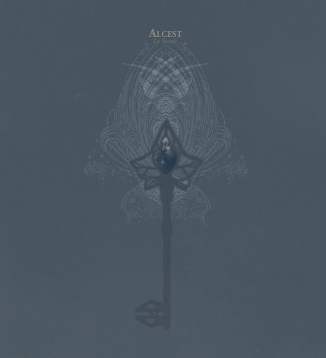

artist: **Alcest** release: _Le Secret_ format: CD, LP year of release: 2011 label: [Prophecy](http://www.prophecy.cd) duration: 54:17

French project **Alcest** has been impressing a good many folk in recent years with an original blend of shoegaze and romantic black metal. When _Le Secret_ was originally released by **Drakkar** in 2005, it gained the project a good following, but things really took off with the first full-length _Souvenirs d'un Autre Monde_ on **Prophecy** in 2007. Followup _Écailles de Lune_ came last year, so the time was ripe to put the debut EP back in the spotlight. The way this was handled by project mastermind **Neige** - by rerecording both tracks - is a stroke of genius, bringing these two tracks up to a level of refinement that fits in perfectly with the two albums, and even exceeds them in some respects.

Judging these tracks by their new versions, I have no hesitation of placing them both among the best released by Alcest thus far. "Le Secret" forms its borders from a gentle circular melody on clean guitar, and its centre is composed of mid-tempo waves of distorted guitars and drums, a exemplary synthesis of shoegaze and black metal playing, with Neige's dreamy clean vocals layered on top. As is often the case with Alcest, most melodic motifs and chords have a sort of brightness and openness to them, steering the music's atmosphere in the direction of sublime natural experiences and mystic narratives.

"Elévation" is equally brilliant. An soft synth intro sets the scene for a faster black metal part, now truly so, with straight-out rhythm and screams. Again, the tone is expansive, open, and bright, tending more towards nature-inspired kind of black metal than the nihilist one. After the break, the mid-tempo middle part is a sublime series of the same motif worked out in different ways, passing through strongly percussioned heavy parts, and culminating in the dreamy style that is typical for Alcest. A reprise of the original black metal part and synth from the intro closes the circle.

With these two tracks, Alcest returns to its origins, and simultaneously delivers its best work, in my opinion. _Le Secret_ manages to deftly avoid the points on the two full length albums where the bright atmosphere turned a little too soft, like the sugary "Tir Nan Og" on _Souvenirs_, and in doing so, stays focused on the strongest points of the music: the expansive natural riffs and the dreamy gentler parts. The addition of the two original tracks is also nice, albeit mostly for historical interests. They illustrate perfectly how to take a diamond in the rough and cut some true gems from it.

Prophecy has made some nice collector's editions of this EP for the Alcest fans, who'll love this re-release, but the album is also highly recommended listening for anyone into atmospheric and nature-inspired rock and metal.

Reviewed by **O.S.**

Tracklist:

1\. Le Secret (Rerecorded) (13:32) 2. Elévation (Rerecorded) (13:26)

3\. Le Secret (14:33) 4. Elévation (12:46)
