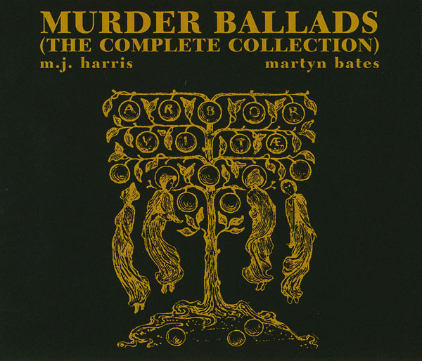

artist: **M.J. Harris** & **Martyn Bates** release: _Murder Ballads (Drift, Passages, Incest Songs)_ format: 3x CD year of release: 1994 (_Drift_), 1997 (_Passages_), 1998 (_Incest Songs_), 1998 (_The Complete Collection_) label: Musica Maxima Magnetica, Invisible duration: 63:24, 55:30, 59:07

detailed info: discogs.com \[_[Drift](http://www.discogs.com/MJ-Harris-Martyn-Bates-Murder-Ballads-Drift/master/236516), [Passages](http://www.discogs.com/MJ-Harris-Martyn-Bates-Murder-Ballads-Passages/release/407705), [Incest Songs](http://www.discogs.com/MJ-Harris-Martyn-Bates-Murder-Ballads-Incest-Songs/release/407708), [The Complete Collection](http://www.discogs.com/MJ-Harris-Martyn-Bates-Murder-Ballads-The-Complete-Collection/release/125576)_\]

Some sublime works of art just pass under the radar for no apparent reason, while for others, it's pretty obvious why they never reached a wide audience. The _Murder Ballads_ trilogy put together by **Mick Harris** (**Scorn**, **Lull**, **Napalm Death**) and **Martyn Bates** (**Eyeless in Gaza**) is, at least to me, an example of the latter category. Who would want to listen to gruesome folk songs, their words ponderously sang by Bates and stretched to their durational limit, accompanied by the darker than black isolationist ambient soundscapes laid down by Harris? Twelve such ballads are presented in quartets, taking almost fifteen minutes on average each, for a total of nearly three hours of, well, utterly unsettling and gloomy music.

The first part of the series was released in 1994, and entitled _Drift_. Like each album, it contains four separate ballads, the first of which is "The Death of Polly", in which a man named Willy leads astray Polly with the promise of marriage, and some "fun" before. In actuality he leads her to a freshly dug grave and stabs her to death, leaving only the "wild birds to moan". In the second ballad, "The Fowler", a young man accidentally shoots his true love in the guise of a swan while out hunting. "Lucy Wan" is a horrifying tale of an incestuous relationship (or rape) that leads to a brother killing his sister Lucy, and subsequently leaving home, presumably to commit suicide:

_O what will you do when your father comes to know O my son, come tell to me O I will set foot in a bottomless boat and I will sail the sea_

_And when will you come back again O my son, come tell to me When the sun and the moon dance on yonder hill and that may never be_

The last track is "Long Lankin", an oft-sung classic about Long Lankin and the False Nurse, who conspire to kill a lady and her child while the lord is away from his house.

Throughout all this, Bates sticks to his own setting of the traditional melodies, delivered sometimes softly, sometimes at full volume, with his powerful and unmistakable high emotive voice. Harris' ambient backing subtly reinforces the cadence of the song with deep, slowly pulsating drones, and fills in the gaps between verses with melodic accents and effects. Ample time is taken to draw out each verse and melody, which gives all of the music a ponderous and slow passing. Though it might take some time to settle into this rhythm, ultimately it allows the listener to take in both the narrative of the ballads and the delicately layered instrumental and vocal melodies, which are unique for each song.

This mode continues throughout the second album _Passages_, and the final one, _Incest Songs_. Number two contains "The Bramble Briar", about two brothers who kill the lover of their sister because he is a servant; "The Cruel Mother", who kills her two unwanted babies in the forest, only to find them returned later to the porch of a church, where she is cursed by them; "The Banks of Fordie" tells of three sisters ambushed by a robber, who asks each of them to be his bride or die. He kills two of the sisters, but the third one reminds him of the damnation in store for him, and he takes his own life instead; "The Murder of Maria Marten" closes the second album, a particularly graphic story similar to that of "The Death of Polly". _Incest Songs_, as the title indicates, is the only album with a unifying theme apart from murder, and all four songs have the forbidden love between brother and sister as its theme, a situation where both parents and children often end up at the wrong end of a knife.

As I stated earlier, the thematics of these traditional folk songs are not that easy to swallow, especially when compared to the relatively flighty and upbeat themes of most of today's popular music. However, students of these traditions and similar ones like folktales, fairytales and urban legends, will realise that they serve the unique purpose of thrilling the listener and warning of possible hostile intentions of others, and of the possible tragedy lurking behind some cases of murder. A touching example is that of "The Bonny Hind", where the incestuous brother and sister at the time do not know they are related. Only later do they discover this, with disastrous results.

The coupling of these themes with a slow and deliberate recounting, and quite oppressive (though beautifully composed) dark ambient music - instead of the traditional a capella or acoustic-instrument renditions - makes this album series a unique piece of art, and one that despite the differing origins of its two musical modes comes out of the woodwork perfectly. Rather than feeling as a random combination, this pairing sounds as natural as a traditional interpretation of ballads might. To me, this is what makes folk so exciting: artists infusing traditional material into their own vision, giving birth to something new. In the case of Harris and Bates' _Murder Ballads_, the result is an utterly unique and essential work that appears to have been under-appreciated during the roughly 15 years it has been out there. I gave some reasons in the beginning for why this is understandable, but here is a heartfelt call to all readers to dive in and (re)discover this masterpiece. There are infinitely worse ways to spend a rainy afternoon.

Reviewed by **O.S.**

Tracklist:

_Drift_ 1\. The Death Of Polly (14:09) 2. The Fowler (18:32) 3. Lucy Wan (14:39) 4. Long Lankin (16:05)

_Passages_ 1\. The Bramble Briar (13:27) 2. The Cruel Mother (11:24) 3. The Banks Of Fordie (13:07) 4. The Murder Of Maria Marten (17:33)

_Incest Songs_ 1\. The Bonny Hind (12:11) 2. Sheaf And Knife (12:07) 3. The Two Brothers (17:09) 4. Edward (17:41)
