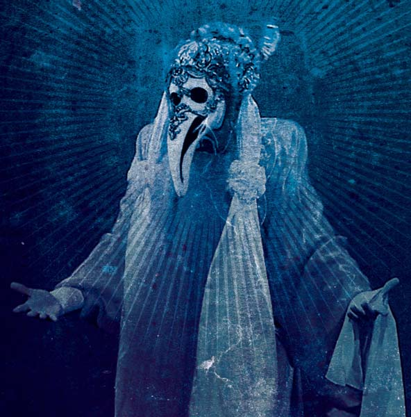
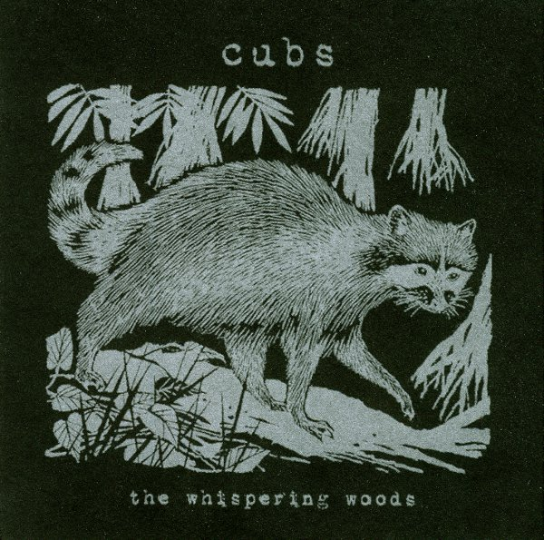
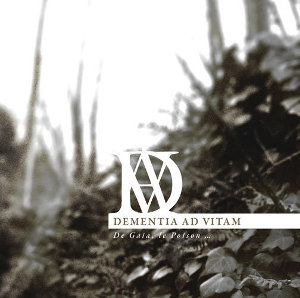
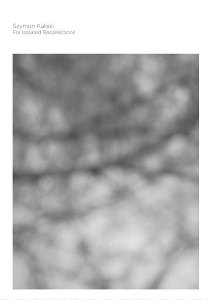

**Aderlating** - _Spear of Gold and Seraphim Bone Part One_ \[[discogs](http://www.discogs.com/Aderlating-Spear-Of-Gold-And-Seraphim-Bone-Part-One/release/2779091)\]

\[caption id="attachment\_1803" align="alignright" width="148" caption="Spear of Gold and Seraphim Bone Part One"\]\[/caption\]

Delectable darkness comes from **Aderlating** recently, a project by Mories of **Gnaw Their Tongues** and Eric of **Mowlawner**. Not surprisingly, the album mixes dark ambient and drones with obscure black metal outbursts to create a dynamic set of compositions. Naturally, these styles mix well in creating a dark and oppressive atmosphere with occult undertones. The proportion between more and less intense pieces is balanced very well, with a good variance between pure abstract soundscapes, all-out black metal fury, and wild noisy parts with free drums.

All in all an excellent album for those particular moods, and a nice supplement to what I've already heard from **Gnaw Their Tongues**. The noisy ritual atmosphere on _Spear of Gold.._. should appeal to lovers of experimental black metal and occult drones and ambient alike.

**Cubs** \- _The Whispering Woods_ \[[discogs](http://www.discogs.com/Cubs-The-Whispering-Woods/release/2637021)\]

\[caption id="attachment\_1804" align="alignleft" width="150" caption="The Whispering Woods"\]\[/caption\]

The second **Cubs** release again features a long list of figures from Irish and British freefolk, collaborating on a series of mostly instrumental tracks. Prominent are lovely (semi-)improvised guitar and violin arrangements, use of samples and electronic effects, exemplifying the experimental folk sound of today. On the whole this album is a very pleasant, relaxing listen, particularly tracks like "Fortis Green", "Hidden Valley" and "Frozen Lake", alternating melancholic and more upbeat moods. Another nice track is "Blackberry Lane", which also has a decidedly cute [video by **tinyEPICs**](http://www.youtube.com/watch?v=97ScJfa0vJU).

_The Whispering Woods_ is not as strong as it perhaps might have been if you look at individual talent of some of the people involved (**Aaron Hurley**, **David Colohan**, **Michael Tanner**, **Vicky Langan**, **James Rider**, etc.). Not all tracks are equally captivating or involved, and the vocals are a bit lacklustre at times. Nevertheless, this is recommended listening for everyone with an ear open for experimental and freefolk, and only the latest of many fine such releases on **Rusted Rail** and **Deadslackstring**, who co-released this one.

 **Dementia ad Vitam -** _De Gaia, le Poison..._ \[[MySpace](http://www.myspace.com/dementiaadvitamband)\]

\[caption id="attachment\_1819" align="alignright" width="150" caption="De Gaia, le Poison..."\]\[/caption\]

French project **Dementia ad Vitam** focuses on rather heavy kind of neoclassical music the combines mostly piano and violin-based melodies with at times bombastic compositions, and some vocal outbursts here and there. At the same time, there are quite a few calm moments and gently flowing classically-inspired waltzes. Most of the tracks on this album are relatively short, allowing an interesting spectrum of different moods. Sometimes, a bit more time is reserved, such as for the acoustic guitar-based "A Présent Si Triste". The variation between such tracks and the shorter impressions is pleasant, and makes the album flow quite nicely, even though it is over an hour long.

Musical inspiration or distant parallels may be found with artists such as **Elend**, **Dargaard,** and **Arcana** , though the moods and compositions on this album make Dementia ad Vitam stand apart more than enough. Although I must say this album leaves me relatively untouched emotionally, the compositions and atmospheres on _De Gaia..._ are rich and interesting, and definitely worth checking out for anyone with a soft spot for high-strung and lush neoclassical works.

 **Szymon Kaliski -** _For Isolated Recollections_ \[[discogs](http://www.discogs.com/Szymon-Kaliski-For-Isolated-Recollections/release/2892571)\]

\[caption id="attachment\_1817" align="alignleft" width="105" caption="For Isolated Recollections"\]\[/caption\]

Young polish ambient artist **Szymon Kaliski** impressed quite a few folks with his release _Out of Forgetting_ in late 2010. Now he's back with a second EP on **Hibernate** that delivers more of the same delicate drones and ambient pieces. Kaliski's tracks are minimal, sparse compositions, relying on little glitches, noises and melodic loops. Most of the melodies have a piano-like tinge to them, and the general atmosphere of these quartet of tracks is that of someone sitting at a piano in a dusty room, keying out little pieces of memory. There's something spacious and contemplative about it that makes _For Isolated Recollections_ an extremely pleasant and calming listening experience.

So far, Kaliski hasn't greatly astounded me with his music, but little works like this one are sure to find their way into the playlist of many ambient lovers, and I for one look forward to hearing more subtle and gentle recordings like this one. Promising work!
