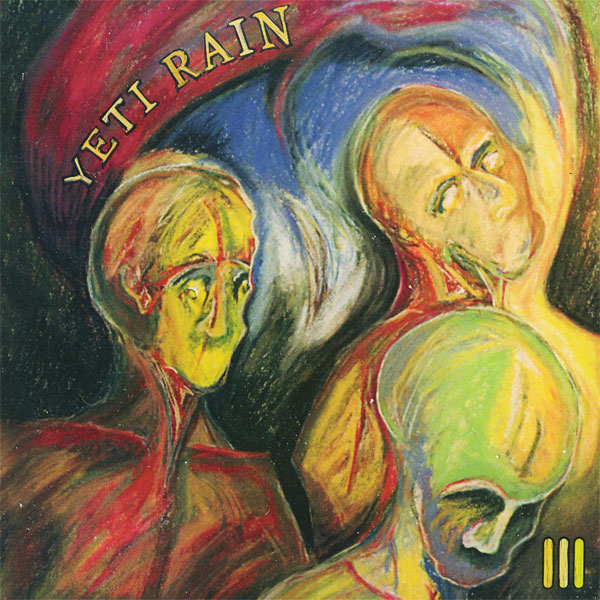

artist: **Yeti Rain** release: _III_ format: CD year of release: 2010 label: [Crimsonic](http://www.crimsonic.com/) duration: 53:16

detailed info: [discogs.com](http://www.discogs.com/release/2911755)

This third album by the Chicago-based trio **Yeti Rain** threw me quite a curve ball. Utilising the basic setup of drums, electric bass, and woodwinds (saxophone and wind synth), the band belt out a series of tracks that are made up of equal parts rock, free jazz, funk, and ominous ambient. While it takes some getting used to, I quickly found that these elements mesh very well due to the skillfulness of composition (or improvisation) displayed on this weird but exciting album.

The first two tracks lean very heavily towards the rock and funk side of the spectrum, with solid driving drums and the bass and winds providing estranging melodies that certainly qualify as jazzy and stimulating. "The Meeting" takes some of the instrumental timbres already heard, but strips it down to an ambient track without drums, narrated by a child's voice. "Fires of Heaven" is another wonderful ambient piece with flowing synth layers, a touch of psychedelic bass, and percussive swells. "The Sky Sickened" starts with more unnerving sax work, and a distorted piece of poetic and equally disturbing spoken word by bassist **William Kopecky**. Later in the track, drums are added whilst the narrative continues, and the song shuttles between words and outbursts of noise. The album's closing track is an echo-drenched piece of woodwinds and distant words, sealing this series of tracks on a decidedly eerie note.

_III_ was a surprising record for me, not quite like most material we receive here, but certainly a pleasant surprise. The album has a unique atmosphere and sound that might appeal to a very diverse listener base, from fans of progrock and free jazz to lovers of experimental and dark ambient, or even avantgarde metal.

Reviewed by **O.S.**

Tracklist:

1\. Planets (10:30) 2. Dragonfly Algebra (12:01) 3. The Meeting (6:49) 4. Fires of Heaven (6:56) 5. The Sky Sickened (11:11) 6. The Sixth Bowl of Wrath (5:48)
