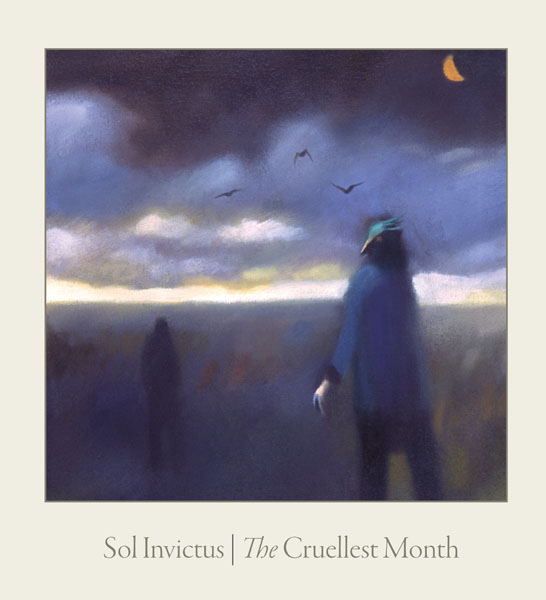

artist: **Sol Invictus** release: _The Cruellest Month_ format: CD year of release: 2011 label: [Auerbach](http://www.prophecyproductions.de/front_content.php?idcat=264&lang=3) duration: 56:50

detailed info: [discogs.com](http://www.discogs.com/Sol-Invictus-The-Cruellest-Month/release/2884210)

It's been a year or six since the last proper Sol Invictus album, and we've had to turn to **Tony Wakeford**'s consistent work on various side projects (**The Triple Tree, Orchestra Noir, Grey Force Wakeford**) and solo works to follow the man's current musical directions. Nevertheless, it seems he's gathered enough inspiration from all these endeavours to infuse Sol Invictus' seminal neofolk with some new influences.

As has been the case with practically all albums by the band in the almost 25 years of its existence (an impressive datum in itself) there is some recycling of themes, melodic motifs, and composition structure. What fascinates me is that despite of this, and with the help of a varying and ever-changing musical arrangement, most of these albums are still interesting and fresh enough, and _The Cruellest Month_ is no exception. Tracks like "Something's Coming" and "Toys" (though the latter is lyrically very enjoyable) have perhaps a bit too much of that "heard this before" feeling, but overall, there is a lot of variation. **Andrew King**'s rendition of traditionals ("Edward" and "Cruel Lincoln") differ from his solo works in the addition of the Sol Invictus band, and practically embody the part of neofolk that is rooted in folk balladry. Tracks like "Stella Maris" and "Fool's Ship" tackle a more expansive sound and nautical theme where the rich arrangements for flute (**Guy Harries**), dulcimer (**Reeve Malka**) and violin (**Renee Rosen**) truly shine. The same point applies to the brilliant instrumental "April Rain".

Another selling point of _The Cruellest Month_ is the collection of series of tracks that have been all over the place, except together on a definitive Sol Invictus studio album: "To Kill All Kings", "The Bad Luck Bird", "The Cruellest Month", and "The Blackleg Miner". All are live staples, typical anthems, or at least bound to become one, so it's good to have them all here. I must say that a bit more fire could have gone into the delivery of these here and there, but overall, these are solid tracks, and more examples of what has kept Wakeford's compositions interesting throughout the years: a strong sense of rhythm, song structure, and memorable melodies.

The first couple of drafts of this review in my head compared _The Cruellest Month_ to side project albums that have impressed me the past few year (_[Ghosts](http://www.eveningoflight.nl/2008/12/01/review-the-triple-tree-ghosts-2008/ "Review: The Triple Tree – Ghosts (2008)")_ by The Triple Tree, _Marble Heart_ by Grey Force Wakeford, _Not All of Me Will Die_ by Wakeford solo). The greater degree of experimentation that Wakeford displayed on such albums is in some sense laudable, and part of me wishes a bit more had trickled through into this one. All the same, this is a Sol Invictus album, and another part of me realises that staying relatively faithful to the song-based tradition of neofolk is what keeps the band on track as a project. In that light, the balance struck between tradition and more loose composition and instrumental play on _The Cruellest Month_ is excellent. So, it's a new album by what stands as the mainstay band of the neofolk genre, and though it's not a thoroughly surprising one, I'd say it's exemplary and at the top of what the genre has to offer.

Reviewed by **O.S.**

Tracklist:

1\. Raining In April (2:34) 2. To Kill All Kings (4:50) 3. The Sailor's Aria (1:38) 4. Fool's Ship (4:24) 5. Toys (3:20) 6. Edward (5:36) 7. The Bad Luck Bird (4:14) 8. April Rain (5:33) 9. Cruel Lincoln (7:59) 10. Something's Coming (4:11) 11. Stella Maris (3:26) 12. The Cruellest Month (5:45) 13. The Blackleg Miner (3:23)

<table id="playlist-0" class="playlist mini_playlist"><tbody><tr class="first"><td class="track_pos" style="width: 25px;">1</td><td class="track_artists"></td><td class="track">Raining In April</td><td class="track_duration" width="25">2:34</td><td width="1"></td></tr><tr><td class="track_pos" style="width: 25px;">2</td><td class="track_artists"></td><td class="track">To Kill All Kings</td><td class="track_duration" width="25">4:50</td><td width="1"></td></tr><tr><td class="track_pos" style="width: 25px;">3</td><td class="track_artists"></td><td class="track">The Sailor's Aria</td><td class="track_duration" width="25">1:38</td><td width="1"></td></tr><tr><td class="track_pos" style="width: 25px;">4</td><td class="track_artists"></td><td class="track">Fool's Ship</td><td class="track_duration" width="25">4:24</td><td width="1"></td></tr><tr><td class="track_pos" style="width: 25px;">5</td><td class="track_artists"></td><td class="track">Toys</td><td class="track_duration" width="25">3:20</td><td width="1"></td></tr><tr><td class="track_pos" style="width: 25px;">6</td><td class="track_artists"></td><td class="track">Edward</td><td class="track_duration" width="25">5:36</td><td width="1"></td></tr><tr><td class="track_pos" style="width: 25px;">7</td><td class="track_artists"></td><td class="track">The Bad Luck Bird</td><td class="track_duration" width="25">4:14</td><td width="1"></td></tr><tr><td class="track_pos" style="width: 25px;">8</td><td class="track_artists"></td><td class="track">April Rain</td><td class="track_duration" width="25">5:33</td><td width="1"></td></tr><tr><td class="track_pos" style="width: 25px;">9</td><td class="track_artists"></td><td class="track">Cruel Lincoln</td><td class="track_duration" width="25">7:59</td><td width="1"></td></tr><tr><td class="track_pos" style="width: 25px;">10</td><td class="track_artists"></td><td class="track">Something's Coming</td><td class="track_duration" width="25">4:11</td><td width="1"></td></tr><tr><td class="track_pos" style="width: 25px;">11</td><td class="track_artists"></td><td class="track">Stella Maris</td><td class="track_duration" width="25">3:26</td><td width="1"></td></tr><tr><td class="track_pos" style="width: 25px;">12</td><td class="track_artists"></td><td class="track">The Cruellest Month</td><td class="track_duration" width="25">5:45</td><td width="1"></td></tr><tr><td class="track_pos" style="width: 25px;">13</td><td class="track_artists"></td><td class="track">The Blackleg Miner</td><td class="track_duration" width="25">3:23</td></tr></tbody></table>
