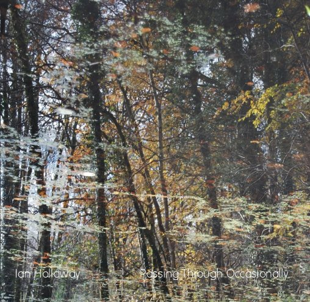

artist: **Ian Holloway** release: _Passing Through Occasionally_ format: CD-R year of release: 2011 label: [Phonospheric](http://www.phonospheric.co.uk/) duration: 37:00

detailed info: [discogs.com](http://www.discogs.com/Ian-Holloway-Passing-Through-Occasionally/release/2748789)

One of **Ian Holloway**'s latest drone works was released on **Adrian Shenton**'s **Phonospheric** label recently. It is one of those longer one-piece suites in which a soundscape can be explored extensively and at a leisurely pace.

In terms of mood, _Passing Through Occasionally_ reminds me of **Itto**'s [_Sound on an Empty Road_](http://www.eveningoflight.nl/2007/03/01/review-itto-sound-on-an-empty-road-2006/ "Review: Itto – Sound on an Empty Road (2006)"), in which Holloway was also involved, because of the combination of dark drones and treated environmental recordings on the one hand, and slow-moving, tentative melodies on guitar and synth on the other. To me, the music describes a solitary journey through some natural environment, where the sensations from outside (plants, insects, weather) are somehow amplified and abstracted at the same time. This contrasts the openness of the outdoors experience with a sort of mental claustrophobia imposed by the altered sensations.

It is an effect I've felt in more of Holloway's compositions and it is always an intriguing listening experience when you are in the mood for something introspective and slightly mystifying. So, if you've been in one of his worlds before and would like to return, or fancy a first journey here, this pleasantly priced but highly limited CD-R is a very fine place to start.

Reviewed by **O.S.**

Tracklist:

1\. Passing Through Occasionally (37:00)

**Itto** is a project of Neil Rowling (**Goatboy**) and Ian Holloway (**Psychic Space Invasion**). This album is one long track of dark droning ambient, with some field recordings and instruments thrown in. I found this album a bit tough to get into, but it turns out to contain a subtle beauty that does show itself after attentive listening.The track starts with some very deep layered drones, and this continues on during the first third of the length. More and more sounds of different frequencies drift in during this section, providing variation. About halfway, a soft guitar melody breaks through the drones, which creates a more peaceful atmosphere than the rather dark beginning. Towards the last quarter of the track, nighttime atmospheres and slightly noisy waves take over the lead, sending the track back into cold darkness.

This album requires a quiet environment, headphones and attentive listening, otherwise it won't be able to show its merits. That makes it perhaps a bit limited in its scope, because its not as interesting as background music as some other ambient. However, if you're a patient listener and a lover of deep obscure soundscapes, this is a very fine release. The _real_ sound of an empty road can be interesting enough in the right circumstances, but this musical interpretation is surely worth your attention.
