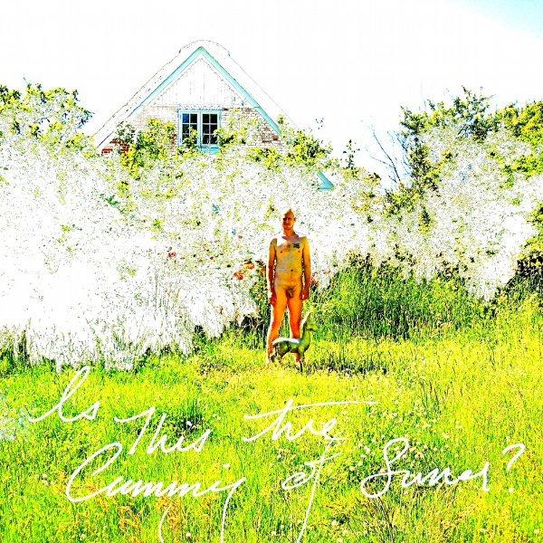

artist: **Moongazing Hare** release: _Is This the Cumming of Sumer?_ format: Digital year of release: 2011 label: [Self-released](http://moongazinghare.bandcamp.com/) duration: 23:29

During recent months, I've been working my way through some of **Moongazing Hare**'s older releases (all self-released through Bandcamp) and it's been a very pleasant journey. And then along comes a new EP, filled with **Death in June** covers no less. I'm always a bit wary when it comes to such projects, but in this case I shouldn't have worried at all.

Apart from the intro and outro tracks, based on various renditions of the classic [Turn! Turn! Turn!](http://en.wikipedia.org/wiki/Turn!_Turn!_Turn!), the five central songs are interpretations of some of Death in June's essential tracks, and Moongazing Hare's **David Folkmann Drost** makes them sound as such as well. Though this EP remains in neofolk and singer/songwriter territory, David's subtle and intimate voice and sparse instrumentation based on guitar and banjo give the songs a whole new sound. This is not greatly apparent in "Hail! The White Grain", which is perhaps closest to the original, but songs like "Fall Apart" and "Rose Clouds of Holocaust" have quite a different timbre and intensity, and one that is not at all unpleasant.

In fact, where Death in June's studio recordings have been wavering in their overall quality and sometimes internal consistency, I can say that this EP here has no problems in that area. It is short, balanced, and very powerful in the understatement of some songs, especially "Fall Apart" and "Despair". So, far more than just a funny project, this cover EP is a worthy addition to growing Moongazing Hare discography, as well as a very fine tribute to the songs of **Douglas Pearce**. Being 100% free to boot, I'd say this one is an essential download for all neo- and experimental folk lovers.

Reviewed by **O.S.**

Tracklist:

1\. Gather Stones or Turn to Dust (1:54) 2. Hail! The White Grain (2:40) 3. Fall Apart (3:43) 4. Despair (4:36) 5. Rose Clouds of Holocaust (3:48) 6. She Said Destroy (5:29) 7. Worm Turn the Knife (1:19)
