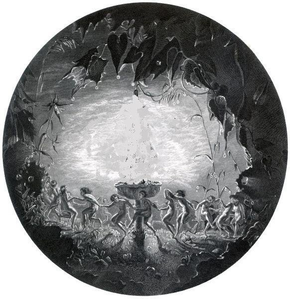

artist: **Sproatly Smith** release**:** _Pixieled_ format: CDr year of release: 2010 label: [Reverb Worship](http://reverbworship.com/) duration: 54:59

detailed info: [discogs.com](http://www.discogs.com/Sproatly-Smith-Pixieled/release/2980407)

It's my pleasure to introduce another treat for lovers of psychedelic folk. **Sproatly Smith**'s second full length album is a very balanced effort that sets some excellent moods. The original edition on **Reverb Worship** is sold out, but there is a limited second edition out as well, and it's also possible to buy a digital version through the artist's [Bandcamp](http://sproatlysmith.bandcamp.com/album/pixieled) page.

It's not in originality that this project stands out, as _Pixieled_ doesn't really bring many innovative elements to a genre that goes back four decades. However, the band's broad influences are balanced to perfection, combining acoustic instrumentation with soft female vocals and a host of tiny details and effects that truly bring the music to life. The tracks themselves are balances likewise, alternating between instrumentals and relaxes pastoral tracks with spoken word and samples ("Pixieled", "Afon Gwy", "Hornsea Cove") and vocal traditionals and songs ("Spring Strathspey", a **Gwydion Pendderwen** cover, the excellent "The Magpie's Nest", etc.). Of further note is the long "Whit Leafed Oak", a great hypnotic psych piece.

The overall mood is calm, flowing, more a brook than a raging river, and focuses on the pastoral elements of the psychedelic folk tradition rather than the chaotic ones. As such, this is a great album whether you want something to play in the background or to listen to more closely. In short, a release to be proud of, deserving of note in the wider alternative folk audience, and promising for the future!

Reviewed by **O.S.**

Tracklist:

1\. Flowers Made Of Winter (2:46) 2. Spring Strathspey (4:53) 3. Pixieled (3:56) 4. The Magpie's Nest (5:09) 5. Afon Gwy (4:20) 6. Sabrina Fair (3:30) 7. Hornsea Cove (4:47) 8. The Ballad Of Tam Lin (5:46) 9. Whit Leafed Oak (8:00) 10. A Leaf Must Fall (5:22) 11. Sanhaim Dance (1:05) 12. Old Years Wake (5:25)
