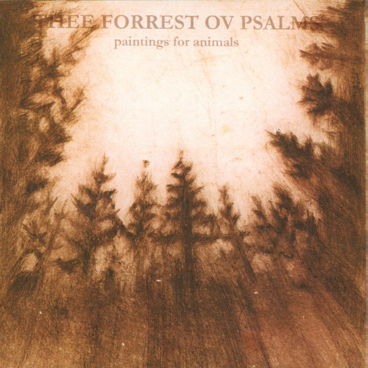

artist: **Paintings for Animals** release: _Thee Forrest ov Psalms_ format: CD-R year of release: 2010 label: [Painted](http://paintedrecords.blogspot.com/) duration: 43:53

detailed info: [discogs.com](http://www.discogs.com/release/2445034)

**Paintings for Animals** is the project of **Pearson Wallace-Hoyt**, dedicated to experimental and ritual music of various sorts. On this release, the focus is on vocals, drones, and bell and bowl percussion.

"A Handful for thee Root" is a fascinating introductory track with slowly mounting, raw drones, spoken word, and clanging percussion. The first main track, "Thee Bells ov Mercuralia", focuses on various loops of bells and singing bowls. It is meditative and mystical, but perhaps a bit long, depending on your mood. "Florauna" is a short but sweet synth intermezzo, softly whizzing and buzzing. The fourth track is right back into expansive ritual territory, starting out calm, but featuring increasingly powerful abrasive drones and vocals. The final piece on this album, entitled "Covalence (Vines)" is rather similar to the second one, but with a bit more percussion (shakers, cymbals) and electronic effects thrown in. Again, a very nice piece with a meditative atmosphere, but perhaps a bit too long.

That is also my general impression of _Thee Forrest ov Psalms_. I can hear that there are a lot of great ideas in **Paintings for Animals**, but in some places on this album, they're spread a bit too thin, which makes the longer tracks OK for background listening, but not extremely satisfying for repeated close listenings. Nevertheless, my interested has really been piqued by this project, and I'd love to hear more recent work to see what else is up their sleeve. Meanwhile, this should be an interesting listen for anyone into ritual ambient and drones, if you're still able to get it, that is, as the original pressing was a mere 50 copies.

Reviewed by **O.S.**

Tracklist:

1\. A Handful For Thee Root (5:24) 2. Thee Bells Ov Mercuralia (10:24) 3. Florauna (2:39) 4. Thee Antler Horn Ov Halsealth (12:13) 5. Covalence (Vines) (13:13)
