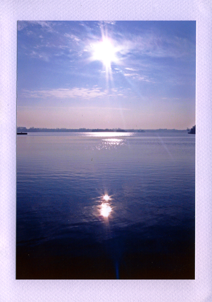

# Out Now!

The third Evening of Light release is a double album by **Agitated Radio Pilot**, the project of **David Colohan**. It combines the EP _Lights Beneath the Lake_ on 3" CD-R with the compilation _Nothing Is Truly Lost_ on 5" CD-R. The first album is a new recording focusing on an experimental mixture of folk and ambient, featuring **Richard Moult, Gavin Prior**, and **Brian Conniffe** as guest musicians. The second album collects twelve tracks that are previously unreleased or were released in the past on rare compilations. Here too, David combines beautiful songs on acoustic guitar and piano with ambient and noisy instrumental compositions. It features a wide range of guest artists, including **John Cavanagh, Aaron Coyne, Shane Cullinane, Annemarie Deacy, Jani Hellén, Aaron Hurley, Vicky Langan, Scott McLaughlin, Gavin Prior, Enda Trautt,** and **Keith Wallace.**

artist: **Agitated Radio Pilot** release: _Lights Beneath the Lake / Nothing Is Truly Lost_ layout: OS & DMK duration: 14 tracks, 62:59 format: 3" CD-R + 5" CD-R release date: August 2011 catalogue number: :EOL03:

Press:

- \*\*\*\* review on [Norman Records](http://www.normanrecords.com/cd/128776-agitated-radio-pilot-lights-beneath-the-lake--nothing-is-truly-lost)
- Played on [Concertzender X-Rated](http://www.concertzender.nl/programmagids.php?date=2012-02-05&month=-3&detail=54856)

Use the player below for a sample preview of this release, containing snippets from 8 of the 14 tracks:

 [:EOL03: Agitated Radio Pilot - Lights Beneath the Lake / Nothing is Truly Lost \[Teaser\]](http://soundcloud.com/eveningoflight/eol03-agitated-radio-pilot) by [Evening of Light](http://soundcloud.com/eveningoflight)
