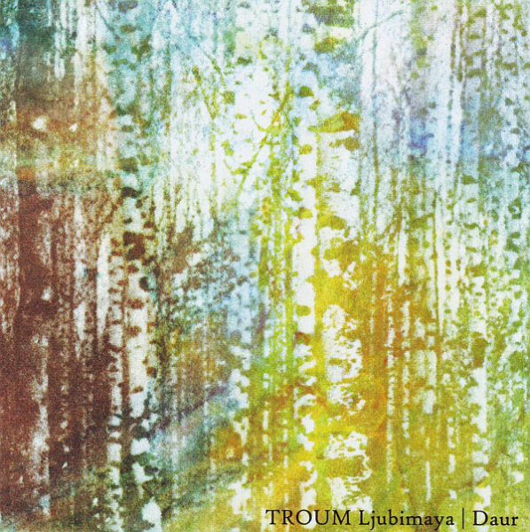

artist: **Troum** release: _Ljubimaya | Daur_ format: CD year of release: 2009 label: [Abgurd](http://www.abgurd.com/) duration: 52:52

detailed info: [discogs.com](http://www.discogs.com/Troum-Ljubimaya-Daur/release/1847688)

This album, released on the Russian **Abgurd** label, compiles two long out of print 10" EPs by **Troum**: _Ljubimaya_ form 2003 and _Daur_ from 1998. Even though this CD release is again a limited edition, it does gives people like who discovered the seminal drone project at some later stage to acquire this earlier recordings.

The opener "Ljubimaya" is in what has become quite a typical Troum sound: dark flowing melodies created with treated guitars and other instruments. "Meerestraum" is quite inconspicuous at first, but on closer listening it reveals wonderful voices and other details in its faint aquatic drones. A very fascinating subdued piece. The quite long "Distracted Protection" is a classic drone loop, varying only in its different modulations and intensities. An OK piece, and featuring sounds by **Yen Pox**, but not spectacular.

The second EP is interesting as well. Opener and title track "Daur" is a stunning piece based on a repeated plucked string melody, layered and coupled with shifting drones and background melodies that increase in intensity, giving this track a perfect buildup over its entire thirteen minutes of length. "Venustas" is a shorter interlude, with thick layered bow-like melodies dominating. "Krypte", finally, is a slightly longer piece again, combining softly sweeping melodic waves a prominent bass-like melody layered over it.

I wouldn't say this is an absolutely essential release in the world of drone and ambient, but it is certainly another proof of the undeniable talent and singular vision of Troum, who remain one of my favourite projects in this area. There are a couple of excellent tracks on here, so if you don't already have the original releases, _Ljubimaya | Daur_ is a very good mid-price addition to your collection.

Reviewed by **O.S.**

Tracklist:

1\. Ljubimaya (7:22) 2. Meerestraum (5:47) 3. Distracted Protection (15:33)

4\. Daur (13:19) 5. Venustas (3:37) 6. Krypte (7:14)
