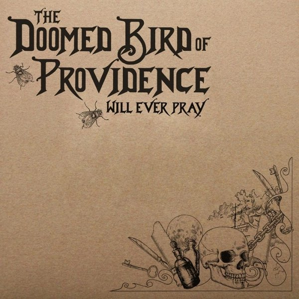

artist: **The Doomed Bird of Providence** release: _Will Ever Pray_ format: CD year of release: 2011 label: [Front & Follow](http://www.frontandfollow.com/) duration: 51:59

detailed info: [discogs.com](http://www.discogs.com/Doomed-Bird-Of-Providence-Will-Ever-Pray/release/3020733)

The first album by London-based project **The Doomed Bird of Providence** let by **Mark Kluzek** is immediately a bulls-eye. These nine tracks of nautically inspired folk set an atmosphere perfectly and holds moments of great musical beauty.

Although Kluzek's drunken sailor type voice is the first thing that hits you when you play the album, and it may take some getting used to, it quickly becomes clear that this music asks for exactly this type of raw, honest, and pathos-filled vocals. The first few tracks bear a heavy stamp of historical sea shanty stylings, and they sway gently, accompanied by guitar, accordion, violin, bells, and percussion. Not stuck in the past though, the music also shows parallels with modern experimental folk, not in the least **Current 93**'s _Sleep Has His House_, though less minimalistic than that particular album. Those first four tracks are all solid stuff, slow and drawn out, mournful and moody.

The massive five-part final of the album is a great work unto itself, though. "The Massacre Of The Whole Of The Passengers And Part Of The Crew Of The Sea Horse On Her Homeward Passage From Sydney", as the piece is called, starts with a gorgeous deep violin drone lasting a full six minutes, which is gradually joined by more instruments to form a wonderful long intro to the gruesome tale that is the narrative heart of the suite, told in raucous style in parts two and three. The fourth part is a slow and sad piano-based track which emphasises the tragedy of the tale, while the short fifth part is a shipboard setting of "Dives and Lazarus" tying the piece and the album firmly together into the annals of folk history.

It's both the general vision and the attention to musical details that make _Will Ever Pray_ a great success. From the spot-on vocals, composition, and instrumentation to little touches like the violins imitating the creak of a ship's rigging, it all works as it should. Albums like these, like sea voyages, are bold endeavours into unknown territory, but thankfully Kluzek and his crew fare a lot surer than the ships that are sung about on this record, which is one of the essential listens in alternative folk of this year. It's limited to 250 copies on CD, release by **Front & Follow**, so get it while the getting's good.

Reviewed by **O.S.**

Tracklist:

1\. On A Moonlit, Ragged Sea (4:33) 2. The Wild Beast Of Goat Island (4:37) 3. On The Deathbed Of Janus Weathercock (6:24) 4. Fedicia Exine (8:28)

_The Massacre Of The Whole Of The Passengers And Part Of The Crew Of The Sea Horse On Her Homeward Passage From Sydney_ 5\. Part 1 (10:28) 6. Part 2 (2:24) 7. Part 3 (5:02) 8. Part 4 (6:20) 9. Part 5 (3:43)
