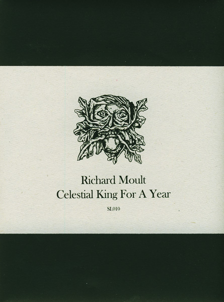

artist: **Richard Moult** release: _Celestial King for a Year_ format: CD-R year of release: 2011 label: [Second Language](http://www.secondlanguagemusic.com/) duration: 34:10

detailed info: [discogs.com](http://www.discogs.com/Richard-Moult-Celestial-King-For-A-Year/release/2824460)

While the majority of **Richard Moult**'s recent musical works focused on piano compositions, this year's _Celestial King for a Year_ is something of a new course, or perhaps only a temporary sojourn into new territory.

The first of three parts on this album consists solely of a mournful composition for strings, of which Moult uses a quintet on this release: three violins (**Ben Sansom, Isobel Found, John Cheshire Joiner**) and two violas (**Alexandria Lawrence, Henry Pye**). The sound of the piece is in line with the atmosphere present on others of Moult's works - loneliness, a powerful or even overpowering numinous natural presence - but decidedly more minimalistic.

This effect is strengthened in the second movement, where **Jessica Constable**'s layered and treated voice weaves thick patterns that manage to be unnerving, sad, and comforting at the same time. Constable transcends the boundaries of classical voice, endowing the performance with raw edges in appropriate places.

The final part returns to strings as instrumentation, with some added effects and faint echoed voices. It is by far the longest movement, but unfurls more melodic development than those that came before, and this prevents the piece from becoming an overlong excercise. Particularly towards the end the intricacy of Moult's composition sinks in, where subtly reverberating waves and a more ambient mood are introduced, mostly coming from mellotron and electronics, the only instruments Moult plays himself on this album.

_Celestial King for a Year_ is one of Richard Moult's more unique recent releases, where he reconfirms his singular vision as a composer. The release as a whole, lovingly put out by **Second Language**, and featuring an art print of Moult's lovely portrait of harpist **Áine O'Dwyer** of **United Bible Studies**, is sure to delight lovers of his earlier works, as well as those interested in modern classical/experimental composers in general.

Reviewed by **O.S.**

Tracklist:

1\. Part I (7:11) 2. Part II (7:33) 3. Part III (19:26)
