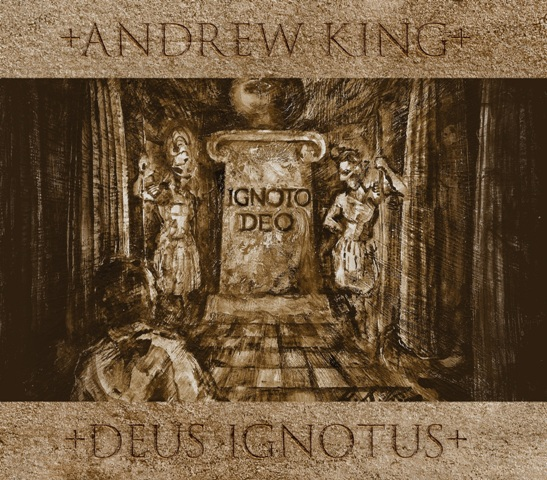

artist: **Andrew King** release: _Deus Ignotus_ format: CD year of release: 2011 label: [Epiphany](http://www.discogs.com/label/Epiphany) duration: 61:55

detailed info: [discogs.com](http://www.discogs.com/Andrew-King-Deus-Ignotus/release/2921651)

It's already been eight years since **Andrew King**'s previous solo album _The Amfortas Wound_ in 2003, and one realises how time flies. The gap is partially bridged by smaller releases and collaborations (with among others **[Sol Invictus](http://www.eveningoflight.nl/2011/06/11/review-sol-invictus-the-cruellest-month-2011/ "Review: Sol Invictus – The Cruellest Month (2011)"), [Duo Noir](http://www.eveningoflight.nl/2010/09/23/review-duo-noir-sintra-2010/ "Review: Duo Noir – Sintra (2010)"), [Brown Sierra](http://www.eveningoflight.nl/2011/04/24/review-andrew-king-brown-sierra-the-kraken-2010/ "Review: Andrew King & Brown Sierra  – The Kraken (2010)"), [The Triple Tree](http://www.eveningoflight.nl/2008/12/01/review-the-triple-tree-ghosts-2008/ "Review: The Triple Tree – Ghosts (2008)")**) so perhaps that is why it doesn't feel like such a long time. Regardless, _Deus Ignotus_ is a long-awaited work, and a new opportunity for King to put forth a very personal collection of traditional songs.

The album starts with some familiar work, to wit the excellent "The Three Ravens" and its intro, which have been welcome guests at King's live performances in recent years. Another familiar tune may be the a capella "Edward", of which an instrumentalised version appeared on the latest Sol Invictus album _[The Cruellest Month](http://www.eveningoflight.nl/2011/06/11/review-sol-invictus-the-cruellest-month-2011/ "Review: Sol Invictus – The Cruellest Month (2011)")_ this year. Some other loose tracks are newer to King's repertoire, as far as I know, such as "The Wife of Usher's Well", accompanied by soft but threatening synths and percussive accents, and "Lord Lovel", another a capella piece.

Perhaps most surprising, and pleasantly so, is the inclusion of some mediaeval tunes, such as "Sic Mea Fata Canenda Solor" from the _[Carmina Burana](http://en.wikipedia.org/wiki/Carmina_burana)_, and [**Oswald von Wolkenstein**](http://en.wikipedia.org/wiki/Oswald_von_Wolkenstein)'s "Fröleichen So Well Wir", which turned into a marvellous waltzing dance track in King's version.

A quartet of tracks (6.1 - 7.2) is dedicated to the Biblical tale of Judas' betrayal of Jesus. King cobbles together a fascinating musical narrative with different perspectives out of four different text sources, at the centre of which stands the 13th century Middle English ballad "Judas", marvellously rendered with powerful percussion by **John Murphy** and instrumental arrangements played by **Hunter Barr** and **Maria Vellanz.** This track is a perfect example of King's original musical vision that combines traditional song with a modern post-industrial form of composition.

I can't do complete justice here to the impressive combination of research and creativity that resulted in these works, but I will simply refer the reader to the extensive notes and lyrics in the booklet to this album, which documents these processes. Nowhere are these notes more elaborate than for the final piece, "Sir Hugh", and for good reason. It is a dark narrative ballad about the alleged murder of a young boy by Jews in mediaeval Lincoln. For the historical background on this instance of the [Blood Libel](http://en.wikipedia.org/wiki/Blood_libel) myth, King's notes provide three pages of information, including references to scholarship. Regardless, the narrative in the ballad related the Blood Libel as historical fact, which shows that the oral tradition on occasion preserves anti-Semitic and other unsavoury ideas. Apart from its insidious historical assertion, though, the song is very powerful as a murder ballad, and King's rendition channels that dark energy of it quite well, confronting the listener with the attractive and enticing ways evil ideas can be packaged, and teaching us to always keep a critical eye and ear open.

Altogether, _Deus Ignotus_ is another milestone for King's oeuvre, the fruits of much research and a singular vision. As before, he is one of the most important and original artists in modern/alternative folk interpretation, and this album is certainly one of his best works to date, lacking next to nothing in diversity of song selection, deliverance, instrumentation, and documentation.

Reviewed by **O.S.**

Tracklist:

1\. Corvus Terrae Terror (2:25) 2. The Three Ravens (6:01) 3. The Wife Of Usher’s Well (6:10) 4. Sic Mea Fata Canendo Solor (6:21) 5. Edward (4:22) 6.1. The Elders Of The People Took Counsel (1:45) 6.2. In Upper Room (5:28) 7.1. Judas (10:13) 7.2. Could Ye Not Watch With Me One Hour (1:16) 8. Lord Lovel (6:57) 9. Fröleichen So Well Wir (3:54) 10. Sir Hugh (7:03)
