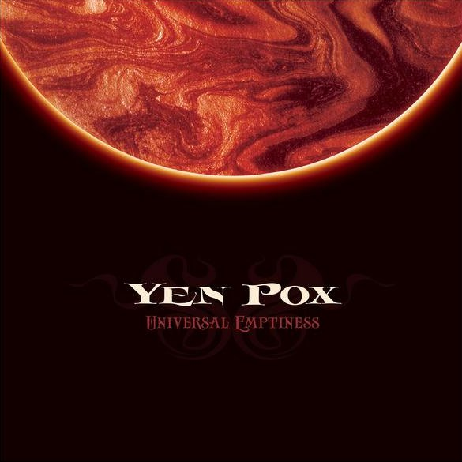

****artist: **Yen Pox** release: _Universal Emptiness_ format: 10" year of release: 2011 label: [Substantia Innominata](http://www.substantia-innominata.de/) duration: 33:16

detailed info: [discogs.com](http://www.discogs.com/Yen-Pox-Universal-Emptiness/release/2901807)

The first new release in many a year by **Yen Pox** is this gorgeous 10" vinyl in the outstanding **Substantia Innominata** series, which seems to be taking over from one-time parent label **Drone Records**, whose 7" drones series has recently ceased.

The first side builds up the tension with massive dark drones and waves, which give way to a slowly pulsating sound structure that dominates the most of the track. Like the brilliant artwork (done by frequent label collaborators **Eye.lyft**) suggests, these are faintly musical sounds, like the distilled aural onslaught of churning galaxies and black holes. The B-side "Below" contains, in a way, more of the same, but this works perfectly. The two sides together form over half an hour of delightfully deep and immersive sounds, ever-shifting so that no second sounds exactly the same. What these tracks lack in concrete melody or familiar points of departure, they make up in texture and flow, which is what music like this can be about too. Imagine listening to the deepest currents of an ocean, or the swirling of star systems through space, and you've got a bit of an idea.

_Universal Emptiness_ is a mini-album that's certainly not for the faint of heart, but those who venture inside will marvel at the complex yet harmonious tides coursing through these two tracks. It's deep, dark, and heavy, and extremely skilfully done. I don't think **Yen Pox** could have wished for a better comeback release, and it is only the latest of highlights in the Substantia Innominata series.

Reviewed by **O.S.**

Tracklist:

1\. Above (16:53)

2\. Below (16:23)
