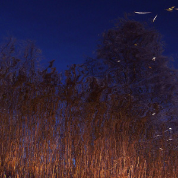

 

[Agitated Radio Pilot Retrospective I](http://www.mixcloud.com/eveningoflight/agitated-radio-pilot-retrospective-i/#utm_source=widget&amp;utm_medium=web&amp;utm_campaign=base_links&amp;utm_term=resource_link) by [Evening Of Light](http://www.mixcloud.com/eveningoflight/#utm_source=widget&amp;utm_medium=web&amp;utm_campaign=base_links&amp;utm_term=profile_link) on [Mixcloud](http://www.mixcloud.com/#utm_source=widget&utm_medium=web&utm_campaign=base_links&utm_term=homepage_link)

To celebrate the release of [_Light Beneath the Lake / Nothing Is Truly Lost_](http://www.eveningoflight.nl/2011/07/23/eol03-agitated-radio-pilot-lights-beneath-the-lake-nothing-is-truly-lost/ ":EOL03: Agitated Radio Pilot – Lights Beneath the Lake / Nothing Is Truly Lost") (:EOL03:) by one of our favourite artists, **Agitated Radio Pilot** (**David Colohan**), we have compiled two retrospective cloudscapes with personal selections the artist's back catalogue, and a couple of tracks from our own release, which is available now. Apart from :EOL03:, there will be a few more **ARP** releases on other labels, but after that, David is laying the project to rest. Another reason to look back!

This first retrospective contains mostly **ARP** album material, with a couple of tracks by **United Bible Studies,** and one from **Holt**, another band in which David was active. Enjoy!

00:00 | ARP | On Cape Clear | [World Winding Down](http://www.eveningoflight.nl/2008/02/01/review-agitated-radio-pilot-world-winding-down-2007/ "Review: Agitated Radio Pilot – World Winding Down (2007)") | 2007 02:05 | ARP | All That Fall | World Winding Down | 2007 05:16 | United Bible Studies | Tributaries of the Styx under Dublin | The Shore That Fears the Sea | 2006 11:40 | ARP | Inis Meain | The Rural Arcane | 2008 17:27 | ARP | Hold Back the Sea | Your Turn To Go it Alone | 2006 20:01 | ARP | The Gathering Dark | World Winding Down | 2007 22:22 | ARP | For Karen Ava | [Peter Wright / The North Sea / ARP](http://www.eveningoflight.nl/2007/11/01/review-peter-wright-the-north-sea-agitated-radio-pilot-2005/ "Review: Peter Wright / The North Sea / Agitated Radio Pilot (2005)") | 2005 25:54 | ARP | You Are Further Away From Me Now Than Ever Before | A Drifting Population | 2003 28:21 | United Bible Studies | The Lowlands of Holland | The Jonah | 2009 32:57 | ARP | The Barely Days | The Rural Arcane | 2008 34:29 | Holt | A Melbourne Nocturne (Live) | Unreleased 40:24 | ARP | On Fastnet Rock | Nothing Is Truly Lost | 2011 43:54 | ARP | Your Turn To Go It Alone | Your Turn To Go It Alone | 2006 47:00 | ARP | Shorelines Clad in Snow | World Winding Down | 2007 50:52 | ARP | And Many a Summer Sleeps | Imaginary East of Longford | 2004 51:53 | ARP | And If I Remained by the Outermost Sea | The Days & Hills Grown Old | 2006
