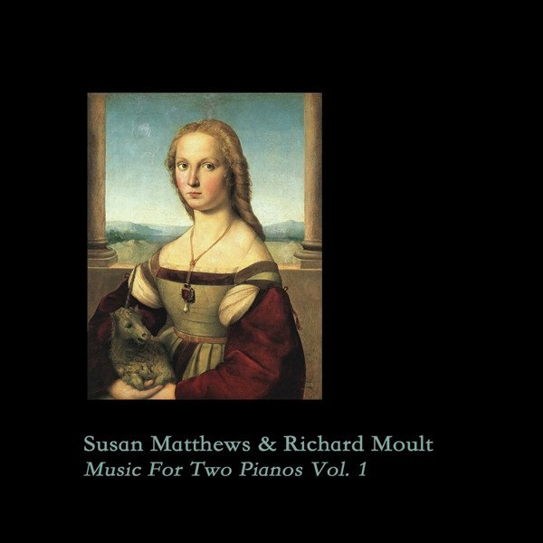

**Café de l'Enfer** \- _Marchant à quatre pattes au-devant de la rédemption_ \[[discogs](http://www.discogs.com/Caf%C3%A9-De-LEnfer-Marchant-Quatre-Pattes-Au-devant-De-La-R%C3%A9demption/release/2954562)\]

\[caption id="attachment\_2262" align="alignright" width="150" caption="Marchant à quatre pattes au-devant de la rédemption"\]\[/caption\]

This debut full-length by Café de l'Enfer on **Steinklang** is a typical piece of martial/neoclassical as we've come to know it for over a decade. The album seeks to confront the listener with the decadence of our age and ages past, drawing copiously from fin de siècle and interbellum imagery in the visual - mostly vintage pornography on the inside of the digipak - textual, and aural aspects of the release.

The music doesn't really stand out from other martial projects that I've heard during the past years. The compositions are sophisticated but predictable, the instrumentation is a bit too synthetic at some points for my tastes. It's certainly not amateuristic, but it _is_ rather hum-drum. Some parts are certainly worth your time, such as the end of "La forêt obscure" and the threatening marches of the title track, but overall I didn't find this a very exciting album.

It is interesting that the contrast between decadence and revolutionary order is such a recurring theme in music like this, because it sometimes seems to me that genre as a whole went from revolutionary innovation to decadent complacency and conformity. A pity. \[OS\]

**Locrian** - _Dort Ist Der Weg / Frozen in Ash_ \[[discogs](http://www.discogs.com/Locrian-Dort-Ist-Der-Weg/master/364959)\]

\[caption id="attachment\_2306" align="alignright" width="150" caption="Dort Ist der Weg"\]\[/caption\]

An upcoming 7" single by US guitar droners Locrian tackles a track originally recorded by **Popol Vuh**. The new version updates the krautrock classic to a rawer, heavier sound, infusing it with dirty and gritty guitars, and replacing the flighty female vocals of the original with subdued chanted variants. While I would be hard-pressed to say that this version matches the level of the original - parts of the excellent riffing and melody are lost in translation - there is something repetitive, plodding and typically Locrian about it that makes it a good listen nonetheless.

The single is backed with "Frozen in Ash", another great piece focusing on raw drones, a bit of black metal styling, and a satisfying conclusion with rolling percussion and descending piano movements. In short_,_ Locrian's _Dort Ist Der Weg_ is an interesting single that will surely please those familiar with the band, as well as an interesting introduction for those who are not. \[OS\]

**Susan Matthews** & **Richard Moult** - _Music for Two Pianos Vol. 1_ \[[discogs](http://www.discogs.com/Susan-Matthews-Richard-Moult-Music-For-Two-Pianos-Vol-1/release/2951748)\]

\[caption id="attachment\_2267" align="alignright" width="150" caption="Music for Two Pianos Vol. 1"\]\[/caption\]

A recent gem from the network of small musical publications in Britain is this collaboration between Matthews and Moult, who sat down to improvise delicate pieces for piano. Now, I don't have the musicological education to be able to place the compositions that emerged from these sessions in terms of style or even tonality, but based on pure feeling they are delicate and subtle, and very satisfying to listen to.

A bit like many of Moult's solo piano works, the melodies on this album speak a unique language that is not directly referential or concrete. Sometimes they can set a mood of wonder or melancholy, but always at such an abstract level that they hold on to a certain mystic power. The seven tracks manage to hold on to a beautiful, calm flow for 45 minutes, and are highly recommended listening for anyone interested in experimental piano music.

Sadly, this one was limited to a mere 50 copies on **Sonic Oyster** records, so you'll either have to look for a second-hand or mailorder copy, or wait for volume 2, which I hope is in the works. \[OS\]

Z'ev & Jason Kahn - Intervals \[[discogs](http://www.discogs.com/ZEV-Jason-Kahn-Intervals/release/2472018)\]

\[caption id="attachment\_2283" align="alignright" width="150" caption="Intervals"\]\[/caption\]

This CD on **Monotype** offers two live recordings by Z'ev and Jason Kahn in Switzerland, April 2009. While I was anxious to hear these gigs, I was somewhat disappointed by the result. While the experimental improvised percussion by both artists (with some minimal electronics as well) is certainly interesting, I feel it might have been more interesting to witness it live and up close than on a recording. That way you can really experience what it is they are doing and how they construct their abstract soundscapes.

As it stands on CD, the abstraction goes a bit too far for me, and without any visual cues or physical presence, the sound quickly lose their import. This is aggravated by the muddy, mediocre recording quality, which downplays the fine detail of sound that is an essential part of the value of experimental percussion and surely audible when one is up close to the actual performance. \[OS\]
