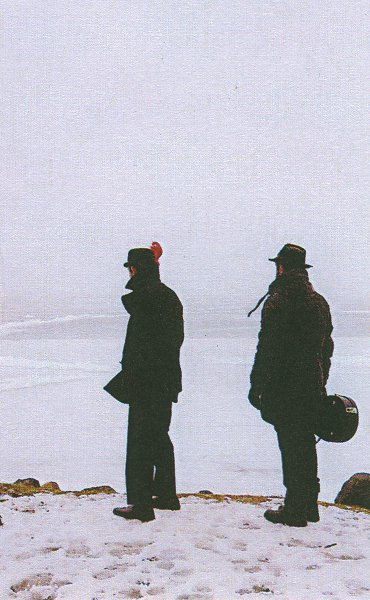

artist: **Rain Drinkers** release: _Urthen Web_ format: MC year of release: 2011 label: [Brave Mysteries](http://www.bravemysteries.com) duration: 32:05

detailed info: [discogs.com](http://www.discogs.com/Rain-Drinkers-Urthen-Web/release/3019026)

Wisconsin duo **Joseph Taylor** and **Zavier Krall** have been releasing limited edition albums as **Rain Drinkers** since 2009. _Urthen Web_ is one of their most recent ones, and their evocative cinematic sounds have found a home on the **Brave Mysteries** label.

The material on this release sounds slightly lo-fi, which is perhaps why cassette is an appropriate medium for this album. The long "Strange Tapestry" fills the A-side, presenting a unique composition where brass, organ, clean electric guitar, and hand percussion are the dominating instruments. Rain Drinkers operate with a flawless sense of tension building and intensity, which is perhaps why so many other reviewers have made the link between this music and cinema soundtracks. Indeed, the horn/trumpet section at the start of the track does paint a bit of Morriconesque musical picture, though I would say that the band never leans to heavily on any of their influences.

The B-side consists of two related pieces entitled "In the Central Loom". The first part starts with deep drones, out of which a great organ melody rises. Distant chants and sporadic plucked strings finish off this excellent section. The closing piece is based on gorgeous interleaved waves of lower and higher strings, free-ranging flute, and various effects, resulting in the most freefolk piece on this album. It's moody, rich, and a great variation added to the end of an already impressive release.

It's a bit difficult to pigeonhole Rain Drinkers' music, as there are bits in there of ambient, but with lots of melody, krautrock, the aforementioned cinematic style, and all sorts of stuff. In this case it's best to let the music just be the music, which is wonderful. _Urthen Web_ is a bit less polished in terms of production than recent CD-R releases like the equally impressive _[Springtide](http://www.discogs.com/Rain-Drinkers-Springtide/release/3050382)_ which was released on **Reverb Worship** this year, but excellent stuff nonetheless. Another testament to the brilliance currently lurking in the US underground, which is being picked up by excellent labels like these.

Reviewed by **O.S.**

Tracklist:

1\. Strange Tapestry (16:05)

2\. In the Central Loom I (9:25) 3. In the Central Loom II (6:35)

http://www.discogs.com/Rain-Drinkers-Springtide/release/3050382
