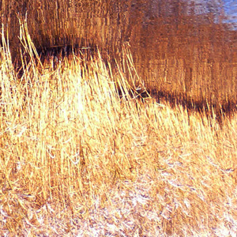

[Agitated Radio Pilot Retrospective II](http://www.mixcloud.com/eveningoflight/agitated-radio-pilot-retrospective-ii/#utm_source=widget&amp;utm_medium=web&amp;utm_campaign=base_links&amp;utm_term=resource_link) by [Evening Of Light](http://www.mixcloud.com/eveningoflight/#utm_source=widget&amp;utm_medium=web&amp;utm_campaign=base_links&amp;utm_term=profile_link) on [Mixcloud](http://www.mixcloud.com/#utm_source=widget&utm_medium=web&utm_campaign=base_links&utm_term=homepage_link)

To celebrate the release of [_Light Beneath the Lake / Nothing Is Truly Lost_](../../2011/07/23/eol03-agitated-radio-pilot-lights-beneath-the-lake-nothing-is-truly-lost/ ":EOL03: Agitated Radio Pilot – Lights Beneath the Lake / Nothing Is Truly Lost") (:EOL03:) by one of our favourite artists, **Agitated Radio Pilot** (**David Colohan**), we have compiled two retrospective cloudscapes with personal selections the artist’s back catalogue, and a couple of tracks from our own release, which is available now. Apart from :EOL03:, there will be a few more **ARP** releases on other labels, but after that, David is laying the project to rest. Another reason to look back!

This second retrospective includes more lovely tracks from important ARP albums, as well as others of Dave's projects and guest appearances, such as **Holt**, **The Driftwood Manor**, **Children of the Stones, United Bible Studies,** and **The Magickal Folk of the Faraway Tree**. Enjoy!

00:00 | ARP | A Darkness Made of Beating Wings | [World Winding Down](http://www.eveningoflight.nl/2008/02/01/review-agitated-radio-pilot-world-winding-down-2007/ "Review: Agitated Radio Pilot – World Winding Down (2007)") | 2007 04:11 | Holt | Hahn River Crossing | 80 Mile Beach | 2003 08:22 | ARP | Thousand Year Stare | [Nothing Is Truly Lost](http://www.eveningoflight.nl/2011/07/23/eol03-agitated-radio-pilot-lights-beneath-the-lake-nothing-is-truly-lost/ ":EOL03: Agitated Radio Pilot – Lights Beneath the Lake / Nothing Is Truly Lost") | 2011 11:52 | The Driftwood Manor | The Same Figure (Leaving) | [The Same Figure (Leaving)](http://www.eveningoflight.nl/2010/09/24/retrospective-the-driftwood-manor-three-2010-releases/ "Retrospective: The Driftwood Manor, three 2010 releases") | 2010 16:47 | ARP | World Winding Down | World Winding Down | 2007 22:18 | ARP | Along the Trails of Midnight Deer | World Winding Down | 2007 24:54 | Children of the Stones | Here Lives the Sun | The Bright Day Is Gone | 2006 27:08 | ARP | Rounding Lizard Point | The Rural Arcane | 2008 30:16 | ARP | In Darkness Now Safely | Like Flightless Birds | 2004 34:03 | ARP | Caroline Sings | World Winding Down | 2007 39:34 | United Bible Studies | Mirror in Cherwell | The Jonah | 2009 42:16 | The Magickal Folk of the Faraway Tree | Going to Mass Last Sunday | [The Soup & The Shilling](http://www.eveningoflight.nl/2010/04/30/review-the-magickal-folk-of-the-faraway-tree-the-soup-the-shilling-2010/ "Review: The Magickal Folk of the Faraway Tree – The Soup & The Shilling (2010)") | 2010 45:30 | ARP | The Liminal Hills | The Days and Hills Grown Old | 2006 47:53 | ARP | Earthfasts | World Winding Down | 2007 58:20 | ARP | On Montauk Point | Nothing Is Truly Lost | 2011 1:02:06 | ARP | The Barren Ground Assembly | Your Turn To Go it Alone | 2006 1:14:45 | ARP | Everything Ends | World Winding Down | 2007
