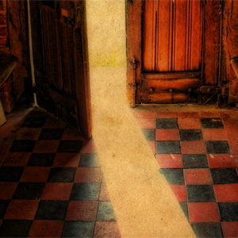

[Cloudscape #18: September 2011](http://www.mixcloud.com/eveningoflight/cloudscape-18-september-2011/?utm_source=widget&utm_medium=web&utm_campaign=base_links&utm_term=resource_link) by [Evening Of Light](http://www.mixcloud.com/eveningoflight/?utm_source=widget&utm_medium=web&utm_campaign=base_links&utm_term=profile_link) on [Mixcloud](http://www.mixcloud.com/?utm_source=widget&utm_medium=web&utm_campaign=base_links&utm_term=homepage_link)

Photography: [Autumnsonata](http://www.flickr.com/photos/autumnsonata/4372078185/in/photostream/)

00:00 | The A. Lords | Mistress Chetell | [The A. Lords](http://www.eveningoflight.nl/2011/10/16/review-the-a-lords-2011/ "Review: The A. Lords (2011)") | 2011 04:53 | Jon DeRosa | Ladies in Love | [Anchored EP](http://www.eveningoflight.nl/2011/08/20/review-jon-derosa-anchored-ep-2011/ "Review: Jon DeRosa – Anchored EP (2011)") | 2011 08:16 | The Driftwood Manor | The Turning Darkness | Shelter EP | 2011 13:03 | Susan Matthews & Richard Moult | Aria | [Music for Two Pianos vol. 1](http://www.eveningoflight.nl/2011/08/29/august-2011-short-reviews/ "August 2011 Short Reviews") | 2011 17:44 | Zvuku | Woodpile | SEQUENCE1 | 2011 22:27 | Popol Vuh | Dort Ist der Weg | Letzte Tage - Letzte Nächte | 1976 26:29 | Rain Drinkers | In the Central Loom I | [Urthen Web](http://www.eveningoflight.nl/2011/08/30/review-rain-drinkers-urthen-web-2011/ "Review: Rain Drinkers – Urthen Web (2011)") | 2011 33:59 | Burial Hex | The Book of Delusions | [Book of Delusions](http://www.eveningoflight.nl/2011/09/21/review-burial-hex-book-of-delusions-2011/ "Review: Burial Hex – Book of Delusions (2011)") | 2011 47:24 | Gimu | The Purification | SEQUENCE1 | 2011 51:45 | Peter Wright | Coruscation | [Peter Wright / The North Sea / Agitated Radio Pilot](http://www.eveningoflight.nl/2007/11/01/review-peter-wright-the-north-sea-agitated-radio-pilot-2005/ "Review: Peter Wright / The North Sea / Agitated Radio Pilot (2005)") | 2005 56:06 | Peter Wright | Heat Haze | Peter Wright / The North Sea / Agitated Radio Pilot | 2005 57:14 | Ruhr Hunter | The Leaving Trees | Moss & Memory | 2006
