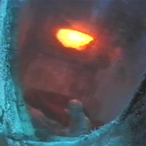

[Aarktica / Jon DeRosa Spotlight](http://www.mixcloud.com/eveningoflight/aarktica-jon-derosa-spotlight/#utm_source=widget&amp;utm_medium=web&amp;utm_campaign=base_links&amp;utm_term=resource_link) by [Evening Of Light](http://www.mixcloud.com/eveningoflight/#utm_source=widget&amp;utm_medium=web&amp;utm_campaign=base_links&amp;utm_term=profile_link) on [Mixcloud](http://www.mixcloud.com/#utm_source=widget&utm_medium=web&utm_campaign=base_links&utm_term=homepage_link)

00:00 | Aarktica | I Am (the Ice) | In Sea | 2009 03:45 | Aarktica | Seventy Jane | Matchless Years | 2008 08:42 | Aarktica | The Mimicry All Women Use | Pure Tone Audiometry | 2003 14:20 | Aarktica | Indie | No Solace in Sleep | 2000 20:58 | Aarktica | In Sea (Mason Jones Remix) | In Sea Remixes | 2010 25:10 | Aarktica | Depression Modern | Live at KUCI 6/15/05 | 2009 31:19 | Aarktica | Aura Lee | Or You Could Just Go Through Your Whole Life And Be Happy Anyway | 2002 35:38 | Aarktica | Am I Demon? | In Sea | 2009 41:30 | Dead Leaves Rising | Cold Dark Water | Waking up on the Wrong Side of No One | 2001 45:54 | Jon DeRosa | Anchored | Anchored EP | 2011 50:34 | Aarktica | Ocean (Aaron Spectre Remix) | Lost Tracks | 2007 57:18 | Aarktica | Nostalgia = Distortion | Or You Could Just Go Through Your Whole Life And Be Happy Anyway | 2002 1:02:34 | Aarktica | The Hook, the Reel, and the Pull | Or You Could Just Go Through Your Whole Life And Be Happy Anyway | 2002 1:03:16 | Aarktica | Water Wakes Dead Cells | Pure Tone Audiometry | 2003 1:08:26 | Aarktica | Williamsburg Counterpoint | Pure Tone Audiometry | 2003
